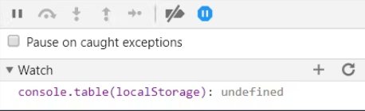
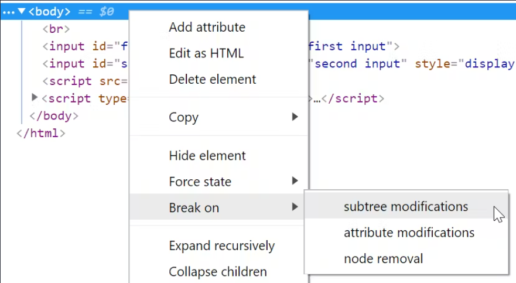
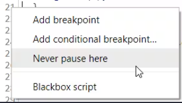
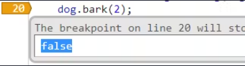
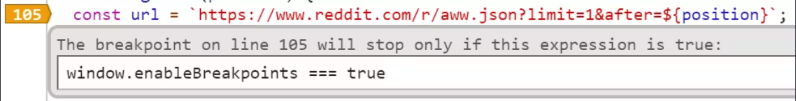
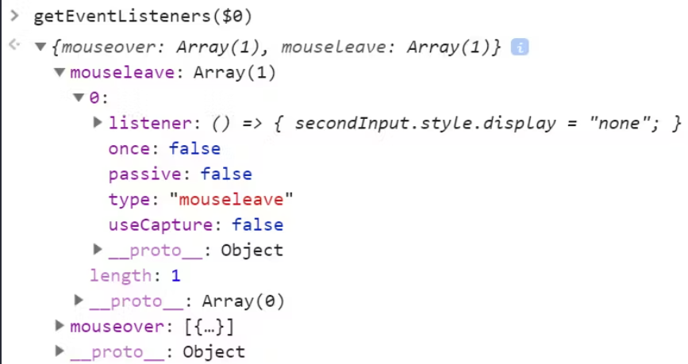

# 【翻译】浏览器不想让你知道的67个怪异调试技巧

> 原文地址：https://alan.norbauer.com/articles/browser-debugging-tricks

一系列实用而不显眼的小技巧，让你充分利用浏览器的调试器。文章预设你对浏览器的开发者工具有中级或以上的了解。

## 进阶的条件断点

通过在你意想不到的地方使用具有副作用的表达式，我们可以从条件断点等基本功能中获取更多的功能。

### 日志点和追踪点

例如，我们可以在断点中使用 `console.log`。日志点 `logpoints` 是在不暂停执行的情况下将日志记录到控制台的断点。Microsoft Edge 内置日志点已有一段时间，而 Chrome 浏览器也在 `v73` 中添加了日志点，但 Firefox 浏览器没有。不过，我们可以在任何浏览器中使用条件断点来模拟日志点。


如果你还想计算该行的执行次数，请使用 `console.count` 而不是 `console.log`。

更新（2020 年 5 月）：现在所有主流浏览器都直接支持日志点/跟踪点（[Chrome 浏览器日志点](https://developers.google.com/web/updates/2019/01/devtools#logpoints)、[Edge 浏览器跟踪点](https://learn.microsoft.com/en-us/archive/microsoft-edge/legacy/developer/#breakpoints)、[Firefox 浏览器日志点](https://firefox-source-docs.mozilla.org/devtools-user/debugger/set_a_logpoint/index.html)）。

### 观察窗格

你还可以在观察窗格中使用 `console.log`。例如，要在调试器中每次暂停应用程序时转储 `localStorage` 的快照，可以创建一个 `console.table(localStorage)` 观察器：



或者，要在 DOM 修改后执行表达式，可以设置 DOM 修改断点（在元素检查器 `Element Inspector` 中）：



然后添加观察表达式，例如记录 DOM 的快照：`(window.doms = window.doms || []).push(document.documentElement.outerHTML)` 。现在，在修改任何 DOM 子树后，调试器将暂停执行，然后新的 DOM 快照会出现在 `window.doms` 数组的末尾。(没有办法创建不暂停执行的 DOM 修改断点）。

### 追踪调用堆栈

比方说，你有一个显示加载旋转器的函数和一个隐藏它的函数，但在代码的某个地方，你调用 show 方法时没有调用匹配的 hide 方法。如何找到未配对 show 方法调用的源代码呢？在 show 方法的条件断点中使用 `console.trace`，运行代码，找到 show 方法的最后一次堆栈追踪，然后点击调用者 `caller` 进入代码：


### 改变程序行为

通过使用对程序行为有副作用的表达式，我们可以在浏览器中即时更改程序行为。

例如，你可以覆盖 `getPerson` 函数的参数 `id`。 由于 `id=1` 的值为 true，这个条件断点会暂停调试器。为避免这种情况，请在表达式中添加 `，false`。


### 快速、粗略的性能分析

你不应该用条件断点评估时间之类的东西来混淆性能分析，但如果你想快速而又粗略地测量某个程序运行所需的时间，可以在条件断点中使用控制台 timing API。在起点设置一个条件断点 `console.time('label')`，然后在终点设置一个条件断点 `console.timeEnd('label')`。每当要测量的程序运行时，浏览器都会向控制台记录运行时间。


### 使用函数的参数

#### 参数数量匹配时中断

仅在当前函数被以 3 个参数调用时暂停：`arguments.callee.length === 3` 。

当重载的函数有可选参数时会非常有用。


#### 函数参数不匹配时中断

仅在调用当前函数时使用了错误的参数数量时暂停：`(arguments.callee.length) != arguments.length`。


在查找函数调用处的错误时会非常有用。


### 使用时间

#### 跳过页面加载

页面加载 5 秒后才暂停：`performance.now() > 5000`。

当你想设置断点，但只想在初始的页面加载完成之后才暂停执行，此功能会非常有用。

#### 跳过 N 秒

如果在接下来的 5 秒内遇到断点，则不暂停执行，而是在之后的任何时间暂停： `window.baseline = window.baseline || Date.now()`，`(Date.now() - window.baseline) > 5000`。

如果想随时在控制台中重置计数器，你只需要执行：`window.baseline = Date.now()`。

### 使用 CSS

根据计算的 CSS 值暂停执行，例如，仅在 document body 的背景色为红色时暂停执行：`window.getComputedStyle(document.body).backgroundColor === "rgb(255,0,0)"`。


### 只在偶数次调用

间隔一行执行时，才暂停一次： `window.counter = window.counter || 0`，`window.counter % 2 === 0`。


### 样本中断

仅在随机抽样执行该行时中断，例如，仅在每执行 10 次时中断 1 次：`Math.random() < 0.1`。


### Never Pause Here

右键单击 gutter 并选择 “Never Pause Here” 时，Chrome 浏览器会创建一个条件断点，该断点为 `false` 且永不通过。这样，调试器就不会在这一行暂停。





当你想将某一行从 XHR 断点中排除、忽略正在抛出的异常等时，它会非常有用。


### 自动的实例 IDs

通过在构造函数中设置以下条件断点，自动为类的每个实例分配唯一 ID：`(window.instances = window.instances || []).push(this)`。

然后检索唯一 ID：`window.instances.indexOf(instance)`（例如，在类方法中使用 `window.instances.indexOf(this)` ）。


### 程序切换

使用全局布尔值选取一个或多个条件断点：



然后通过编程切换布尔值，例如：

- 手动从控制台中：

  ```js
  window.enableBreakpoints = true;
  ```

- 从其他断点：

  

- 从控制台的 timer 中：

  ```js
  setTimeout(() => (window.enableBreakpoints = true), 5000);
  ```

- 等等


## `monitor()` 类调用

::: warning 

只适用于 Chrome 浏览器

:::

你可以使用 Chrome 浏览器的 `monitor` 命令行方法，轻松跟踪对类方法的所有调用。例如，给定一个类 `Dog`：

```js
class Dog {
  bark(count) {
    /* ... */
  }
}
```

如果我们想知道对 `Dog` 所有实例的调用，请将此内容粘贴到命令行中：

```js
var p = Dog.prototype;
Object.getOwnPropertyNames(p).forEach((k) => monitor(p[k]));
```

就会在控制台中得到输出结果：

```js
> function bark called with arguments: 2
```

如果你想暂停任意方法调用的执行（而不只是记录到控制台），可以使用 `debug` 代替 `monitor`。

### 源自指定的实例

如果你不知道所属的类，但有一个实例：

```js
var p = instance.constructor.prototype;
Object.getOwnPropertyNames(p).forEach((k) => monitor(p[k]));
```

当你想编写一个函数，对任何类的任何实例（而不仅仅是 `Dog` ）执行此操作时，该函数就会非常有用。


## 调用和调试函数

在调用要在控制台中调试的函数之前，先调用 `debugger`。例如：

```js
function fn() {
  /* ... */
}
```

源自你的浏览器控制台：

```js
> debugger; fn(1);
```

然后选择 `Step into next function call`，进而调试 `fn` 的执行流程。

当你不想查找 `fn` 的定义并手动添加断点时，或者当 `fn` 动态绑定到一个函数上，而你不知道源代码在哪里时，这种方法会非常有用。

在 Chrome 浏览器中，你还可以选择在命令行中调用 `debug(fn)`，这样每次调用 `fn` 时，调试器都会暂停执行 `fn`。


## URL 变更时暂停执行

在单页面应用程序修改 URL（即发生路由事件）之前暂停执行：

```js
const dbg = () => {
  debugger;
};
history.pushState = dbg;
history.replaceState = dbg;
window.onhashchange = dbg;
window.onpopstate = dbg;
```

至于如何创建一个能在不中断导航的情况下暂停执行的 `dbg` 代码版本，读者可以自行决定如何实现。

此外，请注意这并不能处理代码直接调用 `window.location.replace/assign` 的情况，因为页面会在方法执行后立即卸载，所以没有什么可调试的。如果还想查看这些重定向的来源（并调试重定向时的状态），在 Chrome 浏览器中可以 `debug` 相关方法：

```js
debug(window.location.replace);
debug(window.location.assign);
```


## 调试属性读取

如果你有一个对象，并想知道它的某个属性何时被读取，可以使用带有 `debugger` 调用的对象 getter。例如，将 `{ configOption: true }` 转换为 `{get configOption() { debugger; return true; }}` (在原始源代码中或使用条件断点）。

当你向某个程序传递一些配置选项，并希望查看这些选项的使用情况时，这种方法非常有用。


## 使用 `copy()`

::: warning 

只适用于 Chrome/Firefox 浏览器

:::

使用 `copy()` 控制台 API，你可以将浏览器中的有趣信息直接复制到剪贴板，而无需截断任何字符串。你可能想复制一些有趣的内容：

- 当前 DOM 的快照：`copy(document.documentElement.outerHTML)`
- 资源（如图片）的元数据：`copy(performance.getEntriesByType("resource"))`
- 格式化后的大型 JSON blob：`copy(JSON.parse(blob))`
- 本地存储的转储： `copy(localStorage)`
- 等等。


## 调试 HTML/CSS

JS 控制台有助于诊断 HTML/CSS 的问题。

### 禁用 JS 检查 DOM

在 DOM 检查器中，按下 `ctrl+\` （Chrome/Windows）键可随时暂停 JS 的执行。这样，你就可以检查 DOM 的快照，而不必担心 JS 会改变 DOM 或事件（如 `mouseover`）会导致 DOM 在你眼皮底下发生变化的情况发生。

### 检查难以捉摸的元素

假设你要检查一个 DOM 元素，而该元素只在特定条件下才会出现。检查该元素需要将鼠标移动到该元素上，但当你尝试移动时，该元素却消失了：


要检查元素，可以将以下内容粘贴到控制台：`setTimeout(function() { debugger; }, 5000);`。这样就有 5 秒钟的时间来触发 UI，而一旦 5 秒钟的计时器到了，JS 的执行就会暂停，元素也不会消失。你就可以随意地将鼠标移到开发者工具上，而不会丢失元素：


在暂停执行 JS 时，你可以检查元素、编辑 CSS、在 JS 控制台中执行命令等。

在检查依赖于特定光标位置、焦点等的 DOM 时非常有用。

### 记录 DOM 快照

抓取当前状态下的 DOM 副本：

```js
copy(document.documentElement.outerHTML);
```

每秒记录一次 DOM 的快照：

```js
doms = [];
setInterval(() => {
  const domStr = document.documentElement.outerHTML;
  doms.push(domStr);
}, 1000);
```

或者直接输出到控制台：

```js
setInterval(() => {
  const domStr = document.documentElement.outerHTML;
  console.log("snapshotting DOM: ", domStr);
}, 1000);
```

### 监控聚焦元素

```js
(function () {
  let last = document.activeElement;
  setInterval(() => {
    if (document.activeElement !== last) {
      last = document.activeElement;
      console.log("Focus changed to: ", last);
    }
  }, 100);
})();
```


### 找到加粗元素

```js
const isBold = (e) => {
  let w = window.getComputedStyle(e).fontWeight;
  return w === "bold" || w === "700";
};
Array.from(document.querySelectorAll("*")).filter(isBold);
```

#### 只找后代

或者只是检查器中当前所选元素的后代：

```js
Array.from($0.querySelectorAll("*")).filter(isBold);
```

### 引用当前选择元素

控制台中的 `$0` 是对元素检查器中当前选定元素的自动引用。

#### 先前检查过的元素

::: warning 

只适用于 Chrome/Edge 浏览器

:::

在 Chrome 浏览器和 Edge 中，你可以用 `$1` 访问上次检查过的元素，用 `$2` 访问之前的元素，等等。

#### 获取事件监听器

::: warning 

只适用于 Chrome 浏览器

:::

在 Chrome 浏览器中，你可以通过 `getEventListeners($0)` 查看当前选中元素的事件监听器，例如：



### 监控元素的事件

::: warning 

只适用于 Chrome 浏览器

:::

调试选定元素的所有事件： `monitorEvents($0)`

调试选定元素的特定事件：`monitorEvents($0, ["control", "key"])`

