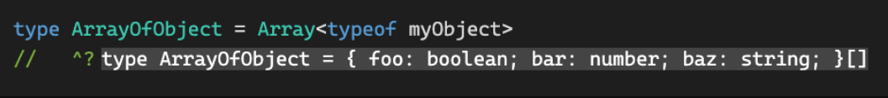

# 【翻译】TypeScript 中的 Array 类型

> 原文地址：https://tkdodo.eu/blog/array-types-in-type-script

今年早些时候，[Matt Pocock](https://twitter.com/mattpocockuk) 发起了一项关于 `Array<string>`（泛型语法）与 `string[]` （数组语法）用法的投票，投票结果令我大惑不解：


> twitter地址在这：https://twitter.com/mattpocockuk/status/1544083145833717767

说白了，这两种写法在功能上完全没有区别。选择哪一种似乎只是个人偏好。无论如何，请确保打开[array - type](https://typescript-eslint.io/rules/array-type/) eslint 规则，以便一致地使用这两种写法。

也就是说，Twitter 上超过 78% 的人都是完全错误的。我通常不处理这种绝对化的问题，因为其中总会有细微的差别和权衡。在这种情况下，我很确定泛型写法要好得多，即使不能说是绝对好。

每当有人提出这个问题，并倾向于使用数组写法时，我都会向他们展示数组写法存在不足的相关论据，然后他们就会立刻被说服。但在此之前，让我们先看看一个总是会出现的论据，它可能是唯一一个支持数组写法的论据：

## 写法上更短

就是这样。这就是优势。编写的字符更少。好像保持代码简短是可维护性的良好指标一样。`let` 的字符数比 `const` 少，这是否意味着我们可以在所有地方都使用 `let` ？好吧，我也知道有这种争论，但我们还是不要讨论这个问题了😂️。

不过说真的，`i` 比 `index` 短，`d` 比 `dashboard` 短，以此类推。短并不代表好。我们知道，我们阅读代码的次数远远多于编写代码的次数，所以我们不应该把重点放在让代码易于编写上，而应该让代码易于阅读，这也正是泛型写法的第一个优势所在：

## 可读性

我们通常从左到右阅读，所以更重要的事情应该放在前面。我们会说"这是一个字符串数组"，或者 "这是一个字符串或数字数组"。

::: code-group

```ts:line-numbers [left-to-right]
// ✅ reads nice from left to right
function add(items: Array<string>, newItem: string)

// ❌ looks very similar to just "string"
function add(items: string[], newItem: string)
```
:::

如果数组中的类型很长，例如是从某个地方推断出来的，那么这一点就尤为重要。IDE 通常使用数组写法来显示数组类型，因此有时当我将鼠标悬停在一个对象数组上时，会得到这样的结果：

::: code-group

```ts:line-numbers [options-array]
const options: {
  [key: string]: unknown
}[]
```

:::

对我来说，这读起来 `options` 就像是一个对象，只有在最后，我才能看到它实际上是一个数组。如果对象有很多属性，情况就会更糟，因为这会使内容变长，并给弹出窗口带来滚动条，几乎不可能看到末尾的 `[]` 。当然，这可能是一个工具问题，但如果我们把它作为一个数组来显示，这个问题就不会存在：一个对象数组。如果分多行显示，就不会这么长了：

::: code-group

```ts:line-numbers [array-of-options]
const options: Array<{
  [key: string]: unknown
}>
```

:::

不管怎么说，继续往下看，因为这并不是泛型写法的唯一优点。

## 只读数组

让我们来看一种场景——作为函数输入的大多数数组都应该是 `readonly` ，以避免意外性修改。我将在 [另一篇文章](https://tkdodo.eu/blog/the-power-of-const-assertions#use-readonly-everywhere) 中讨论这个话题。如果使用泛型写法，则只需将 `Array` 替换为 `ReadonlyArray` 即可。如果使用数组写法，则必须将其分成两部分：

::: code-group

```ts:line-numbers [readonly-arrays]
// ✅ prefer readonly so that you don't accidentally mutate items
function add(items: ReadonlyArray<string>, newItem: string)

// ❌ "readonly" and "Array" are now separated
function add(items: readonly string[], newItem: string)
```

:::

这并不是什么大问题，但 `readonly` 作为一个保留字，只适用于数组和元组，这就有点奇怪了，因为我们有一个 [内置工具类型](https://www.typescriptlang.org/docs/handbook/utility-types.html#readonlytype) 可以做同样的事情。而且将 `readonly` 和 `[]` 分割开来确实会影响读取时的流畅性。

这些问题只是热身，让我们来看看真正恼人的地方：

## 联合类型

如果我们扩大 `add` 函数的范围，使其也能接受数字，因此我们需要一个字符串或数字数组，会发生什么情况呢？使用泛型写法就不会有问题：

::: code-group

```ts:line-numbers [array-of-unions]
// ✅ works exactly the same as before
function add(items: Array<string | number>, newItem: string | number)
```

:::

然而如果使用数组写法的话，写法就变得很奇怪：

::: code-group

```ts:line-numbers [string-or-number-array]
// ❌ looks okay, but isn't
function add(items: string | number[], newItem: string | number)
```

:::

如果您不能立即发现错误，这就是问题的一部分。它太隐蔽了，因此需要一些时间才能发现。让我们通过实际执行该函数来看看我们得到的错误：

::: code-group

```ts:line-numbers [not-assignable]
// ❌ why doesn't this work 😭
function add(items: string | number[], newItem: string | number) {
  return items.concat(newItem)
}
```

:::

出现下边的错误：

```ts
Type 'string' is not assignable to type 'ConcatArray<number> & string' (2769)
```

[TypeScript playground](https://www.typescriptlang.org/play?#code/GYVwdgxgLglg9mABAQwCaoBQygUwLYDOAXIgVAE4xgDmiAPomCHgEY7kDaAugDSM4B3AJK48JMpRr1GzNuQCUiAN4BYAFCJE2fAQB0EBBGRQMYQSPzz1AX3VA)

这对我来说根本毫无意义。解开这个谜题：这与操作符的优先级有关。`[]` 的绑定比 `|` 操作符更强（换句话讲就是 `[]` 比 `|` 操作符的运行优先级低），所以现在我们让项目的类型变成了 `string` 或者 `number[]`。

我们想要的是：`(string | number)[]`，加上括号，以使我们的代码工作正常。泛型版本没有这个问题，因为它用角括号将 `Array` 与其内容分隔开来了。

还是不相信泛型语法更好？我还有最后一个论据：

## keyof

让我们来看一个相当常见的例子：我们有一个接收对象的函数，同时我们还想把这个对象的键构成的数组传递给同一个函数。如果我们想实现 `pick` 或 `omit` 这样的函数，就需要这个数组：

::: code-group

```ts:line-numbers [pick]
const myObject = {
  foo: true,
  bar: 1,
  baz: 'hello world',
}

pick(myObject, ['foo', 'bar'])
```

:::

我们只想让现有的键作为第二个参数传递，那么该如何做到这一点呢？使用 [keyof 类型操作符](https://www.typescriptlang.org/docs/handbook/2/keyof-types.html)：

::: code-group

```ts:line-numbers [pick-generic-notation]
function pick<TObject extends Record<string, unknown>>(
  object: TObject,
  keys: Array<keyof TObject>
)
```

:::

当然，当我们为数组使用泛型语法时，一切都很顺利。但如果我们将其改为数组语法，会发生什么情况呢？

::: code-group

```ts:line-numbers {3} [pick-array-notation]
function pick<TObject extends Record<string, unknown>>(
  object: TObject,
  keys: keyof TObject[]
)
```

:::

会看到：

```ts
Argument of type 'string[]' is not assignable to parameter of type 'keyof TObject[]'.(2345)
```

[TypeScript playground](https://www.typescriptlang.org/play?#code/GYVwdgxgLglg9mABABxhA1gHgCoHkBGAVgKbSLEAeUxYAJgM6IBKpcATrZvVGzGAOYAaROHRg4AdzAA+aQAo4RUlABciPEujD0xAJ701O3XGDqCJaAG0AugEpEAbwC+AWABQ7iAm6IAtrvNlRABeR3dERGA4ODUeEGJBcMR8AEM2NQBGRLcI1IAvNQByAAtiABsyuEQJdjLaQuzXDzdUDDl-QK1ES0KouAbEQtS2QutEW3cgA)

什么，为什么？这条信息比之前那条更不合理。当我第一次在真正的代码库中遇到这个错误时，我足足盯着它看了 5 分钟。为什么我的键不是字符串？

我试着左改右改，把类型提取为类型别名，也许能得到更好的错误信息，但都没有成功。然后我突然想明白了：又是括号的问题，不是吗？

没错，就是这样。这太可悲了。因为我为什么要关心这个问题呢？直到今天，我都不知道什么才是 `keyof TObject[]` 的合法输入。我想不出来。我只知道定义我们想要的类型的正确方法是：`(keyof TObject)[]`

::: code-group

```ts:line-numbers {3} [fixed-array-notation]
function pick<TObject extends Record<string, unknown>>(
  object: TObject,
  keys: (keyof TObject)[]
)
```

:::

谢什么，愚蠢的语法。

以上就是我在使用数组写法时遇到的所有问题。我觉得很可悲的是，在前面提到的 eslint 规则中，数组写法是默认设置，而大多数人仍然喜欢它，可能就是因为这个原因。

同样可悲的是，IDE 和 TypeScript Playground 使用这种符号显示类型，即使它们的定义显然不同：



也许这篇文章能让社区相信泛型写法更好，也许有一种方法能让我们共同使用泛型写法作为默认设置，这也是我们希望看到的。然后，也许，只是也许，工具就会跟进。


