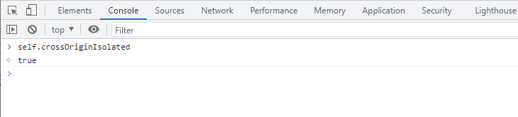
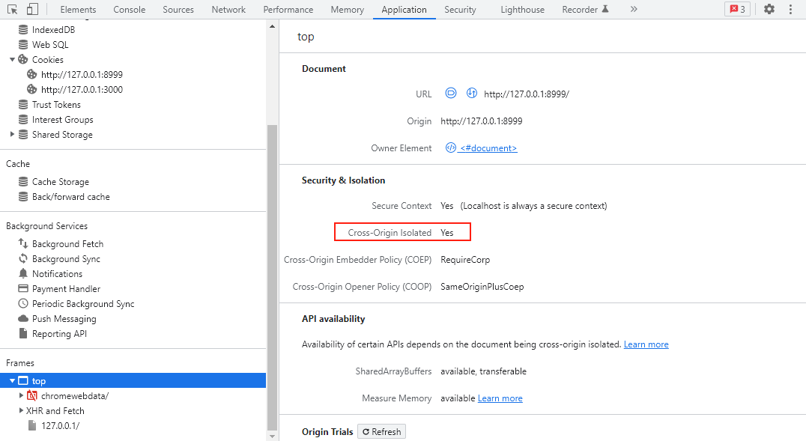
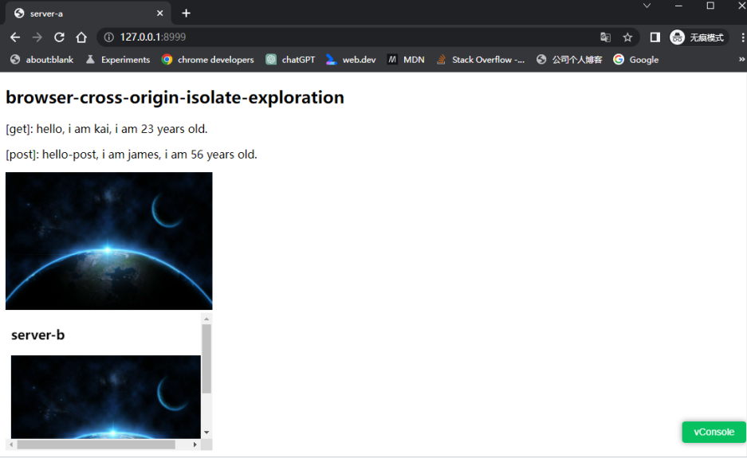
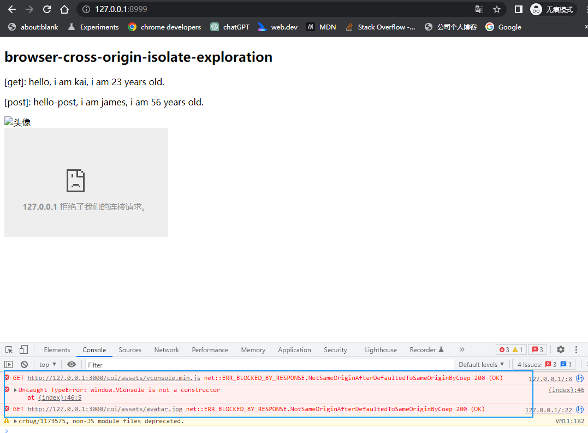
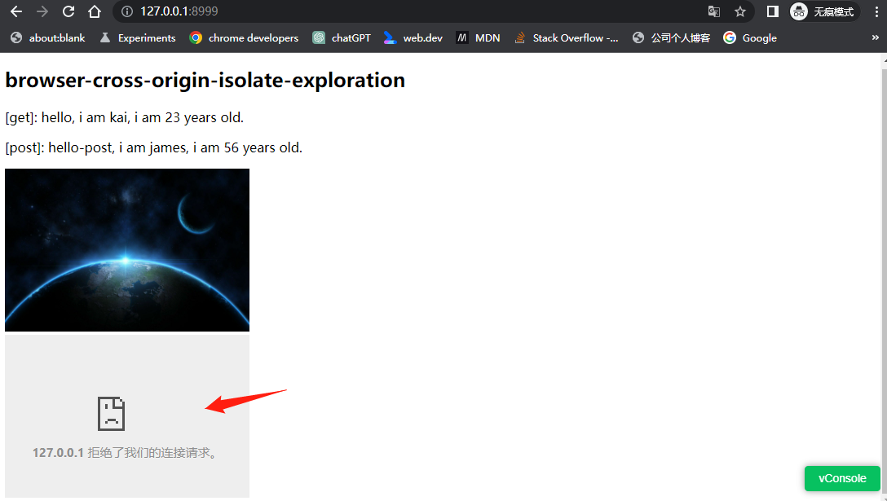
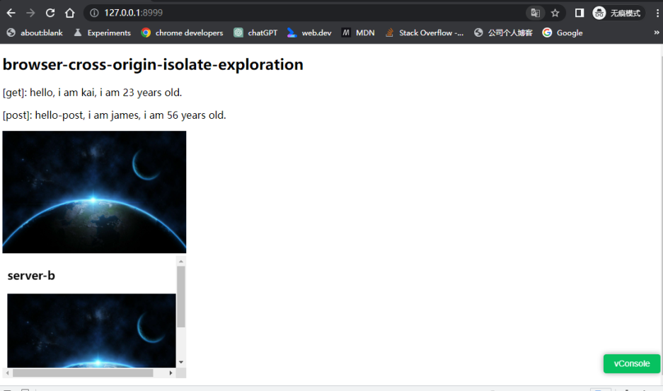

# 记一次浏览器跨域隔离探究实践

## （一）前言

前阵子，在一个微信公众号项目的业务开发过程中，用到了微信的 [JS-SDK](https://developers.weixin.qq.com/doc/offiaccount/OA_Web_Apps/JS-SDK.html) 和其他第三方脚本资源，本地开发联调比较顺利，没什么问题。不过，在将成果物部署到线上测试服务器时，我人懵了。

涉及的JS-SDK和其他第三方脚本资源请求均失败了，涉及业务功能均无法正常使用，影响交付，因此需要尽快排查定位解决该问题。

基于一个个猜测和验证，最终定位问题是由于服务端开启了 **跨域隔离** 导致的，修改Nginx配置解决了这个问题，也因此成果物在项目结项前及时得以交付。在此期间，也找了不少关于跨域隔离的资料，借此打算写篇文章记录下涉及 **跨域隔离** 的概念和做些代码实践。


## （二）关于跨域隔离

### 1. 什么是跨域隔离？

某些 Web API 会导致 `Spectre` 等旁道攻击的风险增加。为了减轻这种风险，浏览器提供了一个基于选择加入的隔离环境，称为**跨源隔离**。

这里所说的 `Web API`，目前主要包括如下几个：

- [SharedArrayBuffer](https://developer.mozilla.org/zh-CN/docs/Web/JavaScript/Reference/Global_Objects/SharedArrayBufferhttps://developer.mozilla.org/zh-CN/docs/Web/JavaScript/Reference/Global_Objects/SharedArrayBuffer)：chrome 92版本后，非跨域隔离状态下无法使用；
- [performance.measureUserAgentSpecificMemory()](https://developer.mozilla.org/en-US/docs/Web/API/Performance/measureUserAgentSpecificMemory)：非跨域隔离状态下无法使用；
- [performance.now() ](https://developer.mozilla.org/en-US/docs/Web/API/Performance/now)：非跨域隔离状态下可以使用（Chrome 110），不过返回的时间精度没有跨域隔离状态下的细；
- [performance.timeOrigin](https://developer.mozilla.org/en-US/docs/Web/API/Performance/timeOrigin)：非跨域隔离状态下可以使用（Chrome 110），不过返回的时间精度没有跨域隔离状态下的细；


### 2. 为什么要引入跨域隔离？

上文说到，`SharedArrayBuffer` 等api的直接使用，会导致 `Spectre` 攻击的风险增加，用户信息被窃取的概率增大，因此，通过设置跨域隔离，可以从软件层面上降低这种风险发生的可能性。

关于啥是 `Spectre`，可以参看这篇文章：[Wikipedia-幽灵漏洞](https://zh.wikipedia.org/wiki/幽灵漏洞)。

更多内容，可参看这篇文章：[为何需要“跨源隔离”才能获得强大的功能](https://web.dev/why-coop-coep/)。


### 3. 如何启用跨域隔离？

> Cross-Origin-Embedder-Policy：下文简称coep
>
> Cross-Origin-Opener-Policy：下文简称coop
>
> Cross-Origin-Resource-Policy：下文简称corp

要启用跨域隔离，只需要给页面主文档发送如下这些响应头即可：

```http
Cross-Origin-Embedder-Policy: require-corp
Cross-Origin-Opener-Policy: same-origin
```

这些响应头指示浏览器阻止加载未选择由跨源文档加载的资源（比如图片或者音频）或 iframe，并防止跨源窗口直接与当前主文档进行交互（即无法通过 `postMessage` 来通信）。这也意味着跨源加载的资源需要选择加入（下文会说如何设置）。

可以通过检查 [`self.crossOriginIsolated`](https://developer.mozilla.org/docs/Web/API/WindowOrWorkerGlobalScope/crossOriginIsolated) 来确定网页是否处于跨域隔离状态：



或者在 `Application` 面板 `frames` 栏中查看：




### 4. 如何减轻跨域隔离的影响？

开启跨域隔离之后，跨域的图像、脚本和iframe等跨域资源是无法正常加载的，因此需要一些解决方案来减轻开启跨域隔离之后带来的影响。

这里，我直接引用文章 [跨域隔离的启用指南](https://web.dev/cross-origin-isolation-guide/) 给出的解决方案内容，即在确定哪些资源将受到跨域隔离的影响后，以下是有关如何实际让这些跨域资源选择加入的一般细则：

1. 在图像、脚本、样式表、iframe 等跨域资源上设置`Cross-Origin-Resource-Policy: cross-origin`标头。在同站资源上设置`Cross-Origin-Resource-Policy: same-site`标头。
2. 如果资源是用 [CORS](https://web.dev/cross-origin-resource-sharing/)（例如，``）提供的，那么请在顶级文档的 HTML 标签中设置 `crossorigin`。
3. 如果加载到 iframe 中的跨域资源涉及另一层 iframe，则在进行下一步之前递归地运用本节中描述的步骤。
4. 在您确认所有跨域资源都已选择加入后，请在加载到 iframe 中的跨域资源上设置 `Cross-Origin-Embedder-Policy: require-corp` 标头。
5. 请确保没有需要通过 `postMessage()` 进行通信的跨域弹出窗口。这些弹出窗口无法在启用跨域隔离时继续运行。您可以将通信移动到另一个非跨域隔离文档中，或使用一种不同的通信方法（例如，HTTP 请求）。

下文中会通过项目demo实践，演示下细则1、2和4。


## （三）跨域隔离实践

好了，相关的知识介绍完了，接下来搞点实践。

### 1. nodejs后台（Koa）

> 完整代码详见：[browser-cross-origin-isolate-exploration](https://github.com/XKyong/browser-cross-origin-isolate-exploration)。

其中，`serverA` 模拟项目启动的服务，`serverB` 模拟第三方服务。

#### 1-1. 问题演示

`serverA` 涉及的核心代码如下：

```javascript
// src/server-a/main.js

const path = require('path')

const Koa = require('koa')
const staticAssets = require('koa-static')
const consola = require('consola')

const app = new Koa()

app.use(staticAssets(path.resolve(__dirname, './dist')))

app.listen(8999, () => {
  consola.success('the server-a is running in: http://127.0.0.1:8999')
})
```

```html
<!-- src/server-a/dist/index.html -->
<!DOCTYPE html>
<html lang="en">
<head>
  <meta charset="UTF-8">
  <meta http-equiv="X-UA-Compatible" content="IE=edge">
  <meta name="viewport" content="width=device-width, initial-scale=1.0">
  <title>server-a</title>
  <script src="http://127.0.0.1:3000/coi/assets/vconsole.min.js"></script>
  <style>
    .avatar {
      width: 300px;
      height: 200px;
    }
  </style>
</head>
<body>
  <h2>browser-cross-origin-isolate-exploration</h2>
  <p class="get-hello-api-content"></p>
  <p class="post-hello-api-content"></p>
  <div></div>
  <iframe width="300" height="200" src="http://127.0.0.1:3000/" frameborder="0"></iframe>

  <script>
    const gHelloEl = document.querySelector('.get-hello-api-content')
    const pHelloEl = document.querySelector('.post-hello-api-content')

    async function showGetHelloContent () {
      const { data } = await getData('http://127.0.0.1:3000/coi/hello', { name: 'kai', age: 23 })
      gHelloEl.textContent = `[get]: ${data}`
    }

    async function showPostHelloContent () {  
      const { data } = await postData('http://127.0.0.1:3000/coi/hello-post', { name: 'james', age: 56 })
      pHelloEl.textContent = `[post]: ${data}`
    }

    Promise.all([
      showGetHelloContent(),
      showPostHelloContent()
    ])
    
    // 启动 vconsole
    new window.VConsole()

    async function getData (url, query = {}) {
      // 省略...
    }

    async function postData (url, data) {
      // 省略
    }
  </script>
</body>
</html>
```

`serverB` 涉及的核心代码如下：

```javascript
// src/server-b/main.js

const fs = require('fs')
const path = require('path')

const Koa = require('koa')
const Router = require('koa-router')
const logger = require('koa-logger')
const bodyParser = require('koa-bodyparser')
const consola = require('consola')
const staticAssets = require('koa-static')

const app = new Koa()
const testRouter = new Router({ prefix: '/coi' })

app.use(async (ctx, next) => {
  // 设置 cors，解决跨域接口请求问题
  ctx.set('Access-Control-Allow-Origin', '*')
  ctx.set('Access-Control-Allow-Methods', 'get,post,put')
  ctx.set('Access-Control-Allow-Headers', 'content-type')

  await next()
})

testRouter.get('/', async (ctx, next) => {
  ctx.body = '<h3>browser-cross-origin-isolate-exploration</h3>'
  await next()
})

testRouter.get('/hello', async (ctx, next) => {
  // 省略...
})

testRouter.post('/hello-post', async (ctx, next) => {
  // 省略...
})

/**
 * 静态资源
*/
testRouter.get('/assets/:assetName', async (ctx, next) => {
  const { assetName } = ctx.params

  ctx.set({
    'Access-Control-Expose-Headers': 'Content-Disposition',
    'Content-Disposition': 'attachment; filename' + assetName,
    'Content-Type': 'application/octet-stream; charset=utf-8'
  })

  // 创建文件读取流
  const res = fs.createReadStream(`${__dirname}/dist/assets/${assetName}`)
  ctx.body = res
  await next()
})

app.use(logger())
app.use(bodyParser())
app.use(testRouter.routes())
app.use(testRouter.allowedMethods())
app.use(staticAssets(path.resolve(__dirname, './dist')))

app.listen(3000, () => {
	consola.success('the server-b is running in: http://127.0.0.1:3000')
})
```

终端执行 `pnpm run serverA` 和 `pnpm run serverB`，然后浏览器访问 `http://127.0.0.1:8999`，可以看到：



此时 `console` 面板输入 `self.crossOriginIsolated` 看到的结果为 `false`，即未开启跨域隔离的情况。

如果我在 `src/server-a/main.js` 添加个中间件：

```javascript
// 省略...

app.use(async (ctx, next) => {
  ctx.set({
    // 启用跨域隔离
    'Cross-Origin-Embedder-Policy': 'require-corp',
    'Cross-Origin-Opener-Policy': 'same-origin'
  })

  await next()
})

app.use(staticAssets(path.resolve(__dirname, './dist')))

app.listen(8999, () => {
  consola.success('the server-a is running in: http://127.0.0.1:8999')
})
```

保存文件，然后刷新运行页面，此时会看到：



此时 `console` 面板输入 `self.crossOriginIsolated` 看到的结果就是 `true`了，因跨域隔离的存在，页面上跨域的资源请求（`` 和 vconsole 的 `<script>`）以及 iframe 请求均失败了。

ok，接下来演示如何解决这些由于跨域隔离导致的问题。

#### 1-2. 细则应用

> 细则1：在图像、脚本、样式表、iframe 等跨域资源上设置`Cross-Origin-Resource-Policy: cross-origin`标头。在同站资源上设置`Cross-Origin-Resource-Policy: same-site`标头。

如此，我们打开 `src/server-b/main.js` 文件，添加行代码：

```javascript
// 省略...

app.use(async (ctx, next) => {
  // 设置 cors，解决跨域接口请求问题
  ctx.set('Access-Control-Allow-Origin', '*')
  ctx.set('Access-Control-Allow-Methods', 'get,post,put')
  ctx.set('Access-Control-Allow-Headers', 'content-type')
  
  ctx.set('Cross-Origin-Resource-Policy', 'cross-origin')

  await next()
})

// 省略...
```

保存文件，然后刷新运行页面，此时会看到：



图片和vconsole的脚本资源请求成功了，不过 `iframe` 的还是不行。

顺着细则列表，我们还能看到：

> 细则4：在您确认所有跨域资源都已选择加入后，请在加载到 iframe 中的跨域资源上设置 `Cross-Origin-Embedder-Policy: require-corp` 标头。

如此，我们打开 `src/server-b/main.js` 文件，再添加行代码：

```javascript
// 省略...

app.use(async (ctx, next) => {
  // 设置 cors，解决跨域接口请求问题
  ctx.set('Access-Control-Allow-Origin', '*')
  ctx.set('Access-Control-Allow-Methods', 'get,post,put')
  ctx.set('Access-Control-Allow-Headers', 'content-type')
  
  ctx.set('Cross-Origin-Resource-Policy', 'cross-origin')
  ctx.set('Cross-Origin-Embedder-Policy', 'require-corp')

  await next()
})

// 省略...
```

保存文件，然后刷新运行页面，此时会看到：



iframe也能出来了。

#### 1-3. 补充说明

下边再补充2点。

首先，如果只是请求跨域资源（如图片、脚本、样式表等等）且这些资源响应头中设置了`Access-Control-Allow-Origin`，而不涉及iframe请求加载，那么，我们可以按照如下细则：

> 细则2：如果资源是用 CORS（例如，``）提供的，那么请在顶级文档的 HTML 标签中设置 `crossorigin`。

即在我们的页面中，给对应的资源 html 标签添加 `crossorigin` 属性，即可实现在跨域隔离状态下加载获取这些资源，而不需要给第三方服务设置coep和coop：

```html


<script src="http://127.0.0.1:3000/coi/assets/vconsole.min.js" crossorigin></script>
```

其次，如果项目某个子路径（比如demo源码中的 `/sub/`）不需要开启跨域隔离，那可以将coep和coop响应头修改为：

```http
Cross-Origin-Embedder-Policy: unsafe-none
Cross-Origin-Opener-Policy: unsafe-none
```

在koa后台代码中（`src/server-a/main.js`）是如下设置的：

```javascript
// 省略...

app.use(async (ctx, next) => {
  // 特定组件标识，不启用跨域隔离
  if (/^\/sub/.test(ctx.path)) {
    ctx.set({
      'Cross-Origin-Embedder-Policy': 'unsafe-none',
      'Cross-Origin-Opener-Policy': 'unsafe-none'
    })
  } else {
    ctx.set({
      // 启用跨域隔离
      'Cross-Origin-Embedder-Policy': 'require-corp',
      'Cross-Origin-Opener-Policy': 'same-origin'
    })
  }

  await next()
})

// 省略...
```


### 2. Nginx

nginx的设置其实跟koa的设置思路是差不多的，因此，这部分就不再展开叙述。

这里直接给出 `conf/nginx.conf` 文件中的配置：

```nginx
#user  nobody;
worker_processes  1;

#error_log  logs/error.log;
#error_log  logs/error.log  notice;
#error_log  logs/error.log  info;

#pid        logs/nginx.pid;

events {
  worker_connections  1024;
}

http {
  include       mime.types;
  default_type  application/octet-stream;

  #log_format  main  '$remote_addr - $remote_user [$time_local] "$request" '
  #                  '$status $body_bytes_sent "$http_referer" '
  #                  '"$http_user_agent" "$http_x_forwarded_for"';

  #access_log  logs/access.log  main;

  sendfile        on;
  #tcp_nopush     on;

  keepalive_timeout  65;

  # 启用gzip压缩
  gzip             on;
  gzip_min_length  10;
  gzip_comp_level   2;
  gzip_types       text/plain application/javascript application/x-javascript text/css;

  server {
    listen       8999;
    server_name  localhost;

    add_header cross-origin-embedder-policy   require-corp;
    add_header cross-origin-opener-policy     same-origin;

    #charset koi8-r;

    #access_log  logs/host.access.log  main;

    location / {
      # root    html;
      # index   index.html index.htm;
      alias     html/;
    }

    location /sub/ {
      add_header cross-origin-embedder-policy   unsafe-none;
      add_header cross-origin-opener-policy     unsafe-none;

      alias    html/sub/;
    }

    #error_page  404              /404.html;

    # redirect server error pages to the static page /50x.html
    #
    error_page   500 502 503 504  /50x.html;
    location = /50x.html {
      root   html;
    }
  }
}
```


## （四）总结

好了，写完了。

本文侧重从实际代码demo层面带领大家了解跨域隔离相关内容，更多的内容顺着下边给出的参考资料，可以了解的更多。

总之记住核心的一点，那就是实际项目开发中，如果需要用到 `SharedArrayBuffer` 等 API ，跨域隔离的开启必不可少。

另外，最近看到的一个东西（内部也用到 `SharedArrayBuffer`，因此需要开启跨域隔离），叫 [webContainers](https://webcontainers.io/)，一种可以让nodejs代码运行在浏览器上的技术解决方案，这是一个从0到1的突破，赋予了浏览器这个载体更多的可能性，感兴趣可以自己去看看。


## （五）参考资料

- [为何需要“跨源隔离”才能获得强大的功能](https://web.dev/why-coop-coep/)
- [使用 COOP 和 COEP“跨源隔离”网站](https://web.dev/coop-coep/)
- [跨域隔离的启用指南](https://web.dev/cross-origin-isolation-guide/)

