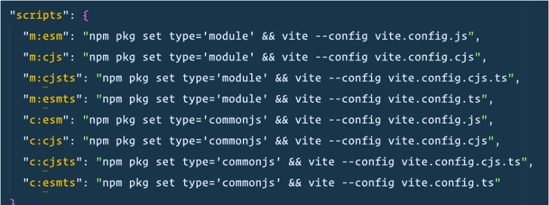

# 【翻译】CommonJS 正在破坏 JavaScript

> 原文地址：https://deno.com/blog/commonjs-is-hurting-javascript

JavaScript 是 Web 开发领域无可争议的王者，但它正在遭到破坏——不是被竞争对手的语言或革命性的新技术所破坏，而是被自己过去的包袱所破坏。这个阴险的破坏者不是别的，正是我们已经容忍了太久的老式模块系统 [CommonJS](https://en.wikipedia.org/wiki/CommonJS)。

## CommonJS 的兴起

JavaScript 诞生约 15 年后，开始从浏览器扩展到服务器。越来越多的大型项目开始使用这种语言，JavaScript 需要一种更好的方法来处理大量源代码。它需要模块化。

2009 年，Mozilla 开发人员 Kevin Dangoor 发出号召。在 ["What Server Side JavaScript needs"](https://www.blueskyonmars.com/2009/01/29/what-server-side-javascript-needs/)一文中，他列出了服务器端 JS 这一新生领域所缺少的许多东西，其中包括模块系统。

> JavaScript 需要一种标准的方式来包含其他模块，并让这些模块生活在独立的命名空间中。有一些简单的方法可以实现命名空间，但却没有标准的编程方式来加载模块（一次！）。这一点非常重要，因为服务器端应用程序可能包含大量代码，而且可能会混合和匹配符合这些标准接口的部分。
>
> — Kevin Dangoor, [What Server Side JavaScript needs (2009)](https://www.blueskyonmars.com/2009/01/29/what-server-side-javascript-needs/)

一周之内，就有 224 人加入了当时所谓的 [ServerJS google group](https://groups.google.com/g/commonjs)，其中包括 npm 创始人 Issac Schlueter 和 Node.js 创建者 Ryan Dahl（这里是他向小组介绍 Node 的地方）。这个小组列表的成员将继续规范 CommonJS 的最初版本，即后来成为 Node 一部分的模块系统。

提议的 CommonJS 语法（`require()`、`module.exports` 等）看起来并不像客户端 JavaScript。这是有意为之的。2009 年，Dangoor 在 ServerJS google group 中发布的信息，清楚地表明了他要将 CommonJS 与浏览器 JavaScript 区分开来的意图：

> 我真的认为，服务器端代码的需求与客户端代码的需求有很大不同，我们最好借鉴 Python 和 Ruby，而不是 Dojo 和 jQuery。

除了 Node.js，其他一些早期的服务器端 JavaScript 运行时也采用了 CommonJS，如 Flusspferd、GPSEE、Narwhal、Persevere、RingoJS、Sproutcore 和 v8cgi（大部分由 CommonJS 核心小组构建）。

但随着使用 CommonJS 作为模块系统的 Node.js 成为事实上的服务器端 JavaScript 运行时后，CommonJS 的广泛标准化工作失去了动力。当只有一个主要运行时时，对标准的需求就会减少：Node.js 实现成为了标准。

> 现在回过头来看，我觉得 CommonJS 的目标似乎是（或者至少应该是）发现 Node，并使我们在这里构建的一切成为可能。我们犯了一些错误，因为事后看来并没有朝着想要的方向发展，但总体而言，我认为整个 CommonJS 项目可以说是成功的。
>
> — Issac Schlueter, 评论在 [Breaking the CommonJS standardization impasse](https://github.com/nodejs/node-v0.x-archive/issues/5132#issuecomment-15503151) (2013)

尽管 CommonJS 是默认的模块系统，但它仍存在一些主要的问题：

- **模块加载是同步的**。每个模块都按照需要的顺序逐个加载和执行。
- **难以进行 tree shake**。tree shake可以移除未使用的模块并最小化构建包的大小。
- **非浏览器原生**。你需要打包器和转换器来使所有这些代码在客户端运行。而使用 CommonJS，要么需要[大量的构建步骤](https://deno.com/blog/you-dont-need-a-build-step)，要么需要为客户端和服务器分别编写代码。

到了 2013 年，CommonJS 小组开始逐渐解散。但就在那一年，负责监督 JavaScript 核心语言更新的 TC39 委员会已经开始着手开发 CommonJS 的接替模块：ECMAScript 模块。

## 网络优先的 ECMAScript 模块

随着 [ES6 语言规范](https://262.ecma-international.org/6.0/) 的发布，TC39 委员会终于在 JavaScript 语言中直接引入了模块系统。其目标是建立一个适用于网络的单一模块加载器系统，包括异步模块加载、浏览器兼容性、静态分析和 tree shaking。

[ES modules 假定它们将通过网络而不是文件系统获取数据](https://hacks.mozilla.org/2018/03/es-modules-a-cartoon-deep-dive/)，从而提供更好的性能和用户体验。

既然模块加载系统已经内置于语言中，那么每个人都会同意使用该系统，这样我们就能将精力集中在更高层次、更重要的问题上，不是吗？

对不对？

## Node 决定同时支持 CJS 和 ESM

> ES Modules 和 CommonJS 就像老海湾调味料和香草冰淇淋一样相得益彰。
>
> — Myles Borins, 源自演讲 [Modules Modules Modules](https://www.youtube.com/watch?v=W5CXzo4TZVU)

(我来自马里兰州，所以这听起来很不错）。

Borins 是 Node "模块团队" 的开发人员之一，该团队的任务是在 Node 中实现 ES Modules。尽管该团队成功地将 ESM 添加到了 Node 中，但却未能就 ESM 与 CJS 之间的互操作性达成明确共识。然而，由于 CJS 已经深深嵌入了 Node，因此 Node 无法将其剥离。这意味着互操作性问题被推给了软件包作者。

下面是同时支持 ESM 和 CJS 的模块 `package.json` 的片段：

[*"发布可在 esm 和 cjs 中运行的软件包真是一场噩梦"*](https://twitter.com/wesbos/status/1610385221324619780) *—— Wes Bos*

[其他模块作者使用 dnt 成功地支持了 CommonJS 和 ESM](https://frontside.com/blog/2023-04-27-deno-is-the-easiest-way-to-author-npm-packages/)。只需用 TypeScript 编写模块，该构建工具就会将其转换为 Node.js，生成 ESM/CommonJS/TypeScript 声明文件和 `package.json`。

显然，在 2023 年支持 CommonJS 已成为一个不容忽视的大问题。是时候抛弃 CommonJS 并过渡到全 ESM 的未来了。

## 再见，感谢所有的 `require`

>  我们设想在未来，安装模块后，开发人员无需构建步骤就能在 Node.js 或浏览器中运行代码。
>
> — Myles Borins, [The Current State of Implementation and Planning for ESModules](https://medium.com/the-node-js-collection/the-current-state-of-implementation-and-planning-for-esmodules-a4ecb2aac07a) (2017)

2009 年，CommonJS 正是 JavaScript 所需要的。该小组解决了一个棘手的问题，并强行通过了一个解决方案，该解决方案每天仍被使用数百万次。

但是，随着 ESM 成为标准，聚焦的重点转变到了 CommonJS 无法胜任的云原生（边缘、浏览器和 serverless 计算）。对开发人员来说，ESM 是更好的解决方案，因为他们可以编写符合浏览器标准的代码；对用户来说，他们可以获得更好的终端体验。

[加入讨论](https://news.ycombinator.com/item?id=36537533)。