# 记一次 Electron-vue 项目开发踩坑与问题解决

## （一）前言 ✈️️

前阵子，我在公司接手开发了一个electron的客户端项目，需要在原有老项目工程的基础上做增量开发，实际业务开发时需要对接C++ SDK。

所拉取项目是基于 [electron-vue](https://github.com/SimulatedGREG/electron-vue) 模版搭建的，看了下至今electron-vue项目的 github star 数量，15.3K，不错，应该用起来问题不大。

谁曾想，被项目从头坑到尾，一个坑出来后，又会进入另外一个坑😂️。

这些坑，有些网上甚至找不到任何资料协助排查，没办法，只得硬着头皮搞。经过连续加班排查后，最终解决了所有面临的疑难问题。

因此，打算搞篇文章记录下开发过程中面临的问题以及解决思路。


## （二）开发前踩坑与问题解决 🎯

### 1. 全局安装 node-gyp 失败

前面说到，项目开发过程中需要对接C++ SDK接口，因此需要用到node-gyp。

默认情况下，直接通过 `npm i node-gyp -g` 是不行的，因为需要一些特定的环境。

详情参看：[npm-node-gyp](https://www.npmjs.com/package/node-gyp)。

因为项目依赖的 `node-gyp` 是 `3.8.0` 版本，所以相应需要做的安装前置操作为：

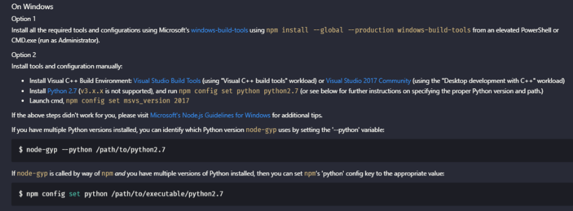

如果上述2个软件环境没有完全匹配要求安装成功，则在项目中执行 `yarn install` 时会出现如下类似的错误：

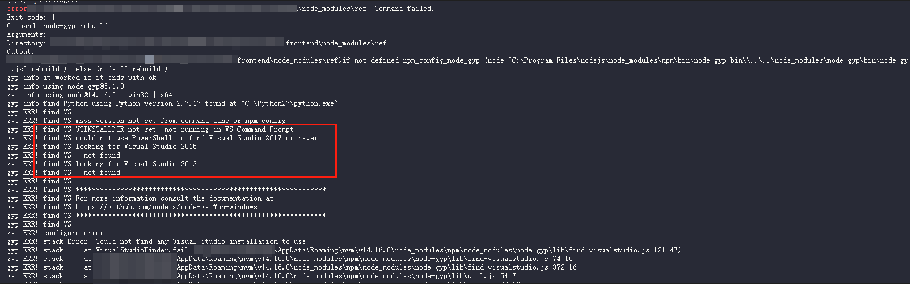

因此请务必确保前置操作涉及的软件环境安装成功。

如果出现如下错误：

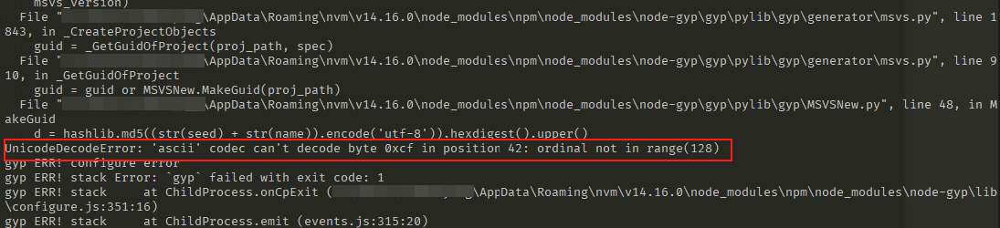

则可以按照 [解决UnicodeDecodeError: 'ascii' codec can't decode byte 0xcf in position 7: ordinal not in range(128)](https://www.cnblogs.com/ingd/p/6185347.html) 文章修改下编码。

另外，尤其需要注意的一点，由于项目中绑定的是 `node-gyp@3.8.0`，如果用最新版本则 `node-gyp rebuild` 操作无法成功，因此安装时需要指定版本安装：`npm i node-gyp@3.8.0 -g`，如此，安装项目依赖时才能成功锁定版本：

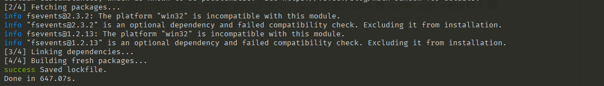


### 2. 项目启动失败

依赖安装成功后，执行 `npm run dev` 命令启动项目，会发现启动的客户端界面是空白的，敲击 `ctrl + shift + i` 组合键打开客户端的 `Developer Tools`，会看到如下报错信息：

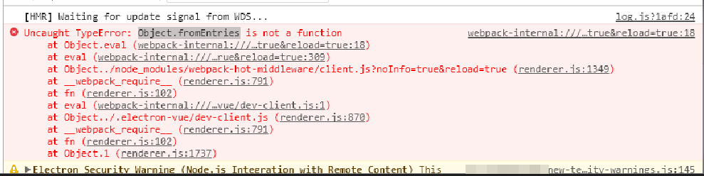

问了下chatGPT，和比对了下当前客户端electron涉及的软件环境版本，截图放到一起可以看到：

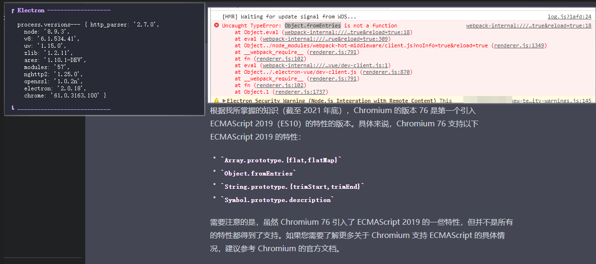

当前electron涉及的chromium大版本为 61，而 `webpack-hot-middleware` 依赖中用到了 `Object.fromEntries` 这个API，该API得等到 `chromium 76` 才被引入，因此 `Object.fromEntries` 打印输出是 `undefined` 的：

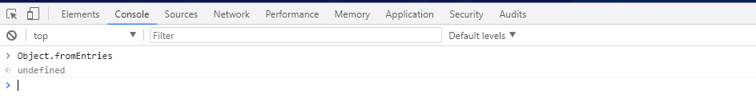

解决方法是在 `webpack-hot-middleware` 依赖中重写实现涉及 `Object.fromEntries` API的代码逻辑，然后通过 [patch-package](https://www.npmjs.com/package/patch-package) 工具去生成补丁实现代码线上线下同步：

```javascript
// node_modules/webpack-hot-middleware/client.js

var genOverrides = function (queryList) {
  var res = {};
  for (var i = 0; i < queryList.length; i++) {
    var item = queryList[i];
    res[item[0]] = item[1];
  }
  return res;
}

if (__resourceQuery) {
  // var overrides = Object.fromEntries(
  //   new URLSearchParams(__resourceQuery.slice(1))
  // );
  var overrides = genOverrides(
    new URLSearchParams(__resourceQuery.slice(1))
  );
  setOverrides(overrides);
}
```

当然了，还有另外一种方案，那就是升级 electron 到支持 `Object.fromEntries` 这个API的版本。

不过这种方案有可能会带来 breaking change，导致现有代码无法运行，也可能导致项目依赖需要做调整，因此**操作时需谨慎**！


## （三）开发中踩坑与问题解决 🎯

### 1. 使用的 electron API 不生效

当时开发时，一个功能的实现需要借助事件总线技术。

在electron程序中，自然而然地想用 ipc 技术来实现 `主进程 <-> 渲染进程` 或者 `渲染进程 <-> 渲染进程` 通信。

这个时候尤其要注意electron的版本，因为electron版本迭代速度太快了，很多api无法生效很大概率是因为新的electron不向下兼容了。

我当时开发的electron版本如下（主进程中通过 `process.versions` 代码可以获取到）：

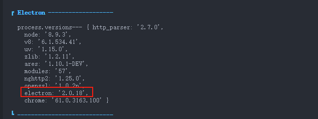

因此需要去electron github官网上切换到对应的 tag，进而找到对应的api文档：[v2.0.18-api](https://github.com/electron/electron/tree/v2.0.18/docs/api)。

by the way，至于为啥版本更迭这么快，一个很重要的原因是electron底层依赖的Chromium版本更迭太快了（看看自己Chrome浏览器更新的速度就知道～），致使electron不得不因此对一些功能或者api做出对应的修改。


## （四）开发完踩坑与问题解决 🎯

### 1. 执行 yarn build 命令构建打包exe程序失败

项目根目录下输入 `yarn build` 进行打包时，可能会出现如下报错：


执行如下命令安装下就可以解决该报错：

```bash
$ yarn add worker-loader@2.0.0 -D
```

继续执行 `yarn build` 可能会又出现如下报错：

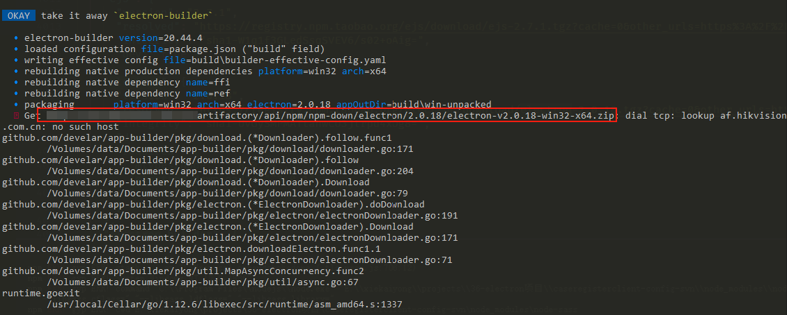

把上述链接拎出来访问下，会发现是 404 的。解决方案是修改根目录 `.npmrc` 文件，指定 electron下载源为国内源即可：

```js
ELECTRON_MIRROR=https://npmmirror.com/mirrors/electron/
```

另外，因为打包用的是 electron-builder，实测发现把 `package.json` 文件中的 `build.asar` 字段设置为 true 会有问题，因此请保持为 false 即可。


### 2. 打包出来的exe程序不能在其他window电脑正常运行

终于呀，把上述问题解决掉后，打出来 exe 包了，而且这个exe包在我自己电脑是可以正常运行的。

不过，当放到现场环境之后，我傻了，客户端运行完出问题了。

这个问题排查了好久，基于每一次猜测，验证，验证无效后推翻重新猜测😩。

不过最终定位到了问题，页面显示不正常是由于一个依赖 `HCNetSdk` 未写回 `dependencies` 字段中所致（至于为啥没有一开始就放在 `dependencies`，是因为这个依赖是本地 `npm link` 出来的，仓库源中不存在，直接 `install` 会找不到）。

那为啥没写回就会有问题呢？

看一下 exe 包输出成果物可以发现直接原因，当我没有将依赖 `HCNetSdk` 写回 `dependencies` 字段，查看下 `/resources/app/dist/electron/renderer.js` ，可以看到：

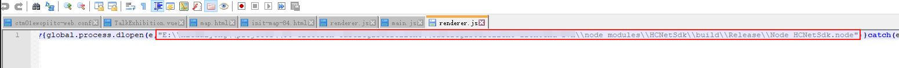

即打出来的 `renderer.js` 中引用这个 `HCNetSdk` 依赖有问题（路径被 webpack resolve 为**绝对路径**了），路径捆绑上我自己电脑的盘符信息，所以在我电脑打开是正常的，因为能索引获取到，但其他电脑是获取不到的。

而如果写回去了，看到的是：

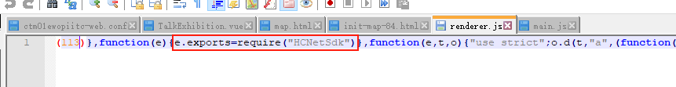

这里没有捆绑上任何的盘符信息，基于 require 的依赖查找机制，因为 `electron-builder` 把 `HCNetSdk` 打进最终包里边了，所以在所有电脑里边都是可以正常运行的。

依赖在exe包中位置如下：

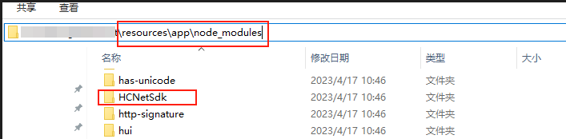

导致以上2种不同解析结果的根本原因，在 `<项目根目录>/.eletron-vue/webpack.renderer.config.js` 源码中可以找到，涉及的核心代码为：

```js
let whiteListedModules = ['vue']

let rendererConfig = {
  entry: {
    renderer: path.join(__dirname, '../src/renderer/main.js'),
  },
  externals: [
    ...Object.keys(dependencies || {}).filter(d => !whiteListedModules.includes(d))
  ]
}
```

不放入 `whiteListedModules` 中的依赖，会被webpack作为外部依赖（externals）处理，不会被打包放到最终的bundle中，`electron-vue`官方文档对这块有说明，详见：[Webpack 配置](https://simulatedgreg.gitbooks.io/electron-vue/content/cn/webpack-configurations.html)。

而这些外部依赖最终会被 `electron-builder` 直接拷贝放到上述所示的exe包依赖目录 `node_modules`，因为 `package.json` 文件中的 `build.asar` 字段值为 false。

`build.asar` 设置为 true 或 false，对项目依赖 node_modules 的处理是不同的，具体说明如下（from chatGPT）：

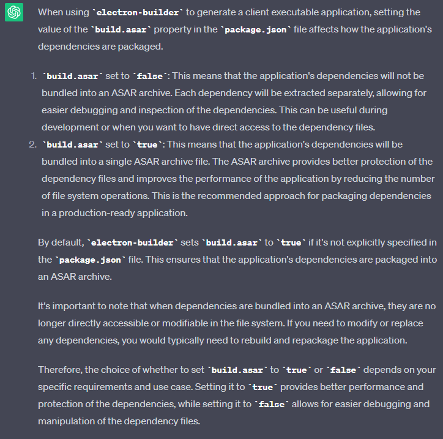


### 3. exe程序运行时如何调试代码

打包出来的exe程序包，安装到windows系统上之后，是不能像开发环境那样打开 `Developer Tools` 调试遇到的问题，也不能像传统web项目借助sourcemap来调试。

此时，需要有一种方案，**支持程序运行时，输出源码中关键位置的日志信息到日志文件中**，以协助我们排查问题。

下边说说，我当时是如何做**客户端日志埋点**的。

首先通过 nodejs，封装了日志文件写入读取的 `LogHandler` 类，核心代码如下：

```js
// log-handler.js
import fs from 'fs'
import path from 'path'
import moment from 'moment'

const DEBUG = process.env.NODE_ENV === 'development'

// 写入日志文件路径
let electronLogPath
if (!DEBUG) {
  electronLogPath = `${__dirname.substring(0, __dirname.indexOf('app'))}\\electron-log\\`
} else {
  electronLogPath = `${process.cwd()}\\electron-log\\`
}

const resolve = fileName => path.resolve(electronLogPath, fileName)

const isObject = value => value !== null && typeof value === 'object'

const logFormatter = ({ fileName, row, msg, logLevel }) => {
  if ((fileName && !row && !msg) || (fileName && row && !msg)) {
    msg = `${fileName}${row}`
    fileName = null
    row = null
  }

  const actionTime = moment().format('YYYY-MM-DD HH:mm:ss')
  const msgStr = isObject(msg) ? JSON.stringify(msg) : msg

  return `${actionTime} ${logLevel} [${fileName}:${row}] - ${msgStr}\n`
}

/**
 * @description 辅助renderer进程调试埋点日志输出
 * @date 2023-04-11
 */
export default class LogHandler {
  static debug = true

  constructor() { }

  /**
   * @description 写入日志文件
   * @date 2023-04-11
   * @static
   * @param {string} fileName renderer进程中输出日志的文件名
   * @param {number} row 输出日志的行，大致就行
   * @param {string} msg 输出日志具体信息
   * @param {string} logLevel 输出日志级别 INFO/WARNING/ERROR
   * @memberof LogHandler
   */
  static writeLog ({ fileName, row, msg, logLevel = 'INFO' }) {
    if (!LogHandler.debug) return

    // 日志文件输出的时间跨度是一天
    const today = moment().format('YYYY-MM-DD')
    const logFileName = `LOG_${today}.log`
    const absoluteFileName = resolve(logFileName)
    const output = logFormatter({ fileName, row, msg, logLevel })

    if (!fs.existsSync(electronLogPath)) {
      // 创建文件夹
      fs.mkdirSync(electronLogPath)
    }

    try {
      // 文件不存在则创建，然后追加写入
      fs.writeFileSync(absoluteFileName, output, { flag: 'a+' })
    } catch (error) {
      fs.writeFileSync(
        absoluteFileName,
        logFormatter({
          fileName: 'log-handler.js',
          row: 70,
          msg: `写入日志文件失败${error.message}`,
          logLevel: 'ERROR'
        }),
        { flag: 'a+' }
      )
    }
  }

  /**
   * @description 读取日志文件
   * @date 2023-04-11
   * @static
   * @param {string} logFileName 日志文件名，示例文件：LOG_2023-04-11.log
   * @return {string} 
   * @memberof LogHandler
   */
  static readLog (logFileName) {
    if (!LogHandler.debug) return

    const absoluteFileName = resolve(logFileName)

    try {
      const fileContent = fs.readFileSync(absoluteFileName)
      return fileContent
    } catch (error) {
      fs.writeFileSync(
        absoluteFileName,
        logFormatter({
          fileName: 'log-handler.js',
          row: 101,
          msg: `读取日志文件失败${error.message}`,
          logLevel: 'ERROR'
        }),
        { flag: 'a+' }
      )
    }
  }
}
```

其次拦截 `console` 对象中常见的方法，在日志输出处做埋点，针对不同环境做不同处理：

```js
// console-hack.js

/**
 * @description console hack操作，拦截 console 对象常用使用方法
 * @date 2023-04-11
 */
import LogHandler from './log-handler'

const DEBUG = process.env.NODE_ENV === 'development'

const originConsoleLog = window.console.log
const originConsoleInfo = window.console.info
const originConsoleWarn = window.console.warn
const originConsoleError = window.console.error

window.console.log = function (...args) {
  return DEBUG
    ? originConsoleLog.apply(null, args)
    : LogHandler.writeLog({
      fileName: args[0],
      row: args[1],
      msg: args.slice(2).join(''),
      logLevel: 'INFO',
    })
}

window.console.info = function (...args) {
  return DEBUG
    ? originConsoleInfo.apply(null, args)
    : LogHandler.writeLog({
      fileName: args[0],
      row: args[1],
      msg: args.slice(2).join(''),
      logLevel: 'INFO',
    })
}

window.console.warn = function (...args) {
  return DEBUG
    ? originConsoleWarn.apply(null, args)
    : LogHandler.writeLog({
      fileName: args[0],
      row: args[1],
      msg: args.slice(2).join(''),
      logLevel: 'WARNING',
    })
}

window.console.error = function (...args) {
  return DEBUG
    ? originConsoleError.apply(null, args)
    : LogHandler.writeLog({
      fileName: args[0],
      row: args[1],
      msg: args.slice(2).join(''),
      logLevel: 'ERROR',
    })
}
```

然后在渲染进程 `main.js` 入口文件中导入该 `console-hack` 文件，实现全局对 `window.console` 常见打印方法的拦截：

```js
// src/renderer/main.js

require('./util/console-hack')
```

接着就可以在代码关键位置出做日志埋点输出了：

```js
console.log('App.vue', 37, '1000秒设置定时返回~')
```

打包出来的exe客户端程序运行时，就会生成类似如下的文件 `LOG_2023-04-13.log`（路径：`/resources/electron-log`）内容了：

```text
2023-04-13 10:21:34 INFO [main.js:29] - Node_HCNetSdk: {}
2023-04-13 10:22:33 INFO [faceLogin.vue:106] - 初始化player成功~
2023-04-13 10:22:33 INFO [faceLogin.vue:137] - 开启定时关闭扫描框
2023-04-13 10:24:21 INFO [main.js:29] - Node_HCNetSdk: {}
2023-04-13 10:24:27 INFO [faceLogin.vue:106] - 初始化player成功~
2023-04-13 10:24:27 INFO [faceLogin.vue:137] - 开启定时关闭扫描框
2023-04-13 10:29:12 INFO [main.js:29] - Node_HCNetSdk: {}
......
```

据此就可以在编辑器中通过 `ctrl + g` 或者 `ctrl + f` 查找定位到对应位置，展开后续问题调试排查工作。

## （五）总结 🚄

至此，文章就写完了。

写完这篇文章，可能只需要花费几个小时的时间，但是，文中提及到的问题，有些坑的排查与解决花费了我一两天才找到问题根源。排查问题很痛苦，不过，解决了问题就很爽，只能说，“痛并快乐着”！

另外，基于本次项目的开发经验，我在公司内部gitlab iris平台上搞了个仓库 `electron-vue-demo`，修复了官方 `electron-vue` 模版项目中发现的问题。不过考虑到外部github上有更优的针对electron项目开发的解决方案，外部就不放了。

希望给面临类似问题的小伙伴提供排错参考！

## （六）参考资料 📝

- [electron-vue官方中文文档](https://simulatedgreg.gitbooks.io/electron-vue/content/cn/)
- [Electron-vue开发实战4——通过CI发布以及更新的方式](https://molunerfinn.com/electron-vue-5)

<Giscus
  repo="xkyong/blogs"
  repo-id="R_kgDOMk5dyA"
  category="Announcements"
  category-id="DIC_kwDOMk5dyM4ChwJe"
  mapping="title"
  reactions-enabled="1"
  emit-metadata="0"
  input-position="top"
  theme="preferred_color_scheme"
  lang="zh-CN"
  loading="lazy"
/>
