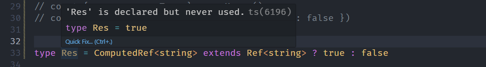
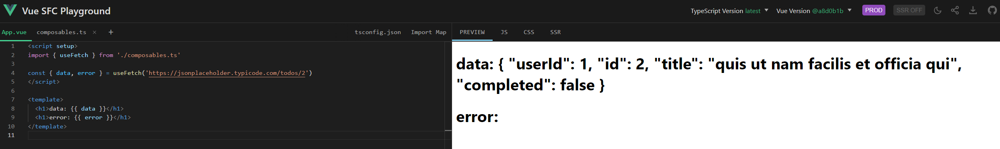
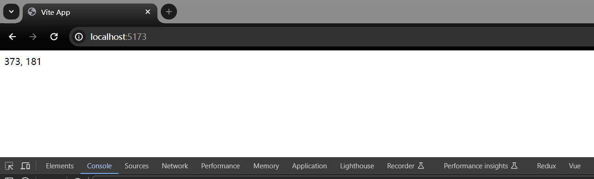
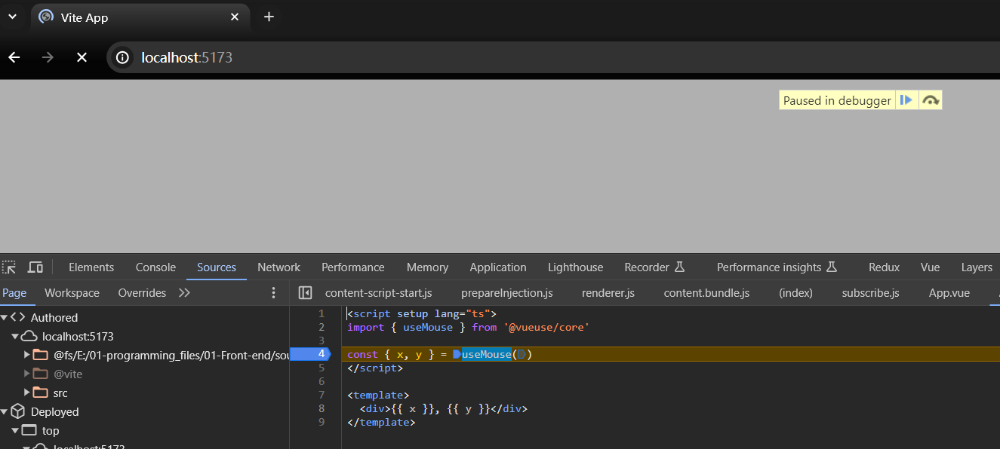
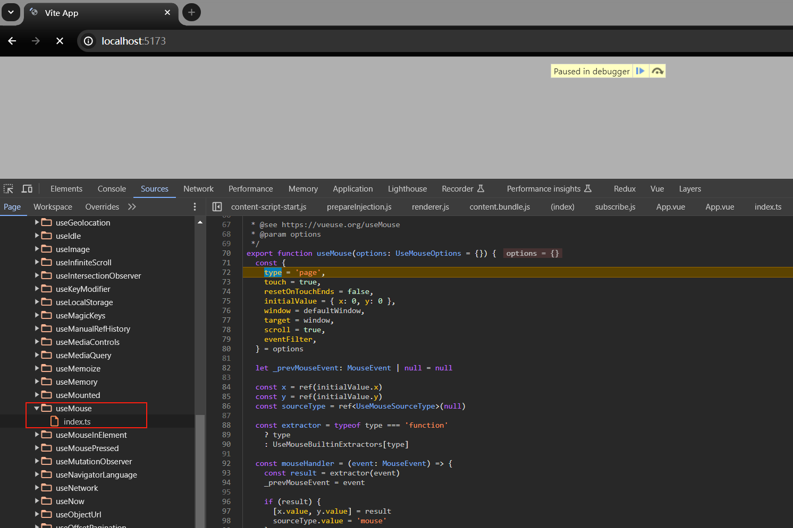

# 唠唠我从 VueUse 源码中学到的 Composable 函数编写技巧

## （一）前言

Vue 3 版本中引入了组合式 API (Composition API) ，使我们可以使用函数的方式来组织 Vue 组件代码逻辑。相较于选项式 API (Option API)，组合式 API 的写法带来的好处是比较明显的，因此，目前自己在 Vue 项目（`Vue >= 2.7` 或者 `Vue@3`）中基本都是用组合式 API 来编写代码。

也是因为使用的比较多，在使用组合式 API 编写 Composable 函数的过程中，难免会思考如何才能把函数写得更优雅，如何才能保障良好的封装性和代码可读性，因此在网上试着找了下，恰好看到社区 [antfu 大佬](https://github.com/antfu) 搞了个 [VueUse](https://vueuse.org/) 库，里边有一系列基于 Composition API 编写的工具函数，不管是仓库的文件组织，还是工具函数的源码实现，甚至于一些 TypeScript 的类型编程实现，都值得我们的学习和借鉴。

这段时间，在公司实际业务项目中用了 VueUse 一段时间后，自己花了点时间阅读了 VueUse 库底层的源码实现，学到了不少 Composable 函数的编写技巧，我做了下整理，因此，就有了这篇文章。

## （二）编写技巧

### 技巧1：使用可选 `options` 对象参数

实际编写  Composable 函数时，对于必须传入的参数，可以占据1个单独的形参位置，否则的话，可以作为可选 `options` 对象参数的属性传入，进而提高 Composable 函数的可配置性。

实际使用该 `options` 对象时，可解构该对象，然后给属性设置必要的默认值。

先以 `useTitle` 函数为🌰️，源代码在这：[VueUse-useTitle](https://github.com/vueuse/vueuse/blob/main/packages/core/useTitle/index.ts)，下边只列出涉及的代码片段：

```ts
export type MaybeRefOrGetter<T> = MaybeRef<T> | (() => T)

export interface ConfigurableDocument {
  document?: Document
}

export type UseTitleOptionsBase =
{
  observe?: boolean
}
| {
  titleTemplate?: MaybeRef<string> | ((title: string) => string)
}

export type UseTitleOptions = ConfigurableDocument & UseTitleOptionsBase

export function useTitle(
  newTitle: MaybeRefOrGetter<string | null | undefined> = null,
  options: UseTitleOptions = {},
) {
  const {
    document = defaultDocument,
  } = options
  
  // 省略其他代码...
}
```

可以看到，`useTitle` 接受一个必要的 `newTitle` 参数和一个可选的 `options` 对象参数，因此，我们可以如下使用：

```ts
import { ref } from 'vue'
import { useTitle } from '@vueuse/core'

// 1.不传入 options 参数 
const title = useTitle('testTitle')
// => document.title = "testTitle"

// 2.额外传入 options 参数，格式化 document.title
const title = useTitle('testTitle', {
  titleTemplate: '%s-%s'
})
// => document.title = "testTitle-testTitle"
```

然后是 [VueUse-useMouse](https://github.com/vueuse/vueuse/blob/main/packages/core/useMouse/index.ts) 🌰️，涉及的代码片段：

```ts
export type MaybeRefOrGetter<T> = MaybeRef<T> | (() => T)

export interface ConfigurableWindow {
  window?: Window
}

export interface ConfigurableEventFilter {
  eventFilter?: EventFilter
}

export interface Position {
  x: number
  y: number
}

export type UseMouseCoordType = 'page' | 'client' | 'screen' | 'movement'
export type UseMouseEventExtractor = (event: MouseEvent | Touch) => [x: number, y: number] | null | undefined

export interface UseMouseOptions extends ConfigurableWindow, ConfigurableEventFilter {
  type?: UseMouseCoordType | UseMouseEventExtractor
  target?: MaybeRefOrGetter<Window | EventTarget | null | undefined>
  touch?: boolean
  scroll?: boolean
  resetOnTouchEnds?: boolean
  initialValue?: Position
}

export export function useMouse(options: UseMouseOptions = {}) {
  const {
    type = 'page',
    touch = true,
    resetOnTouchEnds = false,
    initialValue = { x: 0, y: 0 },
    window = defaultWindow,
    target = window,
    scroll = true,
    eventFilter,
  } = options
  
  // 省略其他代码...
}  
```

可以看到，`useMouse` 没有必传参数，因此只有一个可选的 `options` 对象参数。另外实际解构该 `options` 对象时，对象的属性都设置了必要的默认值，确保函数能够正常按照默认的方式运行。

使用方式就很简单了，如下：

```ts
import { useMouse } from '@vueuse/core'

// 1.不传入 options 参数 
const { x, y, sourceType } = useMouse()

// 2.额外传入 options 参数，禁用掉 touch 检测
const { x, y, sourceType } = useMouse({ touch: false })
```

VueUse 中有大量的 Composable 函数用到了该技巧，对其他函数感兴趣的，建议自己去翻阅看看！


### 技巧2：使用 `ref` 或 `unref` 处理传入的参数

当接收到用户传入的参数且需要兼容多种参数类型时，Composable 函数内部可以使用 `ref` 或者 `unref` 函数对参数进行处理，以提高参数使用的灵活性。

在举🌰️前，先说明一个点，那就是如果将⼀个 ` Ref` 值传递给 ` ref()` 函数，它将会原样将其返回：

```ts
const foo = ref(1) // Ref<1>
const bar = ref(foo) // Ref<1>

foo === bar // true
```

```ts
function useFoo (foo: Ref<string> | string) {
  // 不需要额外操作
  const bar = isRef(foo) ? foo : ref(foo)
  
  // 与上⾯的代码等效
  const bar = ref(foo)
  /* ... */
}
```

`ref()` 函数的这个特性，在编写不确定参数类型的函数时十分有用，如果是用 TypeScript 编写的话，以下这几个工具类型常常是配合一起使用的：

```ts
type ReadonlyRefOrGetter<T> = ComputedRef<T> | (() => T)
type MaybeRef<T> = T | Ref<T>
type MaybeRefOrGetter<T> = MaybeRef<T> | (() => T)
```

比如 `MaybeRef` 与 `ref` 和 `unref` 函数的配合使用，例子如下：

```ts
type MaybeRef<T> = Ref<T> | T

function useBala<T>(arg: MaybeRef<T>) {
  const reference = ref(arg) // 得到 ref
  const value = unref(arg) // 得到值
}
```

ok，接下来举个实际 Composable 函数的🌰️来讲，这里还是以 [VueUse-useTitle](https://github.com/vueuse/vueuse/blob/main/packages/core/useTitle/index.ts) 为例，涉及的代码片段：

```ts
// 重载签名1
export function useTitle(
  newTitle: ReadonlyRefOrGetter<string | null | undefined>,
  options?: UseTitleOptions,
): ComputedRef<string | null | undefined>

// 重载签名2
export function useTitle(
  newTitle?: MaybeRef<string | null | undefined>,
  options?: UseTitleOptions,
): Ref<string | null | undefined>  

// 实现签名
export function useTitle(
  newTitle: MaybeRefOrGetter<string | null | undefined> = null,
  options: UseTitleOptions = {},
) {
  const {
    document = defaultDocument,
  } = options

  const title: Ref<string | null | undefined> = toRef(newTitle ?? document?.title ?? null)
  const isReadonly = newTitle && typeof newTitle === 'function'

  watch(
    title,
    (t, o) => {
      // ...
    },
    { immediate: true }
  )
	
  // 省略其他代码...

  return title
}
```

```ts
// 省略函数重载签名...
export function toRef(...args: any[]) {
  if (args.length !== 1)
    return vueToRef(...args as [any, any])
  const r = args[0]
  return typeof r === 'function'
    ? readonly(customRef(() => ({ get: r as any, set: noop })))
    : ref(r)
}
```

如上代码，核心的是 `const title: Ref<string | null | undefined> = toRef(newTitle ?? document?.title ?? null)` 这行代码，因为 `newTitle` 参数需要兼容多种类型使用的情况，因此这里调用了 `toRef` 函数对 `newTitle` 参数进行处理，然后转成类型为 `Ref<string | null | undefined>` 的变量 `title`。

实际使用时，对于 `newTitle` 这个参数，是可以有多种使用方式的：

```ts
import { ref, computed } from 'vue'
import { useTitle } from '@vueuse/core'

// 1.直接调用，或者传入原始值
const title = useTitle()
const title = useTitle('testTitle')

// 2.传入 `ref` 值
const initialTitle = ref('testTitle')
const title = useTitle(initialTitle)

// 3.传入 `computed` 值或者 () => T 函数
const initialTitle = ref('testTitle')
const computedTitle = computed(() => initialTitle.value)
const title = useTitle(computedTitle)
const title = useTitle(() => 'testTitle')
```

这里要注意一点的时，当使用如上第3种方式时，返回的 `title` 是 `ComputedRef<string>` 类型，该类型是 `Ref<string>` 的子类型，也对应了上边函数重载签名1：




VueUse 中也有大量的 Composable 函数用到了该技巧，对其他函数感兴趣的，建议自己去翻阅看看！


### 技巧3：响应式处理异步代码

利用 Vue 提供的响应式系统，在不阻塞 `setup` 函数执行的情况下，安全可靠地编写涉及异步代码的 Composable 函数，尽管 Vue 提供了一个用以配合处理 `async setup()` 代码的实验性内置组件：[Suspense](https://cn.vuejs.org/guide/built-ins/suspense.html)。

处理核心是先建立数据间的“连结” ，然后再等待异步请求返回将数据填充。

VueUse 中典型的🌰️有 [VueUse-useFetch](https://github.com/vueuse/vueuse/blob/main/packages/core/useFetch/index.ts) 这个函数，源码涉及的内容太多，这里简化下：

```ts
import { shallowRef, unref } from 'vue'
import type { MaybeRef } from 'vue'

export function useFetch<T>(url: MaybeRef<string>) {
  const data = shallowRef<T | undefined>()
  const error = shallowRef<Error | undefined>()
  
  fetch(unref(url))
    .then(r => r.json())
    .then(r => data.value = r)
    .catch(e => error.value = e)
  
  return {
    data,
    error
  }
}
```

如上，当我们调用 `useFetch` 函数时，内部会直接执行 `fetch` 方法去访问 `url`，然后将 `ShallowRef` 类型的 `data` 和 `error` 返回给用户使用。当访问成功拿到数据后，`data` 值会发生变化，错误发生时则 `error` 值会发生变化，页面中用到这2个值的地方，会在 Vue 的响应式系统下，自动更新为变化后的内容。

这里有个使用🌰️，代码放在 [Vue SFC Playground](https://play.vuejs.org/#eNp9U01v2zAM/SuCLnaAwMbWW+Aa2IYM2IB9oMtRF1emY3eKZEhUliLzfx8l1W6CBT34g3yP5KP8fOYfxrE4euAbXjlphxGZA/RjLfRwGI1FdmbewWdA2bOJddYcWFaU0hDomkcFrkCXCS20NNoFdttgs2ZgrbFUcL9U51mPOLpNWT45o0fVSOiNasEW+DwO0rRQUNcSTWtc+T5bCV2VSRFpoQDhQEUIFDFW9e/qMGjDzmkim6aqpOQMxvkRfVEyw1V50YivOToS3g37IqiiUziHDoKHBQcF9seIAy0mOPUKSMAapcyfrzGH1sN6zsse5O8b+Sd3CjnBf1pwYI8g+IJhY/eACd7++g4nel/Ag2m9IvYb4AM4o3zQmGgfvW5J9gUvqv0Sv+Wg9zu3PSFoNy8VhAbmFPmCkxU+vbH6q9y74i7WCT3RKV77gY5xMY/ro4AH6NbMawvd4iIalQm7+IxcAMT/1jw/0lb/08IFp0jtvJZB2+Ktalfn3qrNUl05tLRtvSLpVMdYcmd0yv2FpmrH/pKsFrpBQ1vnq0t2cs4VfRtTt0rSvYtOj3sGQasXkLECe9A5dauZjVbLb2JBYHFslAeaa18Zsgl9KVknVQsHrsZb+nWtnndm6V+cg1iYgik8Jj79A564WTI=) 上：



使用该技巧的，还有如下几个函数，感兴趣可以看看：

- [VueUse-useAsyncState](https://github.com/vueuse/vueuse/blob/main/packages/core/useAsyncState/index.ts)

- [VueUse-useAsyncQueue](https://github.com/vueuse/vueuse/tree/main/packages/core/useAsyncQueue/index.ts)


### 技巧4：动态输出函数返回值

Composable 函数可以动态输出函数返回值，默认情况下可以只输出一个值，当用户需要对输出值有更细粒度的控制时，可以给 `options` 对象参数设置某个标识属性（VueUse 中是 `controls` 属性），然后输出包含该值的对象，同时该对象还有输出值的操作函数。

以 `useNow` 函数为🌰️，源代码在这：[VueUse-useNow](https://github.com/vueuse/vueuse/blob/main/packages/core/useNow/index.ts)，下边只列出涉及的代码片段：

```ts
export type Fn = () => void

export interface Pausable {
  isActive: Readonly<Ref<boolean>>
  pause: Fn
  resume: Fn
}

export interface UseNowOptions<Controls extends boolean> {
  controls?: Controls
  interval?: 'requestAnimationFrame' | number
}

export function useNow(options: UseNowOptions<boolean> = {}) {
  const {
    controls: exposeControls = false,
    interval = 'requestAnimationFrame',
  } = options

  const now = ref(new Date())

  const update = () => now.value = new Date()

  const controls: Pausable = interval === 'requestAnimationFrame'
    ? useRafFn(update, { immediate: true })
    : useIntervalFn(update, interval, { immediate: true })

  if (exposeControls) {
    return {
      now,
      ...controls,
    }
  }
  else {
    return now
  }
}
```

可以看到，`useNow` 接受一个可选的 `options` 对象参数，当 `options.controls` 不传或者为 `false` 时，只会输出 `now` 值；当 `options.controls` 为 `true` 时，会输出一个对象，该对象除了 `now` 属性外，还包含 `pause` 和 `resume` 这2个操作函数，`pause` 函数可以暂停 `now` 时间值变化，而 `resume` 函数则可以恢复 `now` 时间值变化。

因此，我们可以如下使用：

```ts
import { useNow } from '@vueuse/core'

// 1.简单使用，useNow 只返回 now 值
const now = useNow()

// 2.需要更多操作，设置 options.controls 为 true，然后我们可以暂停/恢复 now 值变化
const { now, pause, resume } = useNow({ controls: true })
```

使用该技巧的，还有如下几个函数，感兴趣可以看看：

- [VueUse-useTimeAgo](https://github.com/vueuse/vueuse/blob/main/packages/core/useTimeAgo/index.ts)
- [VueUse-useTimestamp](https://github.com/vueuse/vueuse/blob/main/packages/core/useTimestamp/index.ts)
- [VueUse-usePermission](https://github.com/vueuse/vueuse/blob/main/packages/core/usePermission/index.ts)


## （三）其他内容

### VueUse 源码调试

为了更好地了解 VueUse 底层 Composable 函数的执行细节，单单只阅读源代码应该是不太够的，必要的代码调试还是需要的。

而如何对 VueUse 源码进行调试，这里也给出操作步骤。

首先就是把仓库拉到本地，不管是直接 `git clone` ，还是先 `fork` 到自己账户然后再 `git clone`：

```bash
$ git clone https://github.com/vueuse/vueuse
```

 然后使用 pnpm 进行依赖安装，我指定 `registry` 为淘宝镜像源 `https://registry.npmmirror.com/` 进行安装时，发现有些包安装会有问题，因此建议直接用 pnpm 默认的 `registry`，即 `https://registry.npmjs.org/`，此时安装估计还是会有问题，因为镜像源在国外，而如何解决，想必不用我多说：

```bash
$ pnpm install
```

之后打开项目工程，命令行终端执行如下命令启动 `vite` 这个文件夹的 playground：

```bash
$ cd playgrounds/vite
$ pnpm i
$ pnpm dev
```

浏览器访问 `http://localhost:5173/` ，可以看到：



进入 `Sources` 面板，在如下位置打个断点，然后刷新页面：



然后敲击 `F11` 键就可以进入 Composable 函数（这里是 `useMouse`）的源代码中了：



之后就可以进行愉快地调试了。

### 单元测试用例参照

不得不说的一点是，VueUse 底层针对每个 Composable 函数都做了很全面的单元测试，确保了函数能够按照预期进行工作。

VueUse 底层的单元测试用例是通过 [Vitest](https://Vitest.dev/) 测试框架编写的，如果自己项目中想基于 Vitest 来编写测试用例，或者想学习如何编写测试用例，VueUse 也是一个很好的借鉴和学习仓库。

当然，如果没写过单元测试，可以先看看阮一峰大神之前写过的这篇文章：[测试框架 Mocha 实例教程](https://www.ruanyifeng.com/blog/2015/12/a-mocha-tutorial-of-examples.html)，学习完一些理论知识后，结合实践，学得会更多，更快！


## （三）总结

本文基于自己阅读 VueUse 库底层源码的实践，整理输出了4大编写 Composable 函数的编写技巧：

- 使用可选 `options` 对象参数
- 使用 `ref` 或 `unref` 处理传入的参数
- 响应式处理异步代码
- 动态输出函数返回值

另外，还提到了 VueUse 源码调试方法，Vitest 单元测试用例参照等其他跟 VueUse 相关的内容。

除了上边讲到的这些技巧外，VueUse 官方文档有一节关于编写 Composable 函数的指南，内容可作为补充，这里也把链接列下：[VueUse-Guidelines](https://vueuse.org/guidelines.html)。

Happy Coding!


## （四）参考资料

- [Vue.js官方文档-组合式函数](https://cn.vuejs.org/guide/reusability/Composables.html)
- [Coding Better Composables (Series)](https://michaelnthiessen.com/coding-better-Composables/)
- [可组合的 Vue - Anthony Fu](https://antfu.me/posts/Composable-vue-vueconf-china-2021)
- [VueUse-Best Practice](https://vueuse.org/guide/best-practice.html)
- [VueUse-Guidelines](https://vueuse.org/guidelines.html)

<Giscus
  repo="xkyong/blogs"
  repo-id="R_kgDOMk5dyA"
  category="Announcements"
  category-id="DIC_kwDOMk5dyM4ChwJe"
  mapping="title"
  reactions-enabled="1"
  emit-metadata="0"
  input-position="top"
  theme="preferred_color_scheme"
  lang="zh-CN"
  loading="lazy"
/>
