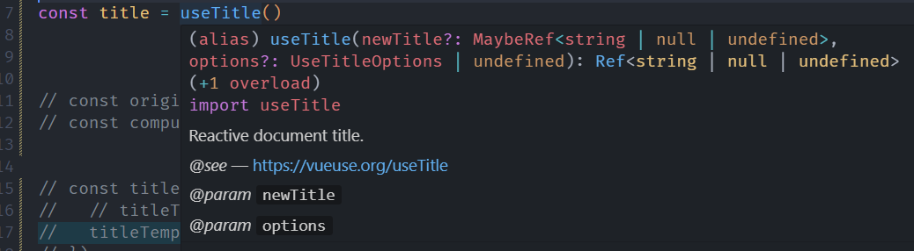
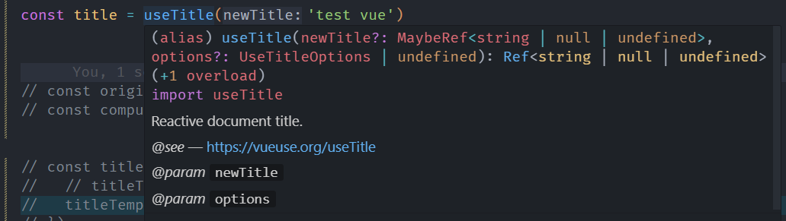
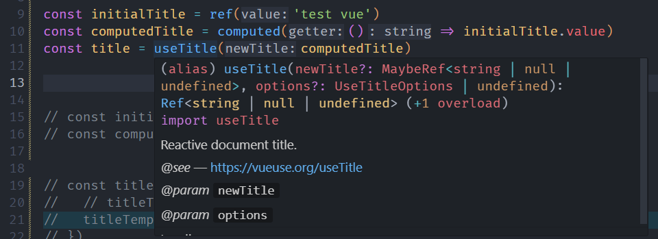
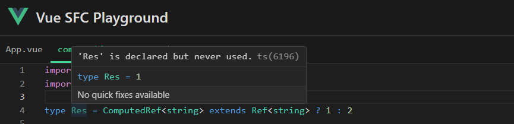

# 唠唠我从 VueUse 源码中学到的 TypeScript 编写技巧

## （一）前言

这段时间，在公司实际业务项目中用了 VueUse 一段时间后，自己花了点时间阅读了 VueUse 库底层的源码实现，阅读过程中，发现 VueUse 内部有不少关于 TypeScript 的类型编程实现，值得我们的学习和借鉴。因此，经过自己的吸收和整理后，决定输出篇文章记录些编写技巧。

## （二）编写技巧

### ReturnType 配合 typeof 的妙用

假设现在需要在自己的项目中书写一个 composable 函数，🌰️如下：

```typescript
import { ref, isRef, computed } from 'vue'
import type { Ref, ComputedRef } from 'vue'

export type UseCounterReturn = {
  counter: Ref<number>
  double: ComputedRef<number>
  incre: (step?: number) => number
  decre: (step?: number) => number
}

export function useCounter (initialVal?: number | Ref<number>) {
  const counter = initialVal 
    ? (isRef(initialVal) ? initialVal : ref(initialVal))
    : ref(0)

  const double = computed(() => Math.pow(counter.value, 2))

  const incre = (step = 1) => counter.value += step

  const decre = (step = 1) => counter.value -= step

  return {
    counter,
    double,
    incre,
    decre
  }
}
```

如上，你可能会单独写个 `UseCounterReturn` 类型定义，然后将其作为 `useCounter` 函数的返回值类型暴露出去。

不过像上边这种不是特别复杂的场景，这个 `UseCounterReturn` 类型定义不需要我们自己额外再单独书写，直接用 `ReturnType` 配合 `typeof` 关键字就可以简化实现了，修改后的代码如下：

```typescript
import { ref, isRef, computed } from 'vue'
import type { Ref } from 'vue'

export function useCounter (initialVal?: number | Ref<number>) {
  const counter = initialVal 
    ? (isRef(initialVal) ? initialVal : ref(initialVal))
    : ref(0)

  const double = computed(() => Math.pow(counter.value, 2))

  const incre = (step = 1) => counter.value += step

  const decre = (step = 1) => counter.value -= step

  return {
    counter,
    double,
    incre,
    decre
  }
}

export type UseCounterReturn = ReturnType<typeof useCounter>
```

如上写法在 vue sfc playground 看到的效果为：


### 函数重载实践

TypeScript 官方文档上有关于函数重载的介绍，链接为：[TypeScript Handbook-Function Overloads](https://www.typescriptlang.org/docs/handbook/2/functions.html#function-overloads)。

不过看了之后，可能对于如何在实际业务项目中编写，还是会有点懵，此时可以借鉴下 VueUse 中用法。这里以 `useTitle` 函数为🌰️，源代码在这：[VueUse-useTitle](https://github.com/vueuse/vueuse/blob/main/packages/core/useTitle/index.ts)，唠唠自己的想法。

`useTitle` 可以有几种不同的使用方式，对应得到的类型提示，在 VsCode 中是不一样的：

- 直接调用，或者传入原始值：





- 传入 `ref` 值


- 传入 `computed` 值


可以看到，第1、2种用法得到函数签名类型提示是一样的，而 `computed` 用法是另外一种类型提示。

具体到 `useTitle` 源码中，函数重载的签名是这样的：

```typescript
// 重载签名1
export function useTitle(
  newTitle: ReadonlyRefOrGetter<string | null | undefined>,
  options?: UseTitleOptions,
): ComputedRef<string | null | undefined>

// 重载签名2
export function useTitle(
  newTitle?: MaybeRef<string | null | undefined>,
  options?: UseTitleOptions,
): Ref<string | null | undefined>
  
// 实现签名
export function useTitle(
  newTitle: MaybeRefOrGetter<string | null | undefined> = null,
  options: UseTitleOptions = {},
) { /* 省略具体的函数实现 */ }
```

其中，`ReadonlyRefOrGetter` ，`MaybeRef` 和 `MaybeRefOrGetter` 类型分别是：

```typescript
type ReadonlyRefOrGetter<T> = ComputedRef<T> | (() => T)
type MaybeRef<T> = T | Ref<T>
type MaybeRefOrGetter<T> = MaybeRef<T> | (() => T)
```

第1点需要注意的是，从类型层面来说，`newTitle` 参数的类型，实现签名中的类型必须 **兼容包含** 上述2个重载签名的类型。

当我们传入 `computed` 值时，TypeScript 的类型检查会命中第1个重载签名，然后就不会在往下检查了，反映到 IDE 中就是鼠标 hover 在 `useTitle` 这个函数上边时，会出现 **重载签名1** 的具体类型内容。

如果我把 `useTitle` 源码中的如上的 **重载签名1** 和 **重载签名2** 的代码书写位置调换下，针对上述的 `computed` 值的用法，可以看到：



此时因为 TypeScript 的类型检查还是会命中第1个重载签名，即 `MaybeRef` 这个，但此时 IDE 的类型提示是不够准确的。

而之所以会命中`MaybeRef` 这个，是因为从类型层面来讲， `ComputedRef` 其实是 `Ref`  的子类型，传入的 `ComputedRef<string>` 会命中 `Ref<string>`  这个类型：



这引入了第2点需要注意的点，那就是函数重载声明的排序很重要，因为 TypeScript 是按照顺序进行检查的，一旦发现符合某个类型声明，就不再往下检查了，所以**类型最宽的声明应该放在最后面，防止覆盖其他类型声明**。

### 基于 Vue 类型的拓展

Vue 3 源码是通过 TypeScript 编写的，因此在类型这块，Vue 内部也提供了些 TypeScript 类型供用户使用，完整的工具类型列表在这：https://github.com/vuejs/core/blob/main/packages/runtime-core/src/index.ts 。

而 VueUse 内部，基于 Vue 提供的这些类型，实现了些编写 Composable 函数时实用的工具类型，大致的列表和解释如下。

```typescript
type MaybeRef<T> = T | Ref<T>
type MaybeRefOrGetter<T> = MaybeRef<T> | (() => T)
type ReadonlyRefOrGetter<T> = ComputedRef<T> | (() => T)
```

如上这 3 个应该是 VueUse 内部使用最多的工具类型，为了使 composable 函数能够兼容更多的参数输入情况，即考虑输入的是原始值，或 `ref` 函数或 `computed` 函数处理过后的值，我们可以根据使用场景，利用这 3 个给对应参数做类型声明。


## （三）总结

当然了，以上列出的技巧只是我个人阶段性整理后的输出成果，实际上 VueUse 内部的一些零散的工具类型实现，也是可以拿来学习和借鉴的，更多内容感兴趣可自行探索。

当然，不得不承认的一点时，VueUse 确实是一个不错的学习仓库，除了 TypeScript 编写技巧外，Monorepo 文件组织，composable 函数书写，单元测试用例编写等也都值得我们学习和探索。

Happy Coding!


## （四）参考资料

- [The TypeScript Handbook](https://www.typescriptlang.org/docs/handbook/intro.html)
- [阮一峰 TypeScript 教程-TypeScript 的函数类型之函数重载](https://wangdoc.com/typescript/function#%E5%87%BD%E6%95%B0%E9%87%8D%E8%BD%BD)

