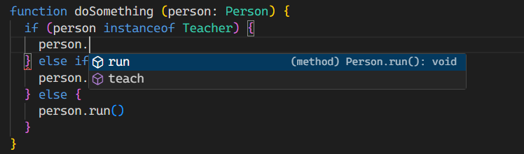
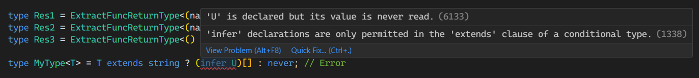

# 唠唠 TypeScript 分布式条件类型与 infer 及应用

## （一）前言

想必大家或多或少都听过 TypeScript，而且应该也写过 TypeScript 代码。

不过可能来讲，在业务代码中用到的 TypeScript 的东西不会很多，更别说 TypeScript 类型编程了。

我个人除了在业务代码中编写 TypeScript 代码外，更多还是想在 TypeScript 的类型编程上持续学习。

而本文，更多是对自己阶段学习成果的整理输出，也希望文中提到的一些思路能够给大家些借鉴。


## （二）条件类型与分布式条件类型

代码示例：[conditional-type](https://www.typescriptlang.org/play?#code/MYGwhgzhAEAKCmAnCB7AdtA3gKGtRArhgBQCUWue0w6qI8AdCCgObEDkhaDP7plAX2xDsoSDAAq8MMAAWSaPAAeAF3hoAJjATJ0FPGpmzoZfVRpo6jZm3aG5PBn0HDso8FGgBlFQQ3qVRVV1LTgkVAwcPAhfDQBPE3Io81oUeiZWDhi-OMdnPCERFTiAB3hoACV4CABGaABeaCkjBWU1TW1wvQB+aBVCcoAuaAAzMBAIeGxissrqgCYG71iAoPbQnQjoXv6CIdHxybcRomAVAEs9DRQvFABbeBVZc7QWEzLdNGHN9CTKc5G7y6GBeMTAaGA8BQgOaciQfyo0A+EQY9lkZEEigm5QBQM+0FBKnBkOhyz8AQRVGR6AY2XiGIKWMmZjw1O4XAZ0EKbmutweTxebDQ8AA7k1pHDEGR+Lz7o9nq9iMKxT5yWgVNK3DNylUIABmJZ1AA+0EWbRCMGNpugJoNOwG0GGY2x0AA9K6+gNpqUddUACyGm3QAPmjrQK2LW3bT17R0HF3u+NHLU+5aIQUAeUQADkCHcAEZIAA8EgAfEsJGsLdAYunXtH2LXBew4+w0HnC4h2CnZrqAKxLHx1lhZ3MF4vsADWYHO7FL3t71QAbIP+pmcx3i-M9fOe+VYOm7ucLgA3eASH0l8uNSuh0JN17YACQvUba9e3afw1vwTD7fHiDPq+-6dp+35VmG+YoGk0hoEB0DsFBMHgmBTQQaE7YgCA8FtgQWGoT+6wwEQ-gjC88AaDhJHwGRwoaKhwpnogADcbgLr6EAAOxLAe5xHqe56Xrs8DztqcwQAAHDxh7HucZ4XmURaYSAomprqACc0l8bJ8mXtRtEUapi61AADFp-FyYJimMUgu5iQAYqcCnlI0xCOGAiAsBAwzgnEADaAC65D1OWvl7tAjkQlUviIGgQ6CiW6EwJFwDOdeaF3jAbk8B5Xk+Wg-lBQ05YPm89qxk6hxTOx4k1HUjQpdFBCxfFrxFkqYAPMMpXBSV74sOWibCTVuo1IsDWnE1LX9e1aCdfA3X9b10BIfQ4KDR6zpHGJo0GhNUWPM1cUzaYIXQCBtluptVVsUAA)。

### 1. 条件类型

条件类型的语法和我们平时使用的三元表达式很类似，它们2者的基本语法如下：

```typescript
// 三元表达式
A === B ? Result1 : Result2

// 条件类型
TypeA extends TypeB ? Result1 : Result2
```

条件类型中可以使用 `extends` 关键字来判断类型的兼容性（基于TypeScript类型层级系统），比如：

```typescript twoslash
class Person {
  run () {
    console.log('run...')
  }
}

class Teacher extends Person {
  teach () {
    console.log('teach...')
  }
}

class Student extends Person {
  study () {
    console.log('study...')
  }
}

type Res1 = Teacher extends Person ? true : false // true
type Res2 = Student extends Person ? true : false // true
```

上述例子中，`Res1` 和 `Res2` 的结果是 `true`，从类型空间来看， `Teacher` 和 `Student` 是 `Person` 的子类型。知道这些类型关系，我们可以如下使用：



`doSomething` 函数定义 `person` 参数类型为 `Person` 即可，然后内部可以基于 `instanceof` 的结果收缩类型到具体子类型完成我们的代码逻辑。

类似的还有联合类型的类型兼容性比较：

```typescript twoslash
type Res3 = 1 | 2 extends 1 | 2 | 3 ? true : false // true
type Res4 = 1 | 4 extends 1 | 2 | 3 ? true : false // false
```

不过绝大部分场景下，条件类型会和 **泛型** 一起使用，搭配使用可以完成的操作可太多了。

先来个简单🌰️：

```typescript twoslash
type StringOrNumber<T> = T extends string ? 'string' : 'number'

type Res5 = StringOrNumber<'kai'> // "string"
type Res6 = StringOrNumber<23> // "number"
```

上述例子中，在条件类型的基础上，基于填充后的泛型参数 `T` ，我们可以判断出传入的值的类型是 `string`  还是 `number`。

当然，条件类型也是可以嵌套使用的：

```typescript twoslash
type PrimitiveType<T> = T extends string
	? 'string'
	: T extends number
	? 'number'
	: T extends boolean
	? 'boolean'
	: T extends null
	? 'null'
	: T extends undefined
	? 'undefined'
	: never;


type Res7 = PrimitiveType<true> // "boolean"
type Res8 = PrimitiveType<null> // "null"
type Res9 = PrimitiveType<undefined> // "undefined"
type Res10 = PrimitiveType<never> // "never"
```

除了简单的原始类型的类型比较外，我们还可以对更复杂的类型进行比较，来个🌰️：

```typescript twoslash
type FuncType = (...args: any[]) => any

type FuncReturnString<T extends FuncType> = T extends (...args: any[]) => string ? true : false

type Res11 = FuncReturnString<(name: string) => string> // true
type Res12 = FuncReturnString<(name: string) => boolean> // false
type Res13 = FuncReturnString<() => number> // false
```

如上例子，我们可以通过 `T extends (...args: any[]) => string ? true : false` 条件类型判断一个函数的返回值类型是否是 `string`。


### 2. 分布式条件类型

代码示例：[distributive-conditional-type](https://www.typescriptlang.org/play?#code/C4TwDgpgBAKhDOwA8MB8UC8soQB7AgDsATeKARigB8oAmaqAZigH5sAuKQiANwgCcAUAHphUUJCgAlBJSxxESSjXo1mNACzpRFBqqaCRYidBnw5UIwwAUlPARJlldBszaVO3PvwCUlnTTW9PZEpLoqrqwunrwCflaBzCGO4S5qUcwx3vEBUNYaOPihTnqRbAVZcZaCJtII9FjO+upQBclhTWWpzQwVXLH8UDpeAoa1AJLwAHIDKOhYANowALqFDmELI-yrbMD8AK7QnABmAIYANvAQY+CmCMxYkzPeSFvaxgfXtWYFj9Ozp0IIHeUDOly+tzq8AArJgoE9ZgAjAD2yPOEEBILBVxukikcLsRRS9F2nygJwuOJqkMmAEEgXMCWtitgAGQuKJ7Q7k0GU67UvEIABscLpDMBwKGH0OAru8AA7KL4PSQK8Bli+bKoQAOJUqpAotEYwga8GGYgQADG51O-Gg6OA-W8ADULpUhBbrbb7RBHRLXedOBLDFsA3D-RdcdBJgBVQgAa0IyIA7oRGVh9gmk6nmSkYII2GLVWhc2EudcoFFsRWeeXBBSzVqpPisBLS2RM4mU4ROWSG1cpeJPk2pA0oJ3sz32mQ26Tuf3oDo602EABOJVxruppAT7uoFfmAAMG6z3aQEv331kFljp+3hH2AFtEQJUEA)。

分布式条件类型，也称为条件类型的分布式特性，在满足一定的条件后即会触发，我把这些触发条件（同时满足）总结如下：

- 类型参数是联合类型；
- 类型参数通过泛型参数传入；
- 泛型参数位于条件类型左侧且不被包裹。

基于上述的触发条件，来看个🌰️：

```typescript twoslash
type Test<T> = T extends 1 | 2 | 3 ? T : never
type Res1 = Test<1 | 2 | 3 | 4> // 1 | 2 | 3

type Res2 = 1 | 2 | 3 | 4 extends 1 | 2 | 3 ? 1 | 2 | 3 | 4 : never // never
```

对于 `Res1`，因为传入的联合类型符合触发的条件，因此触发了分布式特性，例子等价于：

```typescript twoslash
type Res1 = 
| (1 extends 1 | 2 | 3 ? 1 : never) 
| (2 extends 1 | 2 | 3 ? 2 : never) 
| (3 extends 1 | 2 | 3 ? 3 : never) 
| (4 extends 1 | 2 | 3 ? 4 : never)
```

而 `Res2` 中的条件类型不满足触发分布式的条件，因此这里按类型兼容性进行比较，得到的结果就是 `never`。

关于分布式条件类型的注意事项，[神光](https://juejin.cn/user/2788017216685118) 大佬写过一篇微信公众号文章，用几个例子说明了下，我觉得总结很不错了，这里就不再赘述，直接给出链接：[条件类型的特殊情况](https://mp.weixin.qq.com/s/hImNUpuk9Z0rkEgqzi6C_g)。

这一小节的最后，给出几个个人觉得实用的工具类型：

```typescript twoslash
type IsNever<T> = [T] extends [never] ? true : false

type Res3 = IsNever<never> // true
type Res4 = IsNever<any> // false
type Res5 = IsNever<boolean> // false
```

上述例子用 `[]` 包裹了传入的泛型参数，避免触发了分布式特性，加上 `never` 只与自身存在类型兼容（`any`就先不考虑），因此 `IsNever` 可以判断出是否为 `never` 类型。

```typescript twoslash
type IsAny<T> = 1 extends T & 2 ? true : false

type Res6 = IsAny<any> // true
type Res7 = IsAny<never> // false
type Res8 = IsAny<boolean> // false
```

上述例子中，利用了 `any` 的特殊性，即 `1 & any` 交叉类型的结果会是 `any`，加上 `any` 在TypeScript类型层级中，是所有类型的父类型，因此这里的 `IsAny` 可以判断出是否为 `any` 类型。

```typescript twoslash
type IsAny<T> = 1 extends T & 2 ? true : false

type IsUnknown<T> = unknown extends T
? IsAny<T> extends true
  ? false
  : true
: false

type Res9 = IsUnknown<unknown> // true
type Res10 = IsUnknown<any> // false
type Res11 = IsUnknown<number> // false
```

上述例子中，由于TypeScript类型层级中，`unknown` 与 `any` 处于同一层级，2者互为父子类型，因此下边的结果都是 `true`：

```typescript twoslash
type RR = any extends unknown ? true : false // true
type RR2 = unknown extends any ? true : false // true
```

因此，`unknown extends T` 的结果可能为 `any` 或 `unknown`，需要进一步通过上述的 `IsAny` 工具类型剔除 `any` 类型，最终判断出 `unknown` 类型。


## （三）infer及其一些案例应用

代码示例：[infer-case](https://www.typescriptlang.org/play?#code/C4TwDgpgBAYgrgOwMYBVzQLxQBQDp8CGATgOYDOAXFAQiANoC6AlFBgHzW0BQXokUAUQAewIgSTB4yAEoRgcIgjSQAPCigQREBABMysRKnQcs6zcG16c+XMXJUa9Zqw4BLBADMIRKOoD8vlBUCBAAbt48fNCyZACMrIIiYhJSSLLyisoQKtgIBAC2EFRkou4kLOxQJURlHAD0dVWlCCS86FAxAEwJwqLikobpCkroOXmFxc3lLlAARgD28wA2EDT1jQvLqwht-DEAzD1J-alDmaPYFRwIcPmz3utQN3cRu9AAsiBZaiaB5pb6aplKABbDuLw+ACqTEYQSeYW8AG4oA1BEQiPMiJF2r1ksAAILogggADKwGIwAEujUGi0un0jkYvzMdKsdC4UCg4O8UDJFIANByoDZGQxBZzuT4qTouAwoFwAnQ+URgPzBLoGFxggisW8OhAyAAWI59CSEsSk8kq6UqOhAlpqxA6CAedwQHRqm5LJZqzYrGie273IgMR52qaBl4h7H8XH9AAKGPyrjIEBiy3C3xQzNpFnpUET82TqZUkoLHAC8bhIXCuqi+rIAFYTXjC8W0waMxBvm2U9lnsG2I8BxF6zEAGwthNJvvppaZ0a9ktOl1unRDlGNFeukIyriowASFoBo+ViFD1MQA7Al48QCnJvGQxnfJjUHdQSEUnkHvFcmq+SGw54GgAHAkZwjKouTPn+ZRqgQH7BN+RC-vaAFAWQACc163oUFhEI+qGPN4GI+IAmYqAKs2MYfCAN5iLhD40v8+apFkOZMVYeCEKQlBcp4PLxr+jgggW1Y6nqnzgVmuYAgYyCsQkLJ5hxIrcQ4tCML+ZbSMJ2narWVENrEAAMCSfLRd54Y+UETDBb7wZ+I7ITMhGblAdDjJ+qFwQhX5RpqY4GrE8RYBJcjDN81meRG74OUhKFTI8qE8IeR6dGe9YAMJ3ksWUliS0n5i5WD5ex+gAAYACQAN5lgAMgAvgAtNVWn1WVCpQJVVUNdVWWFDlBAlllYCuOSSyuAAXtk0hDm1Wq8gZMSxN0WB9RAA0lgA5AAFutSzzI1ADumJLDojUANYEK4m2PAARLt3rzAA6idOgANJXbdyWNMe+zpe05rEgAkhY+TfOaBVWKKvwQ6VUCAyApZ8VKKyFAgwDyR1Aio9oGPtPNNavAFcSHFgCMgxAYOjC5qKAJipgD30RR6GxMaZNEiAFNU6oqFMq5SXE7EzZsxanMRdg9mIVG8X-jCoaueLPmOdLZTM5OwvA6D3zuUhvqLP6CBy6ijlQAAPnMevbPujSAJLegDvcoAcXKAFj-zNXurHOaxcxtm362yy8OSGm+bWw0N9UDHoa-38IWYBZmqb2Q-o50QCA8weL4bGsvoVVuW9ye8VAb0MFQZYAGpQPVHUlwTYlcO4eEeOI0Dxg+8wIFAVVCh5L4q5yEu+cG8qcvkBArFQPsh5y23zLMsyuAa3ctIwXAV8zoFYNHPYtwgaqbR5m2B5tw8rDdfNTIH487ALWHrxiMeLlvO9TzPc9kCfqI85qVth0ejaR9AMCuHwgSdmZJ-ycxULDTOnAnAw3RAnNyQoywAKAeKYUhB1Kak1AEZBJR4GoUHsJHBwAhR6QiKQus7QugmSwEQhGoCyjgLoMtHel1rpqlEHACAhtGiEyxMTTowVYCAJKHQqYjDNqsM2mqTo+x2FEE4dwqAt1WFfS-sAMgAABQ0uALyAAknQANOaADgVQAMP+AFR9QApoqADC5XiEIoCADK-QA+uaAHylQAvwGAFNzQAedqAAbnQAn9qAE8nQAWdqAG8fQA0eqAAZ1QAC8aADXlL+gAoOUAA-xQigGiLAaDKAgB75UAAHepFABccs7estCQFiNBrECBcC4bQwSJApS+h2QSmRkk3BcMvJChFBg2UHUiHV30uhToK1GnAItPQlojDmFQAkVdKRUAOFcOHGJfhpMBkpIYaDW0Ey2FQBkXIhRd0VE8C-secc+T2gABEIAQDAHGCQS4OxkC7FmDONSCwzhLFpCsUAzkXKucAG5c4FyqBmnCFAi0DSdFZh885lzjjXJebc+5i5YUqEIolKYvShYQq+dCn5sK-ndgRUWPsKgbkqE2stG6G5US3WWl9fhasMVQtNNiglqZcU9kRcS4lMyhwUsaDMoAA)。

### 1. infer介绍

回到上边小节**1. 条件类型**中，我给出了一个判断函数返回参数是否为 `string` 类型的例子，如果现在不再这么比较，而是要拿到其返回值类型，我们可以怎么做？

此时，我们可以使用 `infer` 关键字，`infer` 可以**在条件类型中提取类型的某一部分信息**。

对于上述需求，可以这么写：

```typescript twoslash
type FuncType = (...args: any[]) => any

type ExtractFuncReturnType<T extends FuncType> = T extends (...args: any[]) => infer R ? R : never

type Res1 = ExtractFuncReturnType<(name: string) => string> // string
type Res2 = ExtractFuncReturnType<(name: string) => boolean> // boolean
type Res3 = ExtractFuncReturnType<() => number> // number
```

对于上述例子，当传入的类型参数满足 `T extends (...args: any[]) => infer R` 这样一个结构（不用管 `infer R`，当它是 any 就行）时，会返回 `infer R` 位置的值，即 R。否则，返回 never。

`infer` 是 `inference` 的缩写，意为推断，如 `infer R` 中 `R` 就表示 **待推断的类型**。

`infer` 只能在**条件类型**中使用，因为我们实际上仍然需要**类型结构是一致的**，比如上例中类型信息需要是一个函数类型结构，我们才能提取出它的返回值类型。如果连函数类型都不是，那只会返回 never 。

进一步说明下，`infer` 关键字的声明只允许在条件类型的 `extends` 子句中使用，否则会报错，来看个🌰️：

```typescript
type MyType<T> = T extends string ? (infer U)[] : never; // Error
```

上述写法会报错，报错内容如下：



类型结构除了可以是函数类型外，还可以是其他的，比如数组类型，甚至于是 Promise，来看例子：

比如我想提取出数组中首尾2个元素的类型，可以如下写：

```typescript twoslash
type ExtractArrayStartEnd<T extends any[]> = T extends [
  infer Start,
  ...any[],
  infer End
] 
? [Start, End]
: never

// [string, number]
type Res4 = ExtractArrayStartEnd<[string, undefined, null, boolean, number]>
```

提取出Promise中resolve值的类型，可以如下写：

```typescript twoslash
type ExtractPromiseResolveType<T> = T extends Promise<infer P> ? P : never

type Res5 = ExtractPromiseResolveType<Promise<number>> // number
type Res6 = ExtractPromiseResolveType<Promise<undefined>> // undefined
```

当然了，`infer` 还有更多玩法，下边给出一些自己认为不错的工具类型实现，有些是 type-challenges 上的。


### 2. infer的一些案例应用

案例1：实现 TypeScript 内置工具类型 `Parameters` 和 `ReturnType`：

```typescript twoslash
type FuncType = (...args: any[]) => any

type MyParameters<T extends FuncType> = T extends (...args: infer P) => any ? P : never
type MyReturnType<T extends FuncType> = T extends (...args: any[]) => infer R ? R : never

type Res10 = MyParameters<(name: string, age: number) => string> // [name: string, age: number]
type Res11 = MyReturnType<(name: string, age: number) => string> // string
```

案例2：`KebabCase` 形式字符串转换为 `CamelCase` 形式字符串，比如 `hello-world-kai` 转换为  `helloWorldKai`：

```typescript twoslash
type CamelCase<S extends string> = S extends `${infer L}-${infer R}`
? `${L}${CamelCase<Capitalize<R>>}`
: S

type Res12 = CamelCase<'hello-world-kai'> // "helloWorldKai"
```

因为 `KebabCase` 形式字符串可能存在多个 `-` 连接字符，因此这里还递归调用了 `CamelCase`。

案例3：提取出数组的元素类型：

```typescript twoslash
type ArrayItemType<Arr extends any[]> = Arr extends Array<infer ElementType> 
? ElementType 
: never

// type Res13 = ArrayItemType<string> // 错误写法
type Res14 = ArrayItemType<string[]> // string
type Res15 = ArrayItemType<((age: number) => string)[]> // (age: number) => string
type Res16 = ArrayItemType<[number, boolean]> // number | boolean
// 等价于：
type Res17 = ArrayItemType<(number | boolean)[]> // number | boolean
```

案例4：提取出接口中元素的类型：

```typescript twoslash
type PropType<T, K extends keyof T> = T extends { [Key in K]: infer V }
? V
: never

interface Person {
  name: string
  age: number 
  male: boolean
  hobbies: string[]
}

type Res18 = PropType<Person, 'name' | 'male'> // string | boolean
type Res19 = PropType<Person, 'hobbies'> // string[]
```

这里 `infer` 关键字结合了映射类型和索引类型，实现了提取出接口中属性类型。

案例5：提取出数组中第一个字符串类型的元素：

```typescript twoslash
type FirstArrayStringItem<Arr extends any[]> = Arr extends [
  infer First,
  ...any[]
]
? First extends string 
  ? First
  : never
: never

type Res20 = FirstArrayStringItem<[12, 'kai', true]> // never
type Res21 = FirstArrayStringItem<['kai', 23, true]> // "kai"
```

而在 ts@4.7 版本后，引入了 **infer 约束**功能来实现对特定类型地提取，因此上述的 `FirstArrayStringItem` 可简写为：

```typescript twoslash
type FirstArrayStringItem<Arr extends any[]> = Arr extends [
  infer First extends string,
  ...any[]
]
? First
: never

type Res22 = FirstArrayStringItem<[12, 'kai', true]> // never
type Res23 = FirstArrayStringItem<['kai', 23, true]> // "kai"
```

案例6：深层提取出 Promise 中 resolve 值的类型

```typescript twoslash
type DeepExtractPromiseResolveType<T> = T extends Promise<infer R> ? DeepExtractPromiseResolveType<R> : T

type Res24 = DeepExtractPromiseResolveType<Promise<string>> // string
type Res25 = DeepExtractPromiseResolveType<Promise<Promise<'12'>>> // "12"
type Res26 = DeepExtractPromiseResolveType<Promise<Promise<Promise<true>>>> // true
```

案例会持续更新！


## （四）总结

本文结合一些示例介绍了条件类型、分布式条件类型和 `infer` 关键字的相关内容，也给出了一些工具类型实现，希望对大家有点帮助！

另外，基于条件类型和 `infer` 可以衍生出很多的类型编程写法，`infer` 关键字是类型编程**模式匹配**范式必不可少的工具，更多的内容感兴趣地可以自己去探索探索。

最后，给大家推荐个 Github仓库，是 antfu 搞的 TypeScript 类型编程练习仓库：[type-challenges](https://github.com/type-challenges/type-challenges)，感兴趣可以练练看～

欢迎各位大佬勘误～


## （五）参考资料

- [冴羽TypeScript教程-条件类型](https://ts.yayujs.com/handbook/ConditionalTypes.html)
- [handbook-Conditional Types](https://www.typescriptlang.org/docs/handbook/2/conditional-types.html)
- [Mastering infer in TypeScript](https://javascript.plainenglish.io/mastering-infer-in-typescript-6cf3f93cca86)
