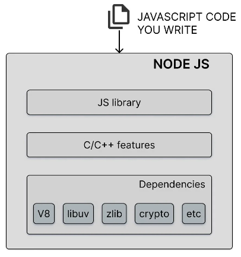
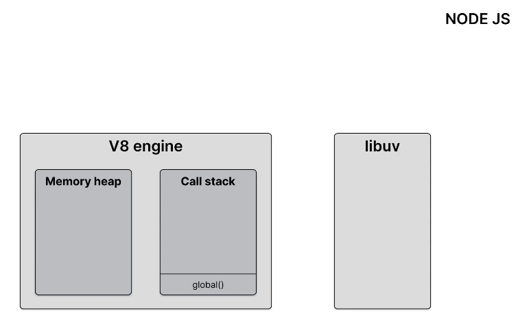
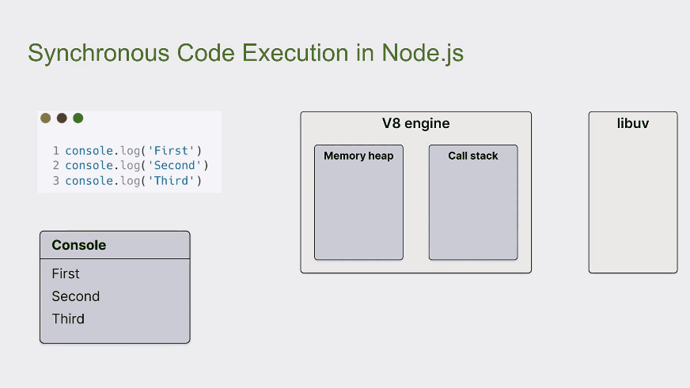
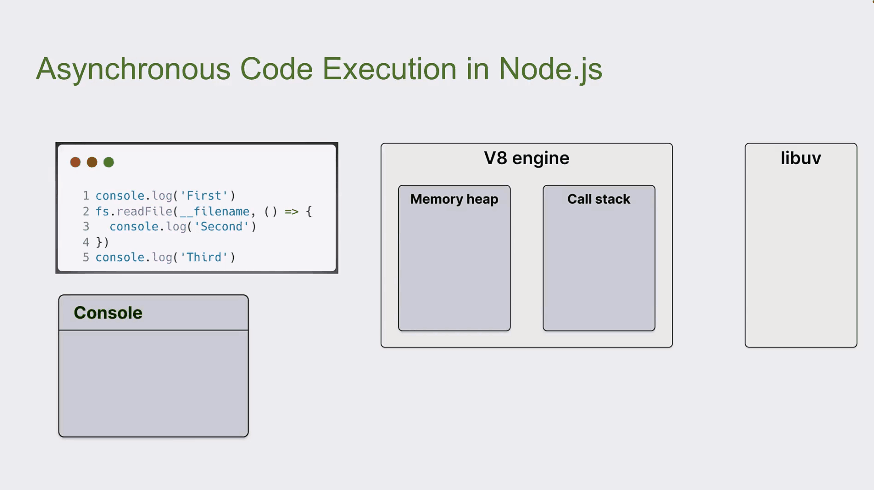
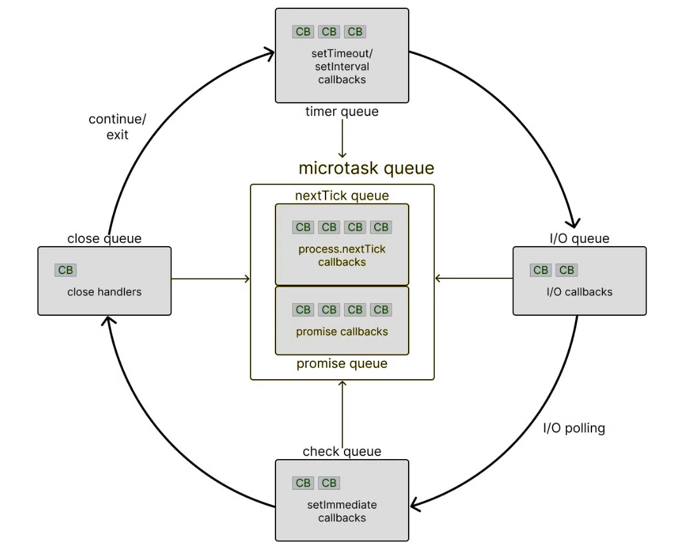

# [译] Node.js 事件循环完全可视化指南

> 原文地址：https://www.builder.io/blog/visual-guide-to-nodejs-event-loop

你已经使用 Node.js 有一段时间了。你已经构建了一些应用程序，玩转了不同的模块，甚至对异步编程已经驾轻就熟。但有件事一直让你耿耿于怀——事件循环。

如果你和我一样，已经花了无数的时间阅读文档和观看视频，试图理解事件循环。但是，即使是经验丰富的开发人员，也很难完全理解它是如何工作的。因此，我编写了这篇可视化指南，以帮助你全面理解 Node.js 事件循环。坐下来，喝杯咖啡，让我们一起深入理解 Node.js 事件循环的世界。

## JavaScript中的异步编程

首先，我们复习一下 JavaScript 中的异步编程。虽然 JavaScript 在网络、移动和桌面应用程序中都有使用，但重要的是要记住JavaScript 最基本的形式，即**JavaScript是同步、阻塞、单线程的语言**。让我们通过一段简短的代码来理解这一点。

::: code-group
```js:line-numbers [index.js]
function A() {
  console.log("A");
}

function B() {
  console.log("B");
}

A()
B()

// Logs A and then B
```
::: 

### JavaScript是同步的

如果我们有两个向控制台打印信息的函数，代码会自上而下地执行，任何时候都只执行一行。在代码片段中，我们可以看到 A 在 B 之前打印。

### JavaScript是阻塞的

JavaScript 的同步特性决定了它是阻塞的。无论前一个程序需要多长时间，在前一个程序完成之前，后一个程序都不会启动。在代码片段中，如果函数 A 需要执行一段密集代码，JavaScript 必须在完成这段代码后才会执行函数 B。

你可能在浏览器中体验过这种情况。当网络应用程序在浏览器中运行时，如果执行了大量代码却不将控制权返回给浏览器，浏览器就会“卡住”。这就是所谓的阻塞。在网络应用程序返回处理器控制权之前，浏览器将被阻止继续处理用户输入和执行其他任务。

### JavaScript是单线程的

线程只是 JavaScript 代码用来运行任务的一个程序。每个线程一次只能执行一个任务。与其他一些支持多线程从而可以并行运行多个任务的语言不同，JavaScript 只有一个线程，称为主线程，用于执行任何代码。

### 等待JavaScript

你可能已经猜到了，JavaScript 的这种模式会带来一个问题，因为我们必须等待数据被获取，然后才能继续执行代码。这个等待过程可能需要几秒钟，在此期间我们无法运行任何代码。如果 JavaScript 在不等待的情况下继续执行，我们就会遇到错误。因此，我们需要一种在 JavaScript 中实现异步行为的方案。这就是 Node.js。

## Node.js运行时



Node.js 运行时是一个可以在浏览器外使用和运行 JavaScript 程序的环境。Node 运行时的核心由三个主要组件组成。

- Node.js 运行所需的外部依赖项，如 V8、libuv 和 crypto
- 提供文件系统访问和网络等功能的 C++ 特性
- 提供函数和实用程序的 JavaScript 库，以便从 JavaScript 代码中获取 C++ 功能

虽然所有部分都很重要，但 Node.js 异步编程的关键部分是外部依赖项 libuv。

## Libuv

[Libuv](https://libuv.org/) 是一个用 C 语言编写的跨平台开源库。在 Node.js 运行时中，它的作用是为处理异步操作提供支持。让我们来看看它是如何工作的。

### 在 Node.js 运行时中执行代码



让我们概念化一下代码在 Node 运行时中通常是如何执行的。当我们执行代码时，位于图片左侧的 V8 引擎会处理 JavaScript 代码的执行。该引擎由内存堆和调用栈组成。

每当我们声明变量或函数时，内存就会在堆上分配；而每当我们执行代码时，函数就会被推入调用栈。函数返回时，会从调用栈中弹出。这是堆栈数据结构的直接实现，最后添加的项目就是第一个要移除的项目（即“后入先出”特性）。在图片的右侧，我们看到了负责处理异步方法的 libuv。

每当我们执行异步方法时，libuv 就会接管任务的执行。然后，libuv 使用操作系统的本地异步机制运行任务。如果本地机制不可用或不够用，它就会利用线程池来运行任务，确保主线程不会被阻塞。

### 同步代码的执行

首先，让我们来看看同步代码的执行。下面的代码由三个 console log 语句组成，一个接一个地打印 `First`、`Second` 和 `Third`。让我们以运行时执行代码的方式来查看代码。

::: code-group

```js:line-numbers [index.js]
console.log("First");
console.log("Second");
console.log("Third");
```

:::

下面是同步代码执行在 Node 运行时的可视化表示。



执行主线程总是从全局作用域开始。全局函数（如果可以这么说的话）被推入堆栈。然后，在第 1 行，我们有一个 console log 语句，函数被推入堆栈。假设这发生在 1 ms 时，`First` 将被打印到控制台。然后，函数从堆栈中弹出。

执行到第 2 行。假设在 2 ms 时，log 函数再次被推入堆栈，`Second` 被打印到控制台，然后函数从堆栈中弹出。

最后，执行到第 3 行。3 ms 时，log 函数被推入堆栈，`Third` 被打印到控制台，函数被弹出堆栈。最后，没有更多代码需要执行时，全局函数也被弹出。

### 异步代码的执行

接下来，让我们看看异步代码的执行。请看下面的代码片段。有三条 log 语句，但这次第二条log语句是在传递给 `fs.readFile()` 的回调函数中。



执行主线程总是从全局作用域开始。全局函数被推入堆栈。然后执行到第 1 行，1 ms 时，控制台打印 `First`，函数从堆栈中弹出。然后执行到第 2 行，2 ms 时，`readFile` 方法被推入堆栈。由于 `readFile` 是异步操作，因此将其移交给 libuv 处理。

接着，JavaScript 从调用栈中跳出 `readFile` 方法，因为就第 2 行的执行而言，它的工作已经完成。在后台，libuv 开始在一个单独的线程上读取文件内容。3 ms 后，JavaScript 继续执行第 5 行，将 log 函数推入堆栈，`Third` 被记录到控制台，函数从堆栈中弹出。

大约 4 ms 时，假设文件读取任务在线程池中完成。此时，关联的回调函数将在调用栈中执行。在回调函数中，会遇到log语句。

然后该log语句被推送到调用栈，`Second` 被打印到控制台，log 函数被弹出。由于在回调函数中没有更多语句要执行，该回调函数紧接着也被弹出。最后，没有更多代码要运行，全局函数也从堆栈中弹出。

控制台输出的是 `First`、`Third` 和 `Second`。

### Libuv和异步操作

很明显，libuv 帮助处理了 Node.js 中的异步操作。对于处理网络请求等异步操作，libuv 依赖于操作系统*原语*。对于没有本地操作系统支持的文件读取等异步操作，libuv 依靠线程池来确保主线程不会被阻塞。不过，这也引发了一些问题。

- libuv 中的异步任务完成后，Node 会在什么时候决定运行调用栈中对应的回调函数？
- 在运行回调函数之前，Node 是等待调用栈为空，还是中断正常的执行流程来运行回调函数？
- 其他异步方法，如 `setTimeout` 和 `setInterval`，也会延迟回调函数的执行吗？

- 如果 `setTimeout` 和 `readFile` 等两个异步任务同时完成，Node 如何决定在调用堆栈中先运行哪个回调函数？一个优先于另一个吗？

所有这些问题都可以通过理解 libuv 的核心部分（即事件循环）来回答。


## 什么是事件循环

从技术上讲，事件循环只是一个 C 语言程序。但你可以将它视为一种在 Node.js 中协调同步和异步代码执行的设计模式。

## 可视化事件循环

只要 Node.js 应用程序启动并运行，事件循环就会一直运行。每个循环中有**六个不同的队列**，每个队列中都有一个或多个最终需要在调用栈中执行的回调函数。



- 首先是 `timer` 队列（严格来说是一个最小堆），其中包含与 `setTimeout` 和 `setInterval` 相关的回调。
- 其次是 `I/O` 队列，它包含与所有异步方法（如与 `fs` 和 `http` 模块相关的方法）相关的回调。
- 第三，`check` 队列包含了 Node 特有的 `setImmediate` 函数相关的回调。
- 第四个是 `close` 队列，用于保存与异步任务的关闭事件相关的回调。

最后是微任务队列，它包含两个独立的队列。

- `nextTick` 队列，用于保存与 `process.nextTick` 函数相关的回调。
- `promise` 队列用于保存与 JavaScript 原生 Promise 相关的回调。

需要注意的是，`timer`、`I/O`、`check`和`close`队列都是 libuv 的一部分。但是，两个微任务队列并不包含在 libuv 中。尽管如此，它们仍然是 Node 运行时的一部分，并在回调的执行顺序中发挥着重要作用。说到这一点，我们接下来就来理解一下。

## 事件循环如何工作

箭头已经说明了问题，但很容易混淆。让我来解释一下队列的优先顺序。首先，要知道所有用户编写的同步 JavaScript 代码都优先于运行时希望执行的异步代码。这意味着只有在调用堆栈清空后，事件循环才会发挥作用。

在事件循环中，执行顺序遵循一定的规则。要理解的规则有很多，让我们一条一条地看：

1. 微任务队列中的任何回调都会被执行。首先执行 `nextTick` 队列中的任务，然后才执行 `promise` 队列中的任务。
2. 执行`timer`队列中的所有回调。
3. 微任务队列中的回调（如果存在）会在`timer`队列中的每个回调之后执行。首先执行 `nextTick` 队列中的任务，然后执行 `promise` 队列中的任务。
4. `I/O` 队列中的所有回调都会被执行。
5. 执行微任务队列（如果存在）中的回调，从 `nextTick` 队列开始，然后是 `promise` 队列。
6. 执行`check`队列中的所有回调。
7. 微任务队列（如果存在）中的回调在`check`队列中的每个回调之后执行。首先执行 `nextTick` 队列中的任务，然后执行 `promise` 队列中的任务。
8. `close` 队列中的所有回调都会被执行。
9. 最后，在同一循环中执行微任务队列。首先执行 `nextTick` 队列中的任务，然后执行 `promise` 队列中的任务。

如果此时还有更多的回调需要处理，循环将继续运行，并重复相同的步骤。另一方面，如果所有回调都已执行完毕，没有更多代码需要处理，事件循环就会退出。

这就是 libuv 的事件循环在 Node.js 异步代码执行中扮演的角色。牢记这些规则后，我们就可以重温之前的问题了。

**Q：当 libuv 中的异步任务完成时，Node 会在什么时候决定运行调用栈中对应的回调函数？**

A：只有当调用栈为空时，才会执行回调函数。

------

**Q：在运行回调函数之前，Node 是等待调用栈为空，还是中断正常的执行流程来运行回调函数？**

A：运行回调函数不会中断正常的执行流程。

------

**Q：其他异步方法（如 `setTimeout` 和 `setInterval`）也会延迟回调函数的执行吗？**

A：`setTimeout` 和 `setInterval` 回调函数优先执行。

------

**Q：如果两个异步任务（如 `setTimeout` 和 `readFile`）同时完成，Node 如何决定在调用堆栈中先运行哪个回调函数？其中一个优先于另一个吗？**

A：`timer` 回调在 `I/O` 回调之前执行，即使两个回调同时准备就绪。

------

我们还学到了很多东西，但我想让你记住下面这个可视化表示（与上文相同），因为它展示了 Node.js 底层如何执行异步代码。


你可能会问：“等等，验证这种可视化的代码在哪里？”。事件循环中的每个队列在执行时都有细微差别，因此最好一次处理一个队列。本篇文章是 Node.js 事件循环系列文章的第一篇。请务必查看下面链接的其他部分（*见原文*），以理解一些可能会绊倒你的问题，即使你的脑海中已经留下了这幅图像。

## 总结

事件循环是 Node.js 的基本组成部分，它通过确保主线程不被阻塞来实现异步编程。理解事件循环的工作原理可能具有挑战性，但它对于构建性能良好的应用程序至关重要。

本篇可视化指南涵盖了 JavaScript、Node.js 运行时和负责处理异步操作的 libuv 中异步编程的基础知识。有了这些知识，你就可以建立一个强大的事件循环心智模型，这将有助于你利用 Node.js 的异步特性编写代码。
