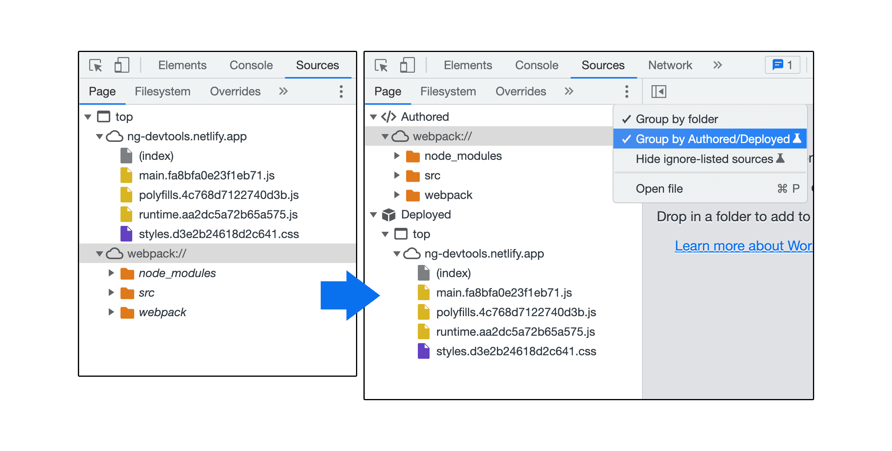
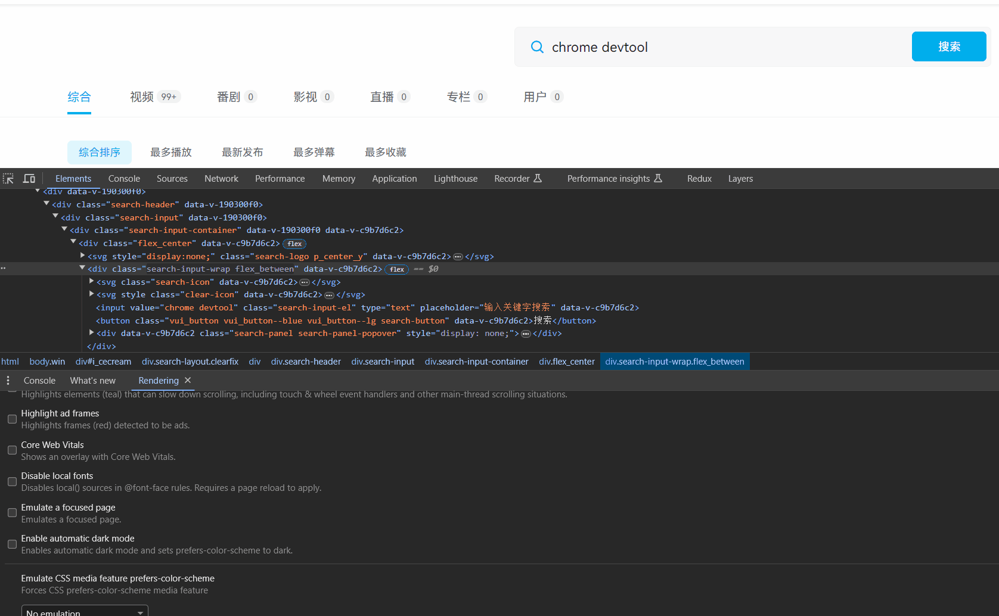
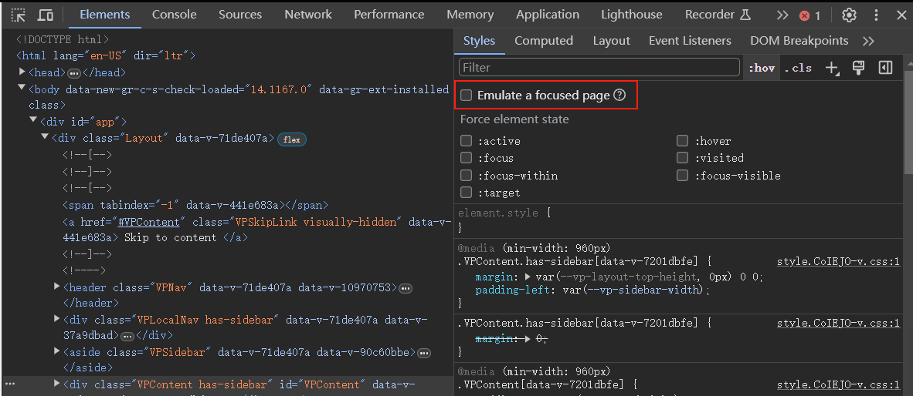
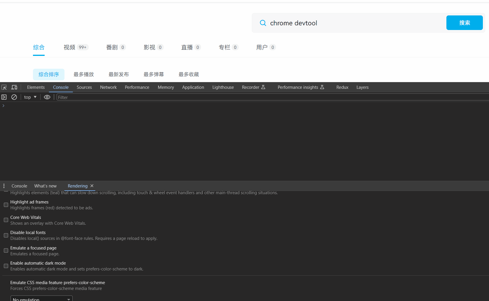
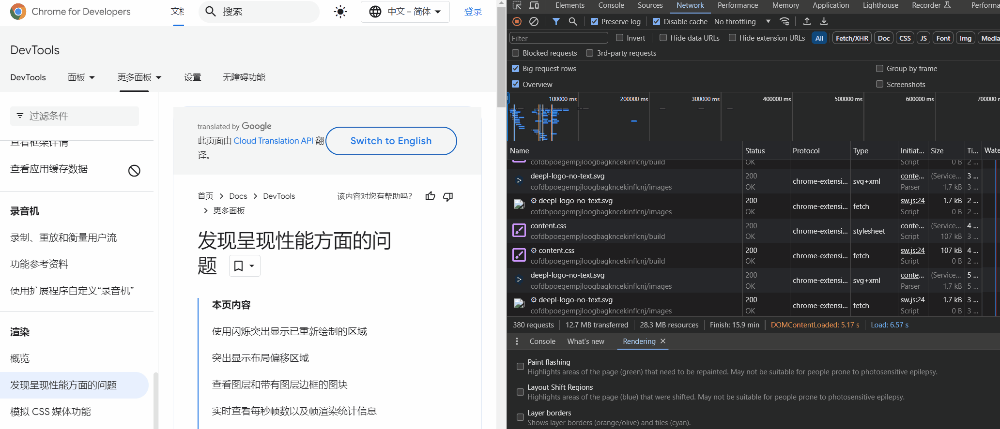
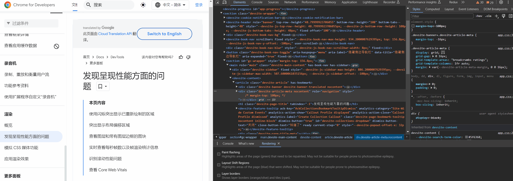
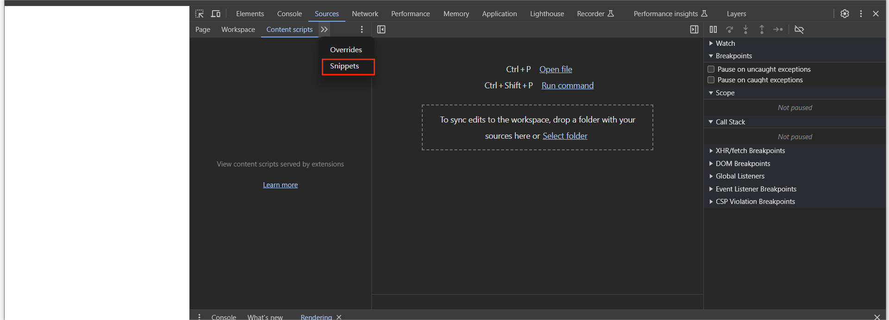
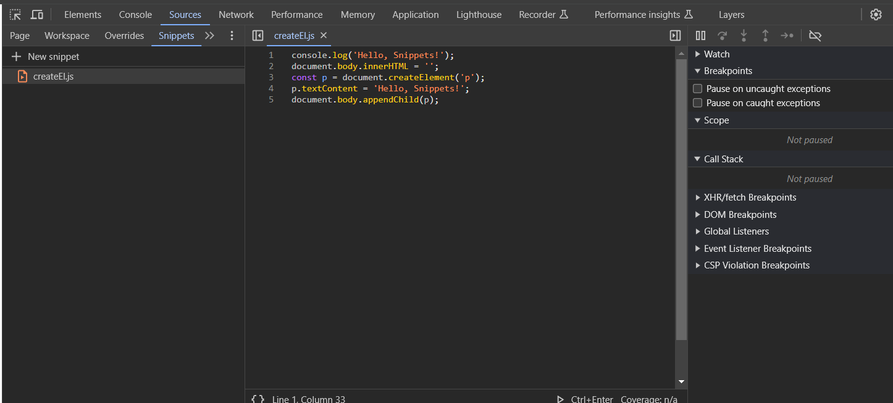
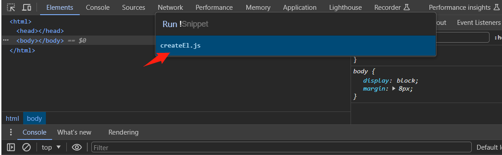
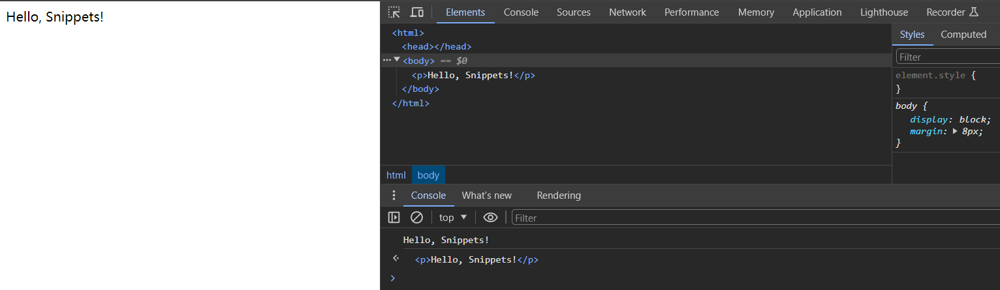

# 🚀唠唠 Chrome DevTools 中一些实用的技巧

> 以下的内容基于 Chrome 浏览器 122.0.6261.112 版本撰写！

## （一）前言

随着 Chrome 浏览器版本的不断迭代，Chrome DevTools 引入了不少实用的功能，其中有些功能对日常工作效率提升是十分明显的，在此，我本来想具体写写自己的使用体验和理解。

不过，我所使用过的功能，结合自己看过的文章资讯，基本上能找到更详实、更完善的内容介绍，因此，这篇文章，我更多是基于使用到的技巧，然后罗列出对应功能的文章链接出处，帮助大家有更完备的阅读体验。

ok，现在开始！

## （二）实用技巧

### Network 面板：直接通过修改响应头解决资源请求跨域问题

在打开 DevTools 的情况下，我们可以直接通过 Network 面板中 `Override` 本地替换功能，直接通过修改响应头解决资源请求跨域问题，相比较于使用代理，这种操作更加直接迅速，我们也多收获了一种跨域问题的解决方案。

除此之外，我们还能对接口的响应体进行覆盖重写，起到 Mock 作用。

`Override` 功能的使用，详细可查看如下 2 篇文章：

- [在本地替换 Web 内容和 HTTP 响应标头](https://developer.chrome.com/docs/devtools/overrides?hl=zh-cn)

- [RFC: Override HTTP response headers locally with DevTools](https://github.com/ChromeDevTools/rfcs/discussions/4)

### Sources 面板：更好区分项目源代码和编译的代码

Sources 面板中启用 `Group by Authored/Deployed` 设置可先查看原始源代码（已编写），这样我们可以更好区分项目源代码和编译的代码，并且还能更快地导航到源代码。

详细可查看文章：[使用源代码映射进行调试](https://developer.chrome.com/docs/devtools/javascript/source-maps?hl=zh-cn#debugging_with_source_maps)。

### Elements/Rendering 面板：解决 dropdown 类的 DOM 元素难以调试问题

在日常开发中，当将焦点从当前页面切换到开发者工具时，某些叠加层元素（UI 组件库中一般是 `dropdown` 相关的 DOM 元素）在焦点触发时会自动隐藏。例如，下拉列表、菜单或日期选择器。

此时如果我们要调试这些叠加层元素，可以尝试2种方式，一种是配合 `Elements/Rendering` 面板，选中对应的 DOM 元素然后开启 `Emulate a focused page` 功能：

> 2024年04月17号20:25更新：如果你的 Chrome 浏览器更新到最新的 123.0.6312.123 版本，那么，`Emulate a focused page` 功能还可以在如下位置开启：

详细可查看文章：[模拟聚焦的网页](https://developer.chrome.com/docs/devtools/rendering/apply-effects?hl=zh-cn)。

除此之外，其实还可以使用 `debugger` 就可以实现：

更多内容详看我的另 1 篇文章：[【翻译】浏览器不想让你知道的67个怪异调试技巧-检查难以捉摸的元素](https://xkyong.github.io/blogs/2023/67-weird-debugging-tricks-your-browser-does-not-want-you-to-know.html#%E6%A3%80%E6%9F%A5%E9%9A%BE%E4%BB%A5%E6%8D%89%E6%91%B8%E7%9A%84%E5%85%83%E7%B4%A0)。

### Elements/Sources 面板：进阶断点操作调试程序代码

日常工作中，可能大部分人使用最多的是设置代码行进行断点，不过，在不知道在哪里查找，或者使用的是大型代码库（比如调试大型开源前端项目）时，设置代码行断点的方式可能效率低下。

因此，知晓如何及何时能够使用其他类型的断点后，调试才能更加得心应手，效率更高效。

详细可查看文章：[使用断点暂停代码](https://developer.chrome.com/docs/devtools/javascript/breakpoints?hl=zh-cn#overview)。

### Recorder 面板：自动化操作流程的利器

试想这样一个场景，我们在开发测试一个长表单网页，当我们输入了 20 个表单项后，突然出现 Bug 了，然后我们回到源代码中去修复了这个 Bug，保存代码后，因为网页重加载或者热更新了，先前输入的 20 个表单项的内容又重置回初始状态值了，我们需要重新输入才能接着后续的调试。

如果此过程遇到多个 Bug 的话，那么这些重复的输入过程会浪费我们不少时间。

通过 Recorder 面板，我们可以把该重复键入表单项的过程录制下来，保存为一段用户流，然后每次需要测试时，回放该段用户流，而如果表单项输入过程中遇到 Bug，我们可以回到对应的录制片段，排查解决问题即可。

我们通过 Recorder 面板实现了自动化键入表单项的操作流程，大大减少了重复录入的测试时间。

Recorder 面板功能还是比较强大的，更多内容，详看：[录制、重放和衡量用户流](https://developer.chrome.com/docs/devtools/recorder?hl=zh-cn)。

### Rendering 面板：直观感受页面回流（或重排）和重绘

以往我们更多是从概念上学习了解页面的回流（或重排）和重绘，不过 Rendering 面板提供了 2 个功能选项，能够让我们更直观地感受到页面回流和重绘。

下边演示下，如果我们需要查看页面重绘的区域，打开 Rendering 面板，然后选中 `Paint flashing`（渲染闪烁）即可：

如果我们需要查看页面重排的区域，打开 Rendering 面板，然后选中 `Layout Shift Regions`（布局偏移区域）即可：

涉及 Redering 面板回流重绘的内容，详看：[发现呈现性能方面的问题](https://developer.chrome.com/docs/devtools/rendering/performance)。

### Sources 面板：使用 JavaScript Snippets 

我们可以通过 Sources 面板添加 snippets（代码段）存储些需要经常在浏览器 Console 面板中测试的代码，然后在需要运行的地方（开启 DevTools 的情况下），敲击 `ctrl + p` 后，键入 `!` 后选择对应的 snippet 执行即可，下边简单演示下：

首先在 Sources 面板中找到 `Snippets` 位置：

然后通过 `New snippet` 创建了一个代码段，文件名为 `createEl.js`，内容如下图：

切换到 Elements 面板，敲击 `ctrl + p` 后，键入 `!` 后选择该 `createEl.js` 执行即可：

更多内容详看：[运行 JavaScript 代码段](https://developer.chrome.com/docs/devtools/javascript/snippets?hl=zh-cn)。

## （三）总结

可以看到，上边所有的文章链接基本上都来自 [Chrome Developer 官方文档 - DevTools](https://developer.chrome.com/docs/devtools?hl=zh-cn)，该文档中有很多实用的功能讲解，而且内容还是比较详实的，感兴趣的可以再去翻阅学习下。

这篇文章更多是对自己用过的功能，而且自己觉得不错的，做下罗列汇总，同时也是做下 Mark，方便自己后续继续更新用到的技巧。

希望上边提到的技巧，能够或多或少帮助到你，祝你早点下班！

Happy Coding!

<Giscus
  repo="xkyong/blogs"
  repo-id="R_kgDOMk5dyA"
  category="Announcements"
  category-id="DIC_kwDOMk5dyM4ChwJe"
  mapping="title"
  reactions-enabled="1"
  emit-metadata="0"
  input-position="top"
  theme="preferred_color_scheme"
  lang="zh-CN"
  loading="lazy"
/>
