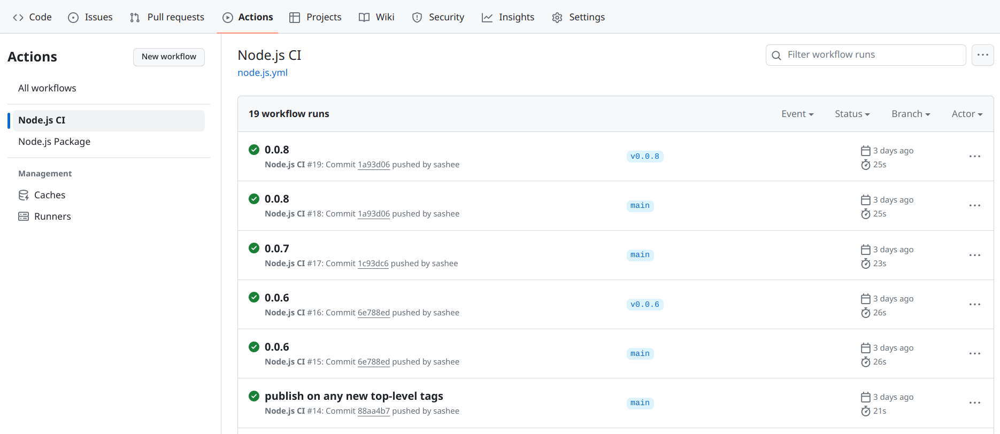
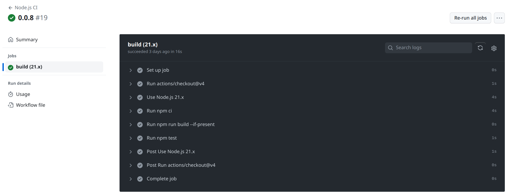
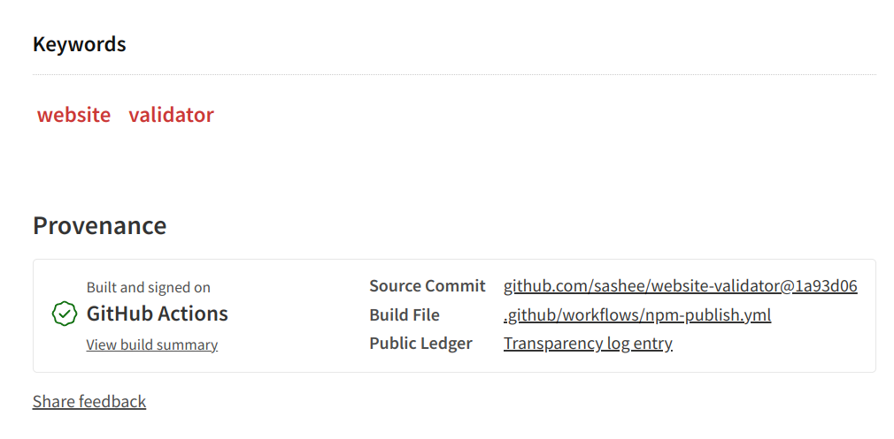
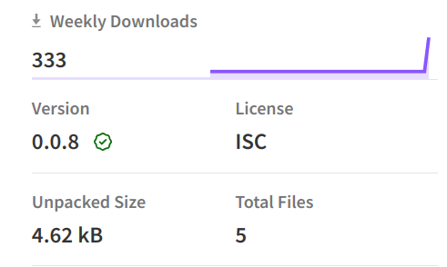
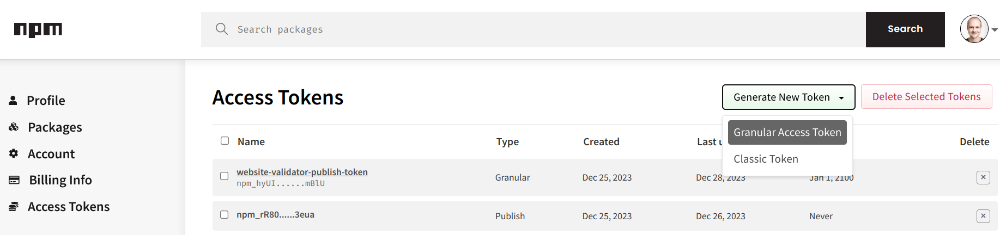
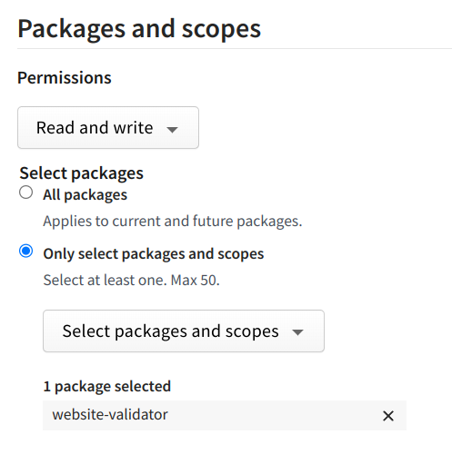
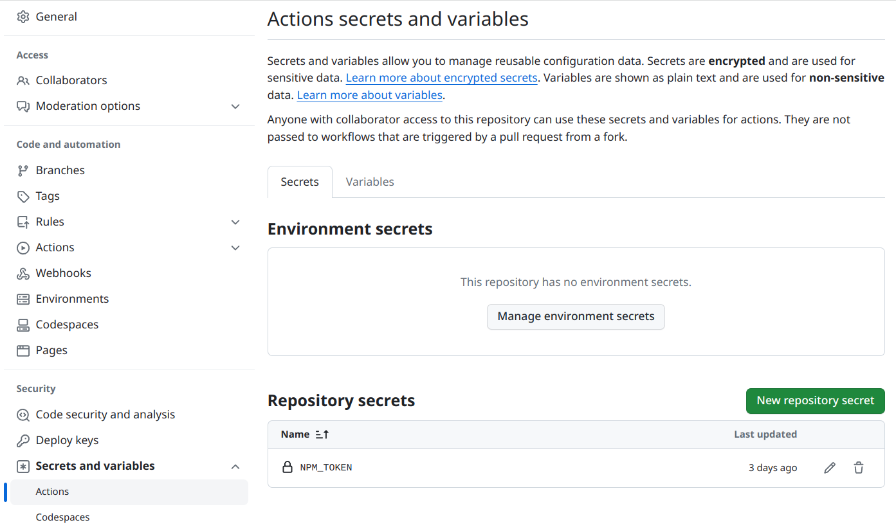
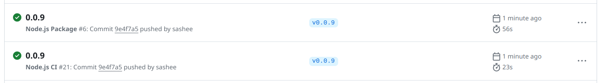
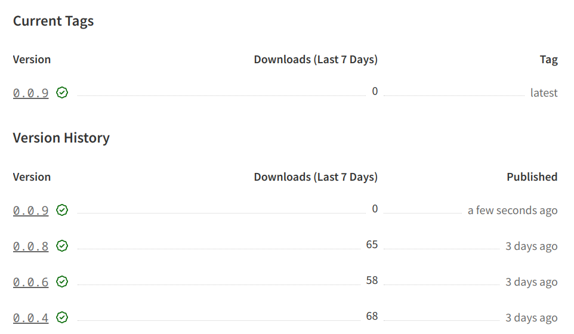

# [译] 如何使用 TypeScript、测试、GitHub Actions 和自动部署到 NPM 操作来发布 NPM 包

> 原文地址：https://advancedweb.hu/modern-javascript-library-starter
>
> 译者注：目前来讲，如果想直接套用一个模板来开发 JavaScript 库，antfu 提供了一个不错的开发模板：[starter-ts](https://github.com/antfu/starter-ts)

## 发布一个 JavaScript 库

彼时，当我想编写并发布一个 JavaScript 库时，我所要做的就是创建一个新的 GitHub 项目，编写一个包含一些基本细节的 `package.json`，添加一个 `index.js`，然后通过 CLI 发布到 NPM。但是，这种简单的设置忽略了许多被视为必要的新东西：没有类型、没有 CI/CD、没有测试，等等。

因此，当上次我需要启动一个新的 JavaScript 库时，我花了一些时间进行基础设置，然后发现这些步骤大多是通用的，可以在不同的项目中重复使用。本文记录了开发和发布一个现代库所需的不同方面。

更具体地说，我想要这些功能：

- 使用 TypeScript 编写库，并在包中发布类型
- 有同样用 TypeScript 编写的测试
- 为构建和运行测试的提交运行 CI 管道
- 为发布到 NPM 仓库的每个新版本运行 CD 管道

## 启动代码

重要的文件是一些配置文件、包源代码和测试文件：

```bash
src/index.ts
src/index.test.ts
package.json
tsconfig.json
```

由于存在编译步骤，源文件和编译文件位于不同的目录中。`.ts` 文件存在 `src/` 目录中，而编译目标文件存在 `dist/` 目录中。

`package.json` 文件：

```json
{
  // name, version, description, other data
  "main": "dist/index.js",
  "type": "module",
  "files": ["dist"],
  "devDependencies": {
    "ts-node": "^10.9.2",
    "typescript": "^5.3.3"
  }
}
```

`files` 字段定义了 `dist`，指明只有编译后的文件才会打包并推送到 NPM 仓库中。然后 `main: "dist/index.js"` 定义了入口。

`tsconfig.json` 文件配置了 `TypeScript` 编译器：

```json
{
  "compilerOptions": {
    "noEmitOnError": true,
    "strict": true,
    "sourceMap": true,
    "target": "es6",
    "module": "nodenext",
    "moduleResolution": "nodenext",
    "declaration": true,
    "outDir": "dist"
  },
  "include": ["src/**/*.*"],
  "exclude": ["**/*.test.ts"]
}
```

根据项目的不同，可以有很多不同的配置，但重要的部分是 `src/` 文件夹中排除测试文件之外的文件，并且 `outDir` 是 `dist`。

`index.ts` 和 `index.test.ts` 文件很简单，只是为了演示库的工作：

```typescript
// src/index.ts

export const test = (value: string) => {
	return "Hello " + value;
}
```

```typescript
// src/index.test.ts

import test from "node:test";
import { strict as assert } from "node:assert";
import {test as lib} from "./index.js";

test('synchronous passing test', (t) => {
  const result = lib("World");
  assert.strictEqual(result, "Hello World");
});
```

这里需要注意下 `import ... from "./index.js"` 这行代码。虽然文件的扩展名为 `.ts`，但导入时使用的是 `.js`。

### NPM 脚本

接下来，在 `package.json` 中配置 `scripts`。

首先是 `build` 和 `clean`：

```json
{
  "scripts": {
    "build": "tsc --build",
    "clean": "tsc --build --clean"
  }
}
```

这2个脚本仅仅是调用 `tsc` 将 `TypeScript` 代码编译成 `JavaScript` 代码：

```bash
$ npm run build

> website-validator@0.0.8 build
> tsc --build

$ ls dist
index.d.ts  index.js  index.js.map
```

接下来，`prepare` 脚本会在软件包发布时运行构建。这是一个特殊的名称，因为 `npm` 会在 [生命周期的不同阶段](https://docs.npmjs.com/cli/v10/using-npm/scripts#prepare-and-prepublish) 调用它：

```json
{
  "scripts": {
    "prepare": "npm run clean && npm run build"
  }
}
```

### 测试

接下来，配置自动测试。为此，我发现不编译测试代码，而是使用一个能在需要时自动兼容 TS 文件的库会更简单。这就是 `ts-node` 依赖发挥作用的地方。

正因为如此，`test` 脚本不需要运行 `build`：

```json
{
  "scripts": {
    "test": "node --test --loader ts-node/esm src/**/*.test.ts"
  }
}
```

`--loader ts-node/esm` 将 `ts-node` 挂载到 node 模块解析进程中，并在导入 `.ts` 文件时对其进行编译。这使得测试设置变得超级简单：无需编译，只需运行。

```bash
$ npm test

> website-validator@0.0.8 test
> node --test --loader ts-node/esm src/**/*.test.ts

(node:245543) ExperimentalWarning: `--experimental-loader` may be removed in the future; instead use `register()`:
--import 'data:text/javascript,import { register } from "node:module"; import { pathToFileURL } from "node:url"; register("ts-node/esm", pathToFileURL("./"));'
(Use `node --trace-warnings ...` to show where the warning was created)
✔ synchronous passing test (1.01411ms)
ℹ tests 1
ℹ suites 0
ℹ pass 1
ℹ fail 0
ℹ cancelled 0
ℹ skipped 0
ℹ todo 0
ℹ duration_ms 2650.590767
```


## 持续集成

现在我们已经为库准备好了所有脚本，是时候设置 GitHub Actions 来为每次推送运行构建和测试了。

操作配置在 `.github/workflows` 目录中，其中每个 YAML 文件都描述了一个工作流。

```yaml
# .github/workflows/node.js.yml
name: Node.js CI

on:
  push:
  pull_request:

jobs:
  build:
    runs-on: ubuntu-latest

    strategy:
      matrix:
        node-version: [21.x]

    steps:
    - uses: actions/checkout@v4
    - name: Use Node.js $
      uses: actions/setup-node@v3
      with:
        node-version: $
        cache: 'npm'
    - run: npm ci
    - run: npm run build --if-present
    - run: npm test
```

让我们来分析一下这个工作流程中有趣的部分！

`on: push, pull_requests` 定义了工作将在每次推送（push）和拉取请求（pull request）时运行。你可以在这里定义一些过滤器，比如只在某些分支运行测试，但现在还不需要。

`build` 任务使用 `ubuntu-latest`，它是运行脚本的良好基础，因为 [它预装了很多软件](https://github.com/actions/runner-images/blob/main/images/ubuntu/Ubuntu2204-Readme.md)。

`strategy/matrix` 定义了运行构建任务的 `node-version`。其工作原理与模板一样：`${matrix.node-version}` 占位符将填入数组中的每个值，每个配置都将在构建过程中运行。

`setup` 很简单：`checkout` 获取当前代码，`setup-node` 安装特定的 NodeJS 版本，然后运行 `npm ci`、`npm run build` 和 `npm test` 。

### In action

GitHub Actions 页面显示了每次推送都会运行的工作流程：



每次更改都会显示步骤日志：



此外，绿色复选标记表示特定 commit 的操作已成功运行：


这样就很容易发现测试是否失败了。

## 自动部署到 NPM 上

让我们来实现 CI/CD 的另一半：自动部署！

为此，我们将配置一个单独的工作流：

```yaml
# .github/workflows/npm-publish.yml
name: Node.js Package

on:
  push:
    tags:
      - "*"

permissions:
  id-token: write

jobs:
  build:
    # same as the other build

  publish-npm:
    needs: build
    runs-on: ubuntu-latest
    steps:
      - uses: actions/checkout@v4
      - uses: actions/setup-node@v3
        with:
          node-version: 20
          registry-url: https://registry.npmjs.org/
      - run: npm ci
      - run: npm publish --provenance
        env:
          NODE_AUTH_TOKEN: $
```

`on/push/tags：["*"]` 定义了工作流将针对所有顶级 tag 运行，如 `1.0.0`、`v5.3.2`，但不针对 `feature/ticket` 或 `fix/bug-45`。这是一个很好的默认配置：它不强制任何版本策略，也允许任何类型的分层分支名称。

`build` 步骤与其他操作相同，只是为了确保能使用所有受支持的 NodeJS 版本构建库，并确保测试通过。

`publish-npm` 是更有趣的部分：它会检查代码、设置正确的 NodeJS 版本、运行 `npm ci` 并发布软件包。`--provenance` 会为软件包添加额外的元数据，这就是 `permissions/id-token: write` 配置的原因。

### 出处（Provenance）

出处（Provenance）是 NPM 仓库的一项现代功能，其目的是提供从已发布软件包到产生该软件包的源代码之间的 [可验证链接](https://github.blog/2023-04-19-introducing-npm-package-provenance/)。

没有它，你在 GitHub 上看到的代码与维护者在构建和发布软件包时看到的代码是一样的。这就意味着，即使你做了额外的工作来审核软件包的源代码，它仍然有可能被修改。

出处（Provenance）解决了这个问题：GitHub Actions 添加了指向代码的元数据，然后工作流程会对软件包进行签名。有了它，恶意维护者在发布前修改代码的可能性就不复存在了。

当发布的版本带有出处（Provenance）时，它就会显示在软件包的页面上：



另外，版本旁边还有一个绿色的复选标记：




### 密钥

自动部署的流程，还缺少一个重要环节：NPM 如何知道该 GitHub Action 可以发布软件包？这就是 access tokens 发挥作用的地方。

NPM 允许创建M2M（Machine-to-Machine）令牌，授予发布新版本的权限。因此，要配置具有发布权限的工作流，就要配置一个 granular access token：



当添加 token 时，可以定义它可以访问哪些软件包：



在另一端，需要为 GitHub 仓库添加一个仓库密钥：



然后，工作流程就可以使用这个密钥了：

```yaml
# .github/workflows/npm-publish.yml

jobs:
  publish-npm:
    steps:
      # ...
      - run: npm publish --provenance
        env:
          NODE_AUTH_TOKEN: $
```

### 发布一个新版本

一切配置完成后，发布新版本就很简单了：

```bash
$ npm version patch
v0.0.9
```

然后推送代码和新的 tag：

```bash
$ git push
$ git push --tags
```

该操作会触发工作流：



之后，新版本就会被推送到 NPM 仓库中了：




