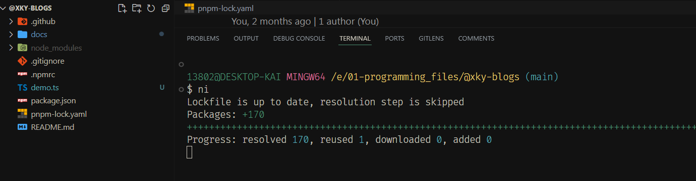
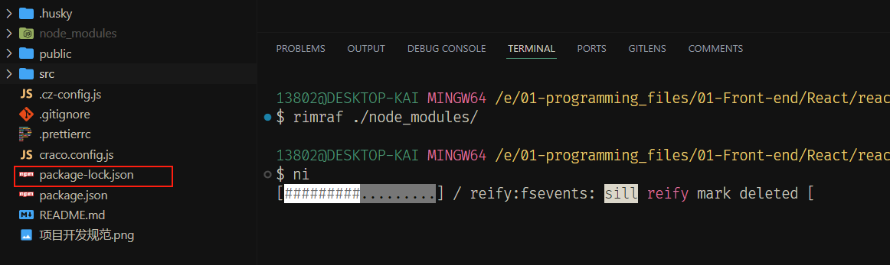
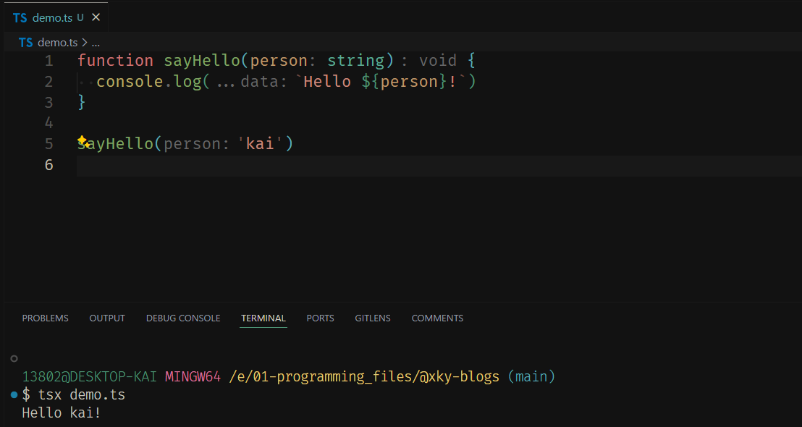
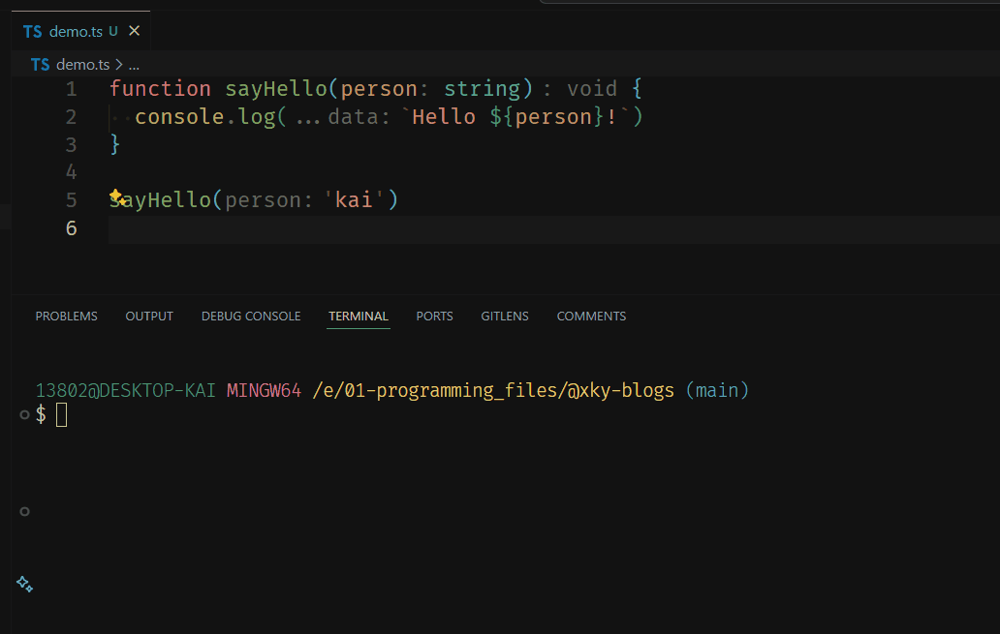
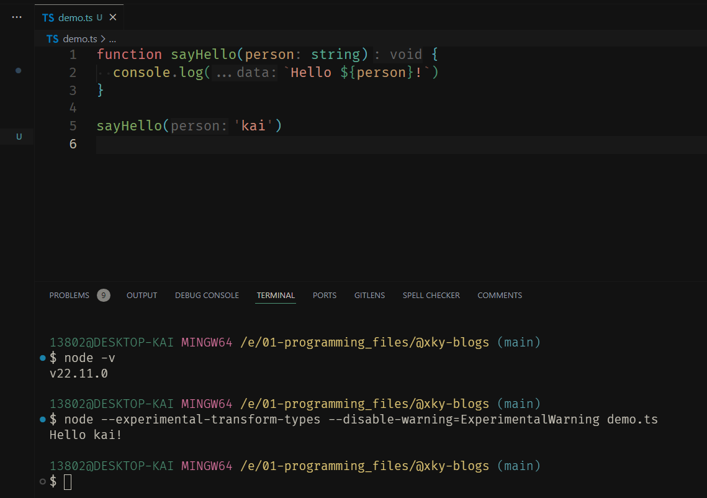
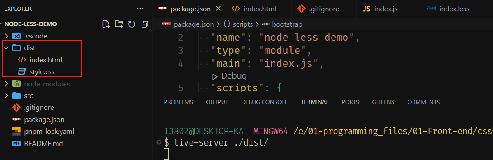
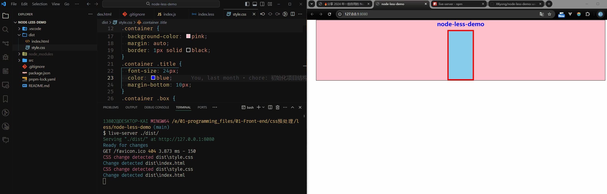
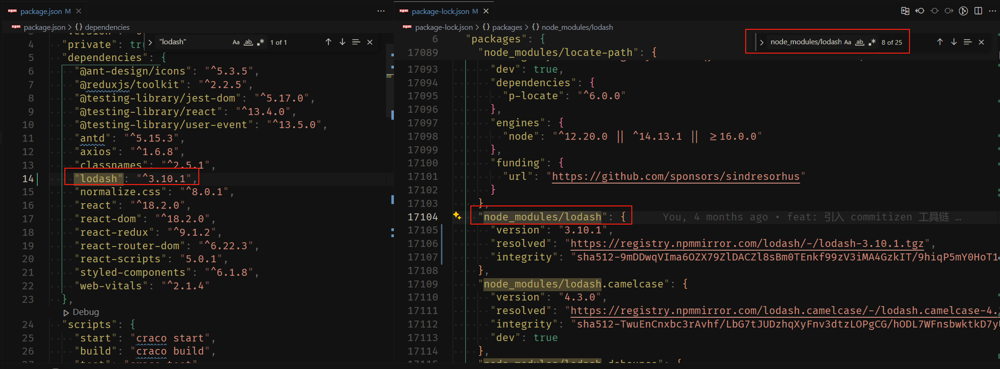
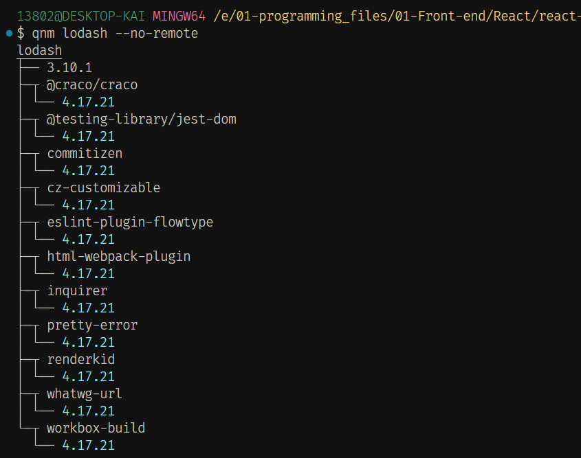

# 🔥分享 2024 年一些好用的 Node.js Cli 工具库

## （一）前言

日常工作过程中，为了提高技术预研和项目开发的效率，在前端社区上发现了不少好用的 Node.js Cli 工具库，用起来也挺顺手的。因此，本文想基于日常工作的开发场景，分享些自用的，好用的，确实能够提升工作效率的 Node.js Cli 工具库。

ok，现在开始！

## （二）Cli 工具库推荐

### 1. [@antfu/ni](https://www.npmjs.com/package/@antfu/ni)

日常开发前端工程项目时，偶尔会遇到工程根目录下的 lock 文件是 `package-lock.json` 文件（表明了使用的是 `npm` 包管理工具），但有些同事可能习惯使用 `yarn` ，会重新执行 `yarn install` 命令，致使同一个工程下，又多个了 `yarn.lock` 文件，这 2 份 `lock` 文件锁定依赖的版本不一致，多人开发时可能会出现问题。

此时，可以使用 `@antfu/ni` 库来解决这种问题，它会自动检测当前工程中的 `lock` 文件或者 `package.json` 中的 `packageManager` 字段，使用正确的包管理工具来管理依赖，确保一个工程下只有一种 `lock` 文件。

比如，当我的仓库中的 `lock` 文件是 `pnpm-lock.yaml` 时，根目录下执行 `ni` 命令会看到：



如果  `lock` 文件是 `package-lock.json` ，则会看到：



### 2. [tsx](https://www.npmjs.com/package/tsx)/[esno](https://www.npmjs.com/package/esno)

对于使用 Node.js 编写的 js 代码，我们可以在命令行终端使用 `node` 或 [`nodemon`](https://www.npmjs.com/package/nodemon) 命令直接运行看到程序执行结果，很是方便。而对于编写的 ts 代码，以往可能更多是使用 [ts-node](https://www.npmjs.com/package/ts-node)（不支持自动地监听文件变更然后重新执行） 或者 [ts-node-dev](https://www.npmjs.com/package/ts-node-dev) 来运行查看结果。

不过在 2024 年，我们可以有更简单的方式，那就是使用 `tsx` 这个库。安装完 `tsx` 后，通过形如 `tsx demo.ts` 命令即可运行看到结果，形如 `tsx watch demo.ts` 命令即可实现文件变更后重新执行程序。

这里演示个🌰：

```ts
function sayHello(person: string) {
  console.log(`Hello ${person}!`)
}

sayHello('kai')
```

使用 `tsx demo.ts` 运行的效果如下：



使用 `tsx watch demo.ts` 运行的效果如下：



而 `esno` 这个库，从 0.15 版开始，`esno` 是 `tsx` 的别名，底层调用的是 `tsx`！

关于 tsx 的更多介绍，详见：https://tsx.is/

::: tip 

 2024年12月14号10点更新：Node 22 版本引入了 `--experimental-transform-types` ，让我们可以直接在 Node 环境中直接运行 ts 代码：



详情见：[Node.js can run TypeScript](https://samthor.au/2024/node-run-typescript/)。

:::


### 3. [http-server](https://www.npmjs.com/package/http-server)

http-server 是一款简单的零配置命令行静态 HTTP 服务器工具库。日常开发过程中，我除了用来作为快速启动技术预研测试的 Demo 程序外，我还用它来传输文件（在同个局域网下，pc端 -> 移动端），几乎所有的文件都支持，都能传输，而且速度极快，只需要在想传输的目录下运行 `http-server` 命令，然后手机端输入启动的 url，就可以看到类似如下的界面：


点击右侧对应的文件链接即可传输到手机设备中。

另外，由于日常工作开发过程中，会有特殊终端设备与开发电脑在调试场景下文件互传的需求，因此，自己封装搞了个工具库，感兴趣可以看下：[easy-file-transfer](https://github.com/XKyong/easy-file-transfer)。


### 4. [live-server](https://www.npmjs.com/package/live-server)

日常开发过程中，在预研相关技术方案时，我常常会编写一个最小量的代码原型，一般都是直接在 `html` 文件中引入相关库的 `UMD` 版本，然后编写原生的 `HTML/CSS/JS` 文件代码。此时，如果使用 `http-server` 库的话，当这些文件发生改变时，必须要重新手动刷新浏览器页面，才能让我们更新的代码生效，开发体验会差点。取而代之地可以使用 `live-server` 库，它可以在我们的 `HTML/CSS/JS` 文件代码更新后，自动帮我们刷新浏览器页面，更新得到最新的效果。

下边来看个🌰：



如上图，终端通过 `live-server ./dist/` 命令，运行成功后即默认会打开浏览器页面，此时，当我修改 `css` 或者 `html` 文件代码时，会看到：



更多使用场景，感兴趣可以自己多探索探索！

### 5. [rimraf](https://www.npmjs.com/package/rimraf)/[trash-cli](https://www.npmjs.com/package/trash-cli)/[del-cli](https://www.npmjs.com/package/del-cli)

日常开发过程中，对于前端开发来说，总会有需要删除 `node_modules` 目录的时候，此时，如果直接用鼠标右键的 `删除` 菜单，那删除操作的效率还是比较低的。取而代之地可以使用 `rimraf` 库，它是一个用于递归删除文件和文件夹的库，类似于 UNIX 命令 `rm -rf`。

使用方式比较简单，安装完之后，在一个前端工程根目录下，执行如下命令即可删除 `node_modules` 目录了：

```bash
$ rimraf ./node_modules
```

这里需要注意的是，`rimraf` 会永久删除文件或者目录，不能复原。如果需要在保护用户文件安全的场景下操作，可考虑使用 `trash-cli` 工具库。类似的还有一个 `del-cli`。

这 3 个库的对比说明如下：

| **特性**       | **rimraf**                                                   | **trash-cli**                                                | **del-cli**                                                  |
| -------------- | ------------------------------------------------------------ | ------------------------------------------------------------ | ------------------------------------------------------------ |
| **简介**       | 递归删除文件和文件夹，类似于 UNIX 命令 `rm -rf`              | 将文件或文件夹移动到操作系统的回收站（垃圾桶）               | 使用 glob 模式删除文件和文件夹，建立在 `rimraf` 之上         |
| **安全性**     | 直接删除                                                     | 将文件移动到回收站，用户可以从回收站恢复                     | 直接删除                                                     |
| **跨平台支持** | 是                                                           | 是                                                           | 是                                                           |
| **异步操作**   | 支持，使用回调                                               | 支持，使用 Promise                                           | 支持，使用 Promise                                           |
| **功能特点**   | 提供简单易用的 API，性能高效，适用于所有主流操作系统         | 将文件移动到回收站，保护用户数据安全，支持 macOS、Windows 和 Linux | 基于 glob 模式匹配文件，异步操作，跨平台，继承了 `rimraf` 的性能和稳定性 |
| **使用场景**   | - 删除临时文件或文件夹 <br> - 清理构建目录 <br> - 递归删除文件和文件夹的任何场景 | - 需要保护用户数据安全的场景 <br> - 应用程序中实现类似操作系统的删除功能，提供回收站恢复机制 | - 使用通配符模式删除构建目录中的文件 <br> - 需要删除多个文件或文件夹，并希望使用异步操作的场景 <br> - 清理构建输出，类似于 `gulp` 等构建工具的清理任务 |
| **备注**       | `rirmaf` 既可以当 Cli 工具使用，也可以直接在 Node.js 程序中使用 | `trash-cli` 只能当 Cli 工具使用， Node.js 程序版本见：[trash](https://www.npmjs.com/package/trash) | `del-cli` 只能当 Cli 工具使用， Node.js 程序版本见：[del](https://www.npmjs.com/package/del) |

更多使用场景，感兴趣可以自己多探索探索！

### 6. [patch-package](https://www.npmjs.com/package/patch-package)

日常开发过程中，如果我们前端项目的依赖出现 bug 了，通常我们会给对应仓库提 Issue，这是一个好的习惯。

但如果项目需要紧急交付，而仓库作者未能及时响应时，此时通常做法是把工程 `node_modules` 目录中依赖的源码拷贝到项目源码中，然后尝试进行修改。

如果依赖本身文件数量少，那就还好，但倘若文件数量比较多的话，势必会增大最终构建成果物体积，而往往我们只需要修改几行依赖源码而已。

此类场景下，我们就可以使用像 `patch-package` 这样的工具库，它的作用，我总结就是能在项目所依赖的库出现 bug 且库作者无法快速响应修复时，我们可以直接修改 `node_modules`目录中该库的源代码，然后通过该工具做仓库线上线下同步。

如何使用 `patch-package` 工具库，文档写得比较清楚了，这里就不罗列赘述了。

不过有一点需要特别强调下，由于 `patch-package` 在打补丁的过程中，会用到 `postinstall` 这个构建钩子，如果线上构建使用了 Jenkins 来做 `CI/CD`，而最终构建出来的成果物补丁没生效，可以重点排查下 `postinstall` 钩子是否正常运行了。

关于该工具库的原理，神光大佬写过一篇文章，感兴趣详看：[patch-package 实现原理：如何保存恢复 node_modules 下的代码改动？](https://juejin.cn/post/7156454739415138341?searchId=20240803101752306561762B96BA5F8495)。

### 7. [qnm](https://www.npmjs.com/package/qnm)

前端工程中，`package.json` 中罗列的依赖的版本，只是一个语义化版本（Semver），不是 `install` 到项目本地的确切版本。

关于语义化版本的介绍，可以看看如下 2 篇文章：

- [semver 2.0.0 语义化版本](https://semver.org/lang/zh-CN/)
- [聊聊 npm 的语义化版本（Semver）](https://github.com/mqyqingfeng/Blog/issues/312)

那如果我们要查看确切的依赖（以 `lodash` 为例）版本呢？

一种是直接查看前端工程中的 `lock` 文件（以 `package-lock.json` 为例）：



如上图，我们想要查找 `lodash` 安装的具体版本，我们确实能在 `package-lock.json` 中找到。

不过这里有个问题，因为项目中安装的其他库也可能依赖了 `lodash`，而且依赖的版本可能跟当前项目依赖的 `lodash` 不一致，这会导致 `package-lock.json` 中有多个版本的 `lodash`，对应上边搜索出来的 `25` 个相关匹配项。

如果我们要找出项目中所有的 `lodash` 版本，通过手动搜索 `package-lock.json` 然后一个个比对，是比较耗时的。

因此，这里介绍另外一种方式，那就是使用 `qnm` 工具库，它是一款能快速、集中地提供项目有关已安装模块信息的工具库，对于当前这个案例，我在根目录执行如下命令：

```bash
$ qnm lodash --no-remote
```

可以看到，`qnm` 把项目本地安装的 `lodash` 版本都找出来了，而且指明了有哪些依赖依赖了它，依赖的 `lodash` 具体版本是多少：



`qnm --no-remote` 是我日常使用比较多的命令，更多其他用法和使用场景，感兴趣可以自己多探索探索！


## （三）总结

本文结合个人日常工作的实际开发场景，罗列总结几个好用的 Node.js Cli 工具库，希望上边提到的工具库，能够或多或少帮助到你，祝你早点下班！

 工具库会持续更新，Happy Coding!


<Giscus
  repo="xkyong/blogs"
  repo-id="R_kgDOMk5dyA"
  category="Announcements"
  category-id="DIC_kwDOMk5dyM4ChwJe"
  mapping="title"
  reactions-enabled="1"
  emit-metadata="0"
  input-position="top"
  theme="preferred_color_scheme"
  lang="zh-CN"
  loading="lazy"
/>
