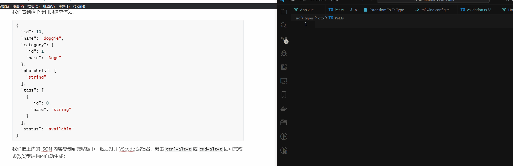
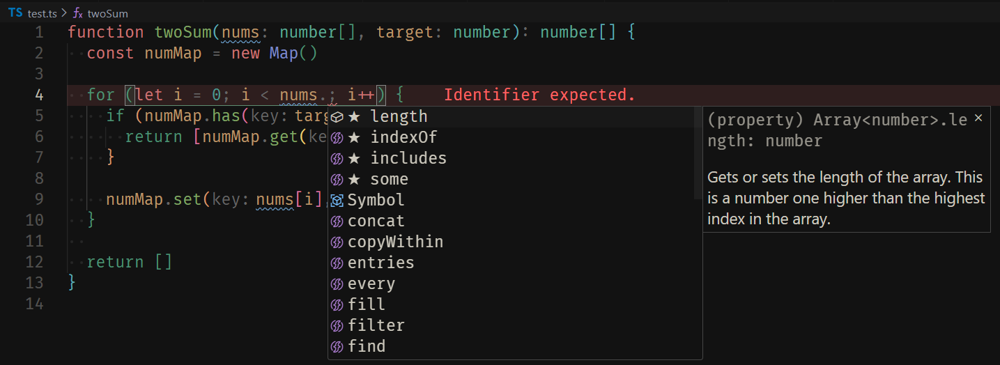
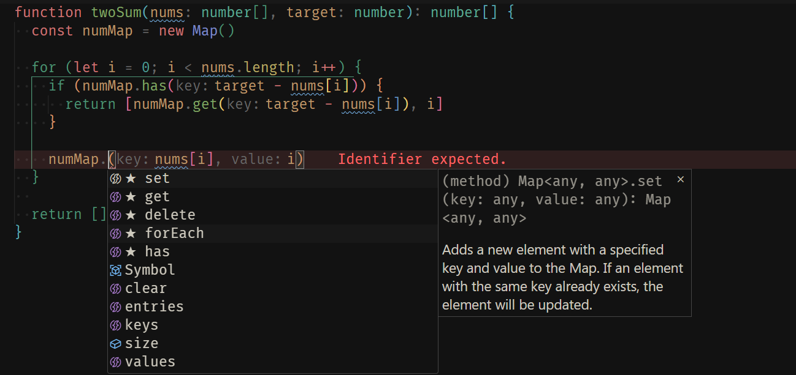
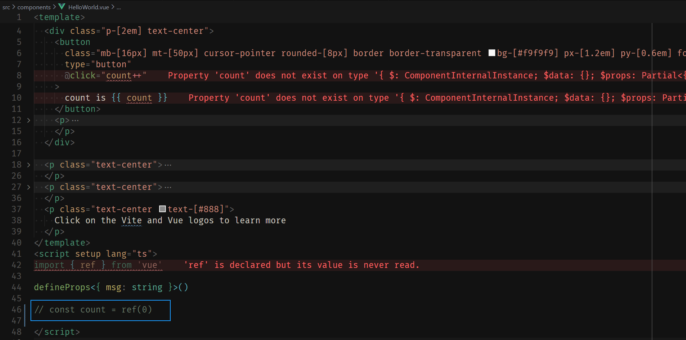
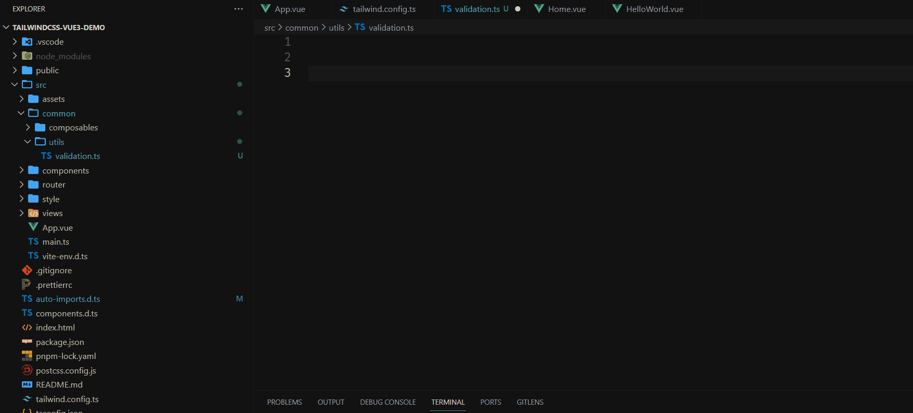
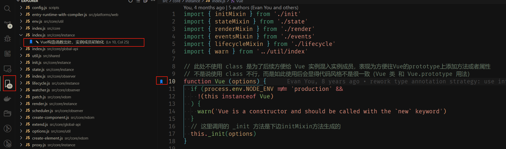
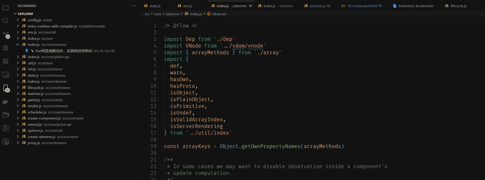

# 分享 2024 年一些自用的工作效率 Boosting 的 Vscode 插件

## （一）前言

2024年了，关于 Vscode 插件的推荐文章，网上还是不少的，因此，我这里不会罗列重复推荐的插件，而是更侧重基于日常工作的开发场景，分享些自用的，确实能够提升工作效率的插件。

因为日常开发主 Vue 框架，偶尔配合 TypeScript 和 Tailwind CSS 来编写项目，因此，以下内容会主要从这几个方面展开。

ok，现在开始！

## （二）插件推荐

### TypeScript/JavaScript 编写

当我们在实际业务开发时，假设前后端接口联调时，后端同事给的是 Swagger 文档，而我们前端项目是基于 TypeScript 来开发的，那么对于后端同事给的 DTO 说明，相应地，我们需要在前端中使用 `interface` 或者 `type` 把接口的 DTO 定义在代码中，此时，常规操作下，我们都是对照着 Swagger 文档，然后把 DTO 的参数以及类型手动敲出来。

不过，现在有更好的操作方式，即根据 DTO 的结构自动生成参数类型结构，不过要借助 [To Ts Type](https://marketplace.visualstudio.com/items?itemName=simonhe.to-ts-type) 这个插件来完成。

下边以 [swagger.io](https://editor.swagger.io/) 上边下图这个 post 接口为例，演示下如何 To Ts Type 这个插件。


我们看到这个接口的请求体为：

```json
{
  "id": 10,
  "name": "doggie",
  "category": {
    "id": 1,
    "name": "Dogs"
  },
  "photoUrls": [
    "string"
  ],
  "tags": [
    {
      "id": 0,
      "name": "string"
    }
  ],
  "status": "available"
}
```

我们把上边的 JSON 内容复制到剪贴板中，然后打开 VScode 编辑器，敲击 `ctrl+alt+t` 或 `cmd+alt+t` 即可完成参数类型结构的自动生成：



把上边的内容换下行，可以看到：

```typescript
type IType = {
  id: number
  name: string
  category: {
    id: number
    name: string
  }
  photoUrls: string[]
  tags: {
    id: number
    name: string
  }[]
  status: string
}
```

转换后的参数类型结构基本就是我们要的，基本不需要修改，编写速度杠杠快！

除此之外，还有3个值得说的插件。

首先是 [TypeScript Importer](https://marketplace.visualstudio.com/items?itemName=pmneo.tsimporter)，这一插件会收集你项目内所有的类型定义，在敲出 `:` 时提供这些类型来进行补全。如果从列表中选中，它还会自动帮你把这个类型导入进来：


其次是 [IntelliCode](https://marketplace.visualstudio.com/items?itemName=VisualStudioExptTeam.vscodeintellicode)，关于该插件的介绍和使用，这里有一篇文章：[IntelliCode for TypeScript/JavaScript](https://devblogs.microsoft.com/typescript/intellicode-for-typescript-javascript/)。

简单讲就是，当你使用 TypeScript/JavaScript 编写代码时，该 IntelliCode 插件会智能基于上下文将最可能的方法或者属性放在选择列表的顶部（以⭐️️符号标识），这样我们就不需要手动敲击上下键去选择我们最需要的方法或属性，进而提高代码的编写效率。

举个🌰️，假设我要写一个 `twoSum` 的函数，可以看到：

当我写 `for` 循环条件时：



然后就是几处使用 `numMap` 的操作，基于不同的上下文语义，IntelliCode 插件给的推荐列表顶部项也是不一样的：




如果我不启用 IntelliCode 插件，那么对于上述的 `for` 循环条件编写：


此时我们就得自己手动把 `length` 属性从列表中找出来，或者手动编写出来。

最后是：[Error Lens](https://marketplace.visualstudio.com/items?itemName=usernamehw.errorlens)，借助该插件，当我们的代码出现 Eslint 报错或者 TypeScript 类型报错时，我们在编写时即可发现，不需要保存然后走一遍 lint 检验或者 TypeScript 类型检查，节省了部分开发时间：



如上，我把 `const count = ref(0)` 这行代码注释掉了，由于 Error Lens 插件发挥了作用，因此我在编辑器中就可以看到代码出现的问题，不需要保存再走 TypeScript 类型检查也能知道我没有定义 `count` 这个 Ref：


### Tailwind CSS 开发

2023年，我在公司的项目中实际使用 Tailwind CSS 去开发业务项目，找到了几个能够提高 CSS 工具类编写效率的工具，在此分享给大家。

首先来讲，编写 Tailwind CSS 工具类，肯定少不了官方提供的 Vscode 插件：[Tailwind CSS IntelliSense](https://marketplace.visualstudio.com/items?itemName=bradlc.vscode-tailwindcss)。

当你有一个基于 Tailwind CSS 的项目（当然了，`tailwind.config.{js,cjs,mjs,ts}` 必不可少）时，那么这个插件就会发挥作用：


如上，我们不需要单独额外去记忆这些 css 工具类，因为该插件会在我们敲击相关类前缀时给我们提供对应工具类列表供我们选择。

其次，实际业务开发时，前端同事会需要参看 UI 同事给的 UI 标注进行开发，给的 UI 标注一般是类似如下的内容：

```css
font-size: 16px;
line-height: 24px;
padding: 0 20px;
color: #ff00ff;
border: 1px solid transparent;
```

如果这些 CSS 我们都要手动转换为 Tailwind CSS 的工具类写法，那效率未免太慢了。

恰巧，Github 上 [Simon-He95](https://github.com/Simon-He95) 大佬搞了几个切实能够进一步提高 Tailwind CSS 编写效率的工具，其中有一个能高效地帮我们自动完成普通 CSS 写法到 Tailwind CSS 工具类写法的转换：[To Tailwindcss](https://marketplace.visualstudio.com/items?itemName=simonhe.to-tailwindcss)。

操作也很简单，只需要把上边的样式复制到剪贴板中，然后打开 VScode 编辑器，敲击 `ctrl+alt+x` 或  `cmd+alt+x` 即可完成转换：


还有一个插件是：[vscode-tailwind-magic](https://marketplace.visualstudio.com/items?itemName=simonhe.vscode-tailwind-magic)，它让我们可以用属性或快捷写法的方式来生成工具类：


关于更多用法，详情可参看该仓库的 README 文档：[vscode-tailwind-magic-README_zh.md](https://github.com/Simon-He95/vscode-tailwind-magic/blob/main/README_zh.md)。

### Vue 开发

这年头，使用 Vue 开发项目，有 2 个插件应该是少不了的：[Vue Language Features (Volar)](https://marketplace.visualstudio.com/items?itemName=Vue.volar) 和 [TypeScript Vue Plugin (Volar)](https://marketplace.visualstudio.com/items?itemName=Vue.vscode-typescript-vue-plugin)，而且相信大家应该也比较熟悉，这里就不过多介绍了。

这里重点想讲的是以下这 2 个插件，2 个都来自 Simon-He95 大佬之手。

首先是 [v component prompter](https://marketplace.visualstudio.com/items?itemName=simonhe.v-component-prompter)，该插件能够为 sfc 导入的自定义组件带来 `props` 、 `emitEvents` 和 `expose methods` 提示，该插件仓库的 demo 动图很好地演示了用法：


该插件的使用，作者写的很清楚了，详情可参看该仓库的 README 文档：[v-component-prompter-README_zh.md](https://github.com/Simon-He95/v-component-prompter/blob/main/README_zh.md)。

另外一个是 [fast jump](https://marketplace.visualstudio.com/items?itemName=simonhe.fast-jump)，能够快速定位到导入依赖期望的源位置，减少到达期望路径中的步骤，该插件仓库的 demo 动图也演示了用法：


该插件的使用，作者也写的很清楚了，详情可参看该仓库的 README 文档：[fast-jump-README_zh.md](https://github.com/Simon-He95/fast-jump/blob/main/README_zh.md)。

### 其他

#### Github Copilot 和 Github Copilot Chat

2024年了，如果条件允许，真的比较建议试试集成 [Github Copilot](https://marketplace.visualstudio.com/items?itemName=GitHub.copilot) 和 [Github Copilot Chat](https://marketplace.visualstudio.com/items?itemName=GitHub.copilot-chat) 到日常工作开发中，因为确实能够提升开发效率呀，开发体验也是很爽。

举个简单例子，假设我现在有一个表单页面，其中有个地方需要输入ip地址并且需要检验合法性，那么，我们可以直接写注释 `检验 ip 地址的有效性`，然后就可以看到 Github Copilot 给的代码建议，敲击 tab 键即可生成代码：



生成的代码基本不需要修改，可直接使用，省去了我们再敲击一遍的时间。

针对上边生成的代码，如果我把 `parts.length !== 4` 这段代码改成 `parts.length !== 5` ，那么，代码逻辑就出现问题了（模拟实际工作中出现的代码逻辑问题），此时，我们可以直接借助 Github Copilot Chat 帮我们找出问题并给出解决方案：


我演示仅仅是这2个插件的常用功能，更多用法，建议自己多在工作中解锁。

### Bookmarks

如果你想阅读一些库或者框架的源码，那么，我一定会推荐你安装下这个 [Bookmarks](https://marketplace.visualstudio.com/items?itemName=alefragnani.Bookmarks) 插件。

简单地讲，该插件的功能如同其名一样，它能让我们通过类似书签的功能快速定位到源码位置。

对于源码中某一行代码，我们可以通过快捷键组合 `ctrl+alt+k` 打上书签，成功之后，左侧会出现一个书签图标，同时左侧插件快捷菜单入口那里会有有一条记录，我们还可以对该记录进行备注说明：



如上，在做了很多标记之后，后续，我们就可以直接点击左侧的书签记录快速定位到对应源码位置，相比全局搜索方便和快捷得多：



这个插件是帮助我阅读仓库源码的一大利器，现在我把它推荐给你！


## （三）总结

好了，针对上边提到的插件，这里做下总结汇总：

| 分类                       | 插件                                                         |
| -------------------------- | ------------------------------------------------------------ |
| TypeScript/JavaScript 编写 | [To Ts Type](https://marketplace.visualstudio.com/items?itemName=simonhe.to-ts-type) 、[TypeScript Importer](https://marketplace.visualstudio.com/items?itemName=pmneo.tsimporter)、[IntelliCode](https://marketplace.visualstudio.com/items?itemName=VisualStudioExptTeam.vscodeintellicode)、[Error Lens](https://marketplace.visualstudio.com/items?itemName=usernamehw.errorlens) |
| Tailwind CSS 开发          | [Tailwind CSS IntelliSense](https://marketplace.visualstudio.com/items?itemName=bradlc.vscode-tailwindcss)、[To Tailwindcss](https://marketplace.visualstudio.com/items?itemName=simonhe.to-tailwindcss)、[vscode-tailwind-magic](https://marketplace.visualstudio.com/items?itemName=simonhe.vscode-tailwind-magic) |
| Vue 开发                   | [Vue Language Features (Volar)](https://marketplace.visualstudio.com/items?itemName=Vue.volar)、 [TypeScript Vue Plugin (Volar)](https://marketplace.visualstudio.com/items?itemName=Vue.vscode-typescript-vue-plugin)、 [v component prompter](https://marketplace.visualstudio.com/items?itemName=simonhe.v-component-prompter)、[fast jump](https://marketplace.visualstudio.com/items?itemName=simonhe.fast-jump) |
| 其他                       | [Github Copilot](https://marketplace.visualstudio.com/items?itemName=GitHub.copilot) 、[Github Copilot Chat](https://marketplace.visualstudio.com/items?itemName=GitHub.copilot-chat)、[Bookmarks](https://marketplace.visualstudio.com/items?itemName=alefragnani.Bookmarks) |

希望上边提到的插件，能够或多或少帮助到你，祝你早点下班！

Happy Coding!


