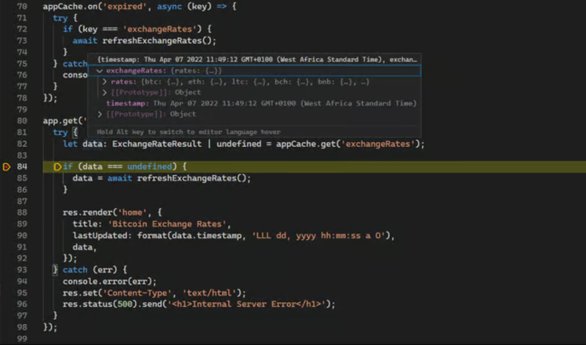

# [译] Node.js 中集成 TypeScript 入门指南

> 原文地址：https://betterstack.com/community/guides/scaling-nodejs/nodejs-typescript

[TypeScript](https://www.typescriptlang.org/) 是 JavaScript 语法的扩展，为该语言增加了类型安全和其他功能。自 2011 年首次亮相以来，TypeScript 不断受到欢迎，并越来越多地用于对可靠性要求极高的各类项目。[Deno](https://deno.land/) 和 [Bun](https://bun.sh/) 等新兴 JavaScript 运行时都内置了 TypeScript 支持，而 Node.js 却没有。因此，你需要投入额外的精力在 Node.js 运行时中集成类型检查。本文将教你如何做到这一点！

## 学习前提

在开始本教程之前，请确保你已安装最新版本的 [Node.js](https://nodejs.org/en/download) 和 `npm`。此外，由于本教程仅关注如何将 TypeScript 顺利集成到 Node.js 项目中，因此希望你对 TypeScript 有基本的了解。


## 步骤1：下载演示项目（可选）

为了说明将 TypeScript 无缝集成到 Node.js 项目中的过程，我们将使用 [演示的 Node.js 应用程序](https://github.com/betterstack-community/btc-exchange-rates) 来显示当前各种加密货币和法定货币的比特币价格。虽然我们将使用这个特定项目进行演示，但你也可以将本指南中列出的步骤应用到你选择的任何其他项目中。

首先，运行下面的命令将代码仓库 clone 到你的机器上：

```bash
$ git clone https://github.com/betterstack-community/btc-exchange-rates
```

进入新创建的 `btc-exchange-rates` 目录，运行下面的命令下载项目的所有依赖项：

```bash
$ npm install
```

然后，执行以下命令启动端口为 3000 的开发服务器：

```bash
$ npm run dev
```

一旦执行成功，你将看到如下的输入：

```bash
> btc-exchange-rates@1.0.0 dev
> nodemon server.js

[nodemon] 2.0.15
[nodemon] to restart at any time, enter `rs`
[nodemon] watching path(s): *.*
[nodemon] watching extensions: js,mjs,json
[nodemon] starting `node server.js`
server started on port: 3000
Exchange rates cache updated
```

请在浏览器中访问 `http://localhost:3000` 查看应用程序的运行情况：


现在你可以进入下一部分，在 Node.js 项目中安装和配置 TypeScript 编译器。


## 步骤2：安装并配置 TypeScript

现在，你已经设置好了演示应用程序，然后通过下面的命令在我们的项目中安装 [TypeScript 编译器](https://www.npmjs.com/package/typescript)：

```bash
$ npm install typescript
```

在本地安装 TypeScript 可以确保版本记录在项目的 `package.json` 文件中，这样将来 clone 项目的人就可以使用相同的 TypeScript 版本，防止版本之间可能出现的破坏性更改。

安装后，项目中就会有 `tsc` 命令，可以通过 `npx` 访问，如下所示：

```bash
$ npx tsc --version
```

```bash
Version 5.2.2
```

根据你学习本教程的时间，你可能会看到不同版本的 TypeScript。通常，每三个月会发布一个新版本。

在开始编译成 JavaScript 源文件之前，你需要设置一个 `tsconfig.json` 配置文件。如果没有它，当你尝试编译项目时，TypeScript 编译器就会出错。虽然可以使用命令行标志，但配置文件更易于管理。


随后在项目根目录下创建一个 `tsconfig.json` 文件：

```bash
$ code tsconfig.json
```

在文本编辑器中打开文件后，粘贴以下内容：

:::code-group

```json[tsconfig.json]
{
  "extends": "@tsconfig/node20/tsconfig.json",
  "include": ["src/**/*"],
  "exclude": ["node_modules"]
}
```

:::

TypeScript 提供了大量 [配置选项](https://www.typescriptlang.org/tsconfig/)，可帮助你指定应包含哪些文件以及编译器的严格程度。以下是对上述基本配置的解释： 

- `extends`：提供了一种从另一个配置文件继承的方式。在本示例中，我们使用的是 [Node v20 的基本配置](https://github.com/tsconfig/bases/blob/main/bases/node20.json)，但你也可以根据自己的 Node.js 版本使用更合适的 [基本配置](https://www.typescriptlang.org/docs/handbook/tsconfig-json.html#tsconfig-bases)。
- `include`：指定程序中应包含哪些文件。
- `exclude`：指定编译时应省略的文件或目录。

另一个未在此处显示的关键属性是 `compilerOptions`。它是 TypeScript 配置的主要部分，涵盖了语言的工作方式。当上面省略时，默认使用基本配置中指定的 `compilerOptions` 或 TypeScript [编译器默认值](https://www.typescriptlang.org/tsconfig#compilerOptions)：

:::code-group

```json[https://github.com/tsconfig/bases/blob/main/bases/node20.json]{6-16}
{
  "$schema": "https://json.schemastore.org/tsconfig",
  "display": "Node 20",
  "_version": "20.1.0",

  "compilerOptions": {
    "lib": ["es2023"],
    "module": "node16",
    "target": "es2022",

    "strict": true,
    "esModuleInterop": true,
    "skipLibCheck": true,
    "forceConsistentCasingInFileNames": true,
    "moduleResolution": "node16"
  }
}
```

:::

上面提到的基本配置是以 [NPM 软件包](https://www.npmjs.com/package/@tsconfig/node20) 的形式提供的，因此需要安装后才能生效：

```bash
$ npm install --save-dev @tsconfig/node20
```

安装基础配置后，在项目根目录下执行以下命令：

```bash
$ npx tsc
```

```bash
error TS18003: No inputs were found in config file '/home/ayo/dev/demo/btc/tsconfig.json'. Specified 'include' paths were '["src/**/*"]' and 'exclude' paths were '["node_modules"]'.


Found 1 error.
```

由于 `src` 目录中没有 `.ts` 文件，你会遇到上述错误。要解决这个问题，可以调整 `tsconfig.json` 配置，通过 `allowJs` 选项识别 JavaScript 文件。**这种方法可以帮助你逐步将 JavaScript 项目过渡到 TypeScript**。你还应使用 `outDir` 选项指定已编译 JavaScript 文件的输出目录：

:::code-group

```json[tsconfig.json]{3-6}
{
  "extends": "@tsconfig/node20/tsconfig.json",
  "compilerOptions": {
    "allowJs": true,
    "outDir": "dist"
  },
  "include": ["src/**/*"],
  "exclude": ["node_modules"]
}
```

:::

保存文件后，再次运行 TypeScript 编译器。你会发现没有输出，这意味着编译成功。

```bash
$ npx tsc
```

现在你应该能在项目根目录下看到一个包含已编译 `server.js` 文件的 `dist` 目录。

```bash
$ ls dist
```

```text
server.js
```

:::warning

译者注：windows 系统可以打开 PowerShell 来运行 `ls` 命令

:::

现在，你可以修改 `nodemon.json` 配置，以运行编译后的文件，而不是源文件：

:::code-group

```json[nodemon.json]{5}
{
  "watch": ["src"],
  "ext": ".js",
  "ignore": [],
  "exec": "node dist/server.js"
}
```

:::

通过这些步骤，你就成功地将 TypeScript 集成到了 Node.js 项目中！


## 步骤3：类型检查 JavaScript 文件（可选）

你现在已设置好同时编译 JavaScript 和 TypeScript 文件，但默认情况下不会对 `.js` 文件执行类型检查。如果你正在将 Node.js 项目过渡到 TypeScript，并希望利用类型检查而不一次性将所有现有 `.js` 文件转换为 `.ts`，你可以使用 `checkJs` 编译器选项启用前者的类型检查：

:::code-group

```json[tsconfig.json]{5}
{
  "extends": "@tsconfig/node20/tsconfig.json",
  "compilerOptions": {
    "allowJs": true,
    "checkJs": true,
    "outDir": "dist"
  },
  "include": ["src/**/*"],
  "exclude": ["node_modules"]
}
```

:::

这里需要提醒的是：在一个大型项目中启用 `checkJs` 可能会导致错误泛滥，而在不过渡到 `.ts` 文件的情况下处理这些错误可能不是最有效的方法。

即使在我们这个不到 100 行的单个文件项目中，仅启用该选项就会产生 20 个错误：


你可以选择在每个文件的开头使用 `@ts-check` 注释进行类型检查，而不是全局启用 `checkJs`：

:::code-group

```js[server.js]
// @ts-check
import express from 'express';
import path from 'node:path';
. . .
```

:::

相反，如果启用了 `checkJs`，但希望将特定文件排除在类型检查之外，可使用 `@ts-nocheck` 注释：

:::code-group

```js[server.js]
// @ts-nocheck
import express from 'express';
import path from 'node:path';
. . .
```

:::

这对于暂时绕过有问题的文件非常方便，因为你可能没有能力立即处理这些文件。

为了实现更精细的控制，TypeScript 提供了 `@ts-ignore` 和 `@ts-expect-error` [注释](https://www.typescriptlang.org/docs/handbook/release-notes/typescript-3-9.html#ts-ignore-or-ts-expect-error)。它们允许你逐行控制类型检查：

```ts
// @ts-expect-error
const app = express();

// or

// @ts-ignore
const app = express();
```

这些特殊注释在 JavaScript（启用了 `allowJs`）和 TypeScript 文件中都有效。鉴于我们的演示应用程序非常简单，我们将不使用 `checkJs` 或本节讨论的特殊注释。相反，我们将直接过渡到 TypeScript，并处理过程中出现的任何类型错误。


## 步骤4：迁移 JavaScript 文件为 TypeScript

从 JavaScript 过渡到 TypeScript 就像将文件扩展名从 `.js` 改为 `.ts` 一样简单。由于每个有效的 JavaScript 程序都是有效的 TypeScript 程序，因此只需进行简单的更改，你就可以开始使用 TypeScript 的功能。

```bash
$ mv src/server.js src/server.ts
```

然后，按如下方式更改 `nodemon.json` 文件中的 `ext` 字段：

```json{3}
{
  "watch": ["src"],
  "ext": ".js,.ts",
  "ignore": [],
  "exec": "tsc && node dist/server.js"
}
```

对于 Node.js 项目，安装 `@types/node` 软件包至关重要。该包提供了内置 Node.js API 的类型定义，TypeScript 编译器会自动检测到这些类型。

```bash
$ npm install --save-dev @types/node
```

此时，你可以运行 TypeScript 编译器，看看是否有任何错误：

```bash
$ npx tsc
```


现在，编译器可以确定内置 Node.js API 的特定类型，错误从 20 个减少到 7 个。剩下的错误大多是因为编译器无法确定某些第三方库的类型。

TypeScript 在遇到没有类型定义的 JavaScript 库时，会默认使用 `any` 类型。然而，在更严格的配置中不允许隐式使用 `any`（[参见此处](https://github.com/tsconfig/bases/blob/main/bases/node20.json#L11)），从而导致这些错误。在下一节中，你将发现解决这个问题的一些策略。

一旦完成将 JavaScript 源文件迁移到 TypeScript，你就可以从 `tsconfig.json` 中移除 `allowJs` 编译器选项。


## 步骤5：修复第三方库引起的类型错误

虽然 TypeScript 功能强大，但它在与 JavaScript 编写的第三方库配合时经常会遇到挑战。它依赖于类型信息来确保类型安全，而 JavaScript 项目无法在开箱即用时提供这些信息。让我们在本节中讨论这些挑战。

### 理解问题

当 TypeScript 遇到 JavaScript 编写的库时，它会默认整个库使用 `any` 类型。这是一种万能类型，基本上可以绕过 TypeScript 的类型检查。

`noImplicitAny` 编译器选项有助于缓解这一问题。启用该选项后，TypeScript 将在无法推断类型时抛出错误，而不是默认为任何类型。该选项是 [严格配置](https://www.typescriptlang.org/tsconfig#strict) 的一部分，可确保更严格的类型检查。

### 解决方案：类型声明

为了帮助 TypeScript 理解 JavaScript 库，作者可以在其软件包中提供类型声明文件（以 `.d.ts` 结尾）。这些文件描述了库的结构，使 TypeScript 能够检查类型，并在编辑器中提供更好的自动完成功能。

有些库（如 `axios`）在其主包中包含了类型声明，但许多其他库（如 `express` 和 `morgan`）则没有。对于这些库，TypeScript 社区通常会在 [NPM 的 @types 作用域](https://www.npmjs.com/search?q=%40types) 下单独创建并发布它们的类型声明。这些类型声明都来自社区，可以在 [DefinitelyTyped 仓库](https://github.com/DefinitelyTyped/DefinitelyTyped) 中找到。

### 修复错误

下面是上一步编译程序时出现的前两个错误：

```bash
src/server.ts:1:21 - error TS7016: Could not find a declaration file for module 'express'. '/home/ayo/dev/betterstack/demo/btc-exchange-rates/node_modules/express/index.js' implicitly has an 'any' type.
  Try `npm i --save-dev @types/express` if it exists or add a new declaration (.d.ts) file containing `declare module 'express';`

1 import express from 'express';
                      ~~~~~~~~~

src/server.ts:4:20 - error TS7016: Could not find a declaration file for module 'morgan'. '/home/ayo/dev/betterstack/demo/btc-exchange-rates/node_modules/morgan/index.js' implicitly has an 'any' type.
  Try `npm i --save-dev @types/morgan` if it exists or add a new declaration (.d.ts) file containing `declare module 'morgan';`

4 import morgan from 'morgan';
                     ~~~~~~~~

. . .
```

正如错误信息所示，通常可以通过在 `@types` 作用域中安装适当的类型声明来解决类型问题。对于当前与 `express` 和 `morgan` 有关的错误，请运行以下命令：

```bash
$ npm install --save-dev @types/express @types/morgan
```

安装类型声明后，重新运行 TypeScript 编译器。现在所有的 `implicit any` 错误都应该消失了，只剩下一个错误：

```bash
$ npx tsc
```

```bash
src/server.ts:76:27 - error TS18046: 'data' is of type 'unknown'.

76       lastUpdated: format(data.timestamp, 'LLL dd, yyyy hh:mm:ss a O'),
                             ~~~~

Found 2 errors in the same file, starting at: src/server.ts:31
```

从现在起，如果你尝试使用库的 API 进行非法操作，编译器会立即提醒你注意问题所在：

:::code-group

```ts[src/server.ts]
// 尝试使用一个不存在的方法
app.misuse(morganMiddleware);
```

:::

```bash
$ npx tsc
```

```bash
src/server.ts:23:5 - error TS2339: Property 'misuse' does not exist on type 'Express'.

23 app.misuse(morganMiddleware);
       ~~~~~~
```

如果你使用的库不太流行，在 `@types` 作用域中没有可用的类型声明，你可能需要为该库编写自定义类型声明文件。请参阅 [TypeScript 手册](https://www.typescriptlang.org/docs/handbook/declaration-files/introduction.html)，了解如何编写。


## 步骤6：修复其他类型错误

在上一节中，我们成功修复了所有因 JavaScript 库中缺少类型信息而导致的 `implicit any` 错误，但还有一个错误需要解决：

```bash
src/server.ts:74:35 - error TS2571: Object is of type 'unknown'.

74       lastUpdated: dateFns.format(data.timestamp, 'LLL dd, yyyy hh:mm:ss a O'),
                                     ~~~~
Found 1 error in src/server.ts:74
```

下划线 `data` 实体包含从 Coin Gecko API 接收到的汇率数据以及最后更新的日期。这个错误表明，TypeScript 无法确定 `data` 对象的类型，因此为其分配了 `unknown` 类型。

`any` 允许你对变量做任何事情，而 `unknown` 则更具限制性：如果不首先断言或缩小其类型，你就无法做任何事情。要解决这个错误，你需要通过创建自定义类型来告知 TypeScript 这个实体的形状。

继续将下面突出显示的行添加到你的 `src/server.ts` 文件中：

:::code-group

```ts[src/server.ts]{5-10,12-16,18-21}
. . .

app.set('views', path.join(__dirname, '..', 'views'));

type Currency = {
  name: string;
  unit: string;
  value: number;
  type: string;
};

type Rates = {
  rates: {
    [key: string]: Currency;
  };
};

type ExchangeRateResult = {
  timestamp: Date;
  data: Rates;
};

. . .
```

:::

在这里，`ExchangeRateResult` 描述了 `data` 实体的形状，看起来像这样：

```json
{
    "timestamp": "2023-10-01T04:20:18.357Z",
    "data": {
        "rates": {
            "aed": {
                "name": "United Arab Emirates Dirham",
                "type": "fiat",
                "unit": "DH",
                "value": 99314.944
            },
            "ars": {
                "name": "Argentine Peso",
                "type": "fiat",
                "unit": "$",
                "value": 9464154.224
            }
        }
    }
}
```

下一步是用自定义类型注释函数的返回类型，让编译器了解你正在处理的数据的形状：

:::code-group

```ts[src/server.ts]{2,6}
. . .
async function getExchangeRates(): Promise<Rates> {
  // ... function body ...
}

async function refreshExchangeRates(): Promise<ExchangeRateResult> {
  // ... function body ...
}
. . .
```

:::

最后，在根路由中指定 `data` 对象的类型，如下图所示，以反映它可以是 `ExchangeRateResult`、`null` 或 `undefined` 如果在缓存中找不到。

:::code-group

```ts[src/server.ts]{4}
. . .
app.get('/', async (req, res, next) => {
  try {
    let data: ExchangeRateResult | undefined = appCache.get('exchangeRates');

    . . .
  } catch (err) {
    . . .
  }
});
. . .
```

:::

完成这些更改后，重新运行 TypeScript 编译器。有了额外提供的类型信息，TypeScript 编译代码时应该不会出现任何错误。

```bash
$ npx tsc
```

通过这些步骤，你已经解决了错误，并使你的代码库更加健壮。TypeScript 的类型系统与自定义类型定义相结合，可确保你的代码更具可预测性、更易于理解，并且不易出现运行时错误。


## 步骤7：简化开发流程

在 Node.js 环境中使用 TypeScript 时，由于需要进行类型检查和转译，开发工作流程有时会感觉很繁琐。不过，有了正确的工具和配置，你就可以简化这一过程，从而更专注于编码。

例如，你可以调整 `nodemon.json` 配置，将 TypeScript 编译和 Node.js 执行合并为一条命令：

:::code-group

```json[nodemon.json]
{
  "watch": ["src"],
  "ext": ".js,.ts",
  "ignore": [],
  "exec": "tsc && node dist/server.js"
}
```

:::

通过这种设置，每次对 `src` 目录中的 `.ts` 文件进行修改时，Nodemon 都会首先运行 TypeScript 编译器，然后使用 Node.js 执行编译后的 JavaScript。

虽然上述设置有效，但由于需要单独的编译步骤，因此仍存在一些开销。[tsx 软件包](https://www.npmjs.com/package/tsx)（TypeScript Execute 的缩写）利用以速度著称的 [esbuild 打包器](https://esbuild.github.io/) 提供了更快的替代方案。它允许你直接运行 TypeScript 文件，而无需类型检查。

请通过下面的命令将它安装到你的项目中：

```bash
$ npm install tsx --save-dev
```

然后，按 `Ctrl-C` 键退出当前的 `nodemon` 进程，再用 `tsx` 直接执行 `src/server.ts` 文件：

```bash
$ npx tsx src/server.ts
```

```bash
server started on port: 3000
Exchange rates cache updated
```

要在文件更改时自动重新启动，请使用内置的 `watch` 模式：

```bash
$ npx tsx watch src/server.ts
```

`tsx` 的主要缺点是不执行类型检查。为了确保代码的类型安全，你可以在一个单独的终端中使用 `--noEmit` 标志，以观察模式运行 TypeScript 编译器。这将在不产生任何输出文件的情况下检查类型错误：

```bash
$ npx tsc --watch --noEmit
```

通过这种设置，当出现类型错误时，你会立即得到反馈，但这不会影响你的开发速度，因为程序会继续编译。你可以忽略这些错误，直到你准备好将工作单元提交到源代码控制中。


## 步骤8：使用 ESLint 检查 TypeScript

检查（Linting）是开发过程中的一个重要部分，因为它可以捕捉潜在错误并强制执行一致的编码风格，从而帮助保持代码质量。对于 TypeScript 项目，推荐使用 [ESLint](https://www.npmjs.com/package/eslint)，尤其是在 [TSLint](https://www.npmjs.com/package/tslint) 过时之后。

首先安装 ESLint 和 TypeScript 的必要插件：

```bash
$ npm install eslint @typescript-eslint/parser @typescript-eslint/eslint-plugin --save-dev
```

然后在项目根目录下创建 `.eslintrc.json` 文件并如下更新文件内容：

:::code-group

```json[.eslintrc.json]
{
  "root": true,
  "parser": "@typescript-eslint/parser",
  "parserOptions": {
    "ecmaVersion": 2024,
    "sourceType": "module",
    "project": "tsconfig.json"
  },
  "extends": ["eslint:recommended", "plugin:@typescript-eslint/recommended"],
  "env": {
    "node": true
  },
  "rules": {},
  "ignorePatterns": ["dist"]
}
```

:::

此配置会设置 ESLint 来解析 TypeScript 文件，并为 TypeScript 应用一组推荐的检查规则。在此阶段，只要安装了相关的 ESLint 插件，你就能在编辑器中看到检查信息。

你还可以创建一个可在命令行中执行的 `lint` 脚本：

:::code-group

```json[package.json]
"scripts": {
  "dev": "nodemon",
  "lint": "eslint . --fix"
}
```

:::

现在运行 `npm run lint` 将对项目进行检查，并自动修复任何可自动修复的问题。

```bash
$ npm run lint
```

```bash
/home/ayo/dev/betterstack/demo/btc-exchange-rates/src/server.ts
   80:31  error  'next' is defined but never used             @typescript-eslint/no-unused-vars
  101:7   error  'server' is assigned a value but never used  @typescript-eslint/no-unused-vars

✖ 2 problems (2 errors, 0 warnings)
```

虽然推荐的规则集是一个很好的起点，但你可能需要对它们进行定制，以满足你的项目需求。例如，如果你想禁用警告未使用变量的规则，可以更新 `.eslintrc.json` 中的规则部分，如下所示：

:::code-group

```json[.eslintrc.json]
. . .
"rules": {
  "@typescript-eslint/no-unused-vars": "off"
}
. . .
```

:::

请查看 [ESLint 文档](https://eslint.org/docs/user-guide/configuring/) 和 [typescript-eslint 仓库](https://github.com/typescript-eslint/typescript-eslint)，了解有关为 JavaScript 和 TypeScript 配置 ESLint 的更多信息。


## 步骤9：使用 Prettier 格式 TypeScript 代码

[Prettier](https://prettier.io/) 是一种广泛使用的代码格式化工具，支持包括 TypeScript 在内的多种语言。将 Prettier 与 ESLint 集成可确保代码中潜在错误被检查出来，并保持格式一致。以下是如何为你的 TypeScript 项目设置 Prettier：

```bash
$ npm install --save-dev prettier
```

然后，创建一个 Prettier 配置并更新其内容，如下图所示：

:::code-group

```json[.prettierrc.json]
{
  "printWidth": 80,
  "singleQuote": true,
  "trailingComma": "es5",
  "bracketSpacing": true
}
```

:::

现在你可以运行 Prettier 去格式化 TypeScript 文件：

```bash
$ npx prettier --write src/server.ts
```

```bash
src/server.ts 134ms
```

为了确保 Prettier 的格式化不会与 ESLint 的检查规则冲突，你需要集成以下软件包：

```bash
$ npm install --save-dev eslint-config-prettier eslint-plugin-prettier
```

然后如下修改 `.eslintrc.json` 文件的内容：

:::code-group

```json[.eslintrc.json]{4}
"extends": [
  "eslint:recommended",
  "plugin:@typescript-eslint/recommended",
  "plugin:prettier/recommended"
]
```

:::

`plugin:prettier/recommended` 配置做了两件事：

1. 它添加了 `prettier` 插件，将 Prettier 作为 ESLint 规则运行。
2. 它扩展了 `eslint-config-prettier` 配置，关闭了所有可能与 Prettier 冲突的 ESLint 规则。

在此设置下，使用 `--fix` 选项运行 ESLint 也会修复 Prettier 格式化问题。如果你的编辑器集成了在保存时自动修复 ESLint 问题的功能，这一点尤其有用。


## 步骤10：使用 Visual Studio Code 调试 TypeScript 代码

调试是应用程序开发过程中的一个重要环节，而在使用 TypeScript 时，获得无缝的调试体验至关重要。Visual Studio Code 为 TypeScript 提供了集成调试环境，让你可以直接在编辑器中调试代码。

在调试 TypeScript 代码之前，你需要生成源映射。更新你的 `tsconfig.json`，加入 `sourceMap` 选项，如下所示：

:::code-group

```json[tsconfig.json]{5}
{
  "extends": "@tsconfig/node20/tsconfig.json",
  "compilerOptions": {
    "outDir": "dist",
    "sourceMap": true
  },
  "include": ["src/**/*"],
  "exclude": ["node_modules"]
}
```

:::

完成后，为 TypeScript 设置一个启动配置文件，如下所示：

:::code-group

```json[.vscode/launch.json]
{
  "version": "0.2.0",
  "configurations": [
    {
      "name": "Debug server.ts",
      "type": "node",
      "request": "launch",
      "program": "${workspaceFolder}/src/server.ts",
      "preLaunchTask": "tsc: build - tsconfig.json",
      "outFiles": ["${workspaceFolder}/dist/**/*.js"]
    }
  ]
}
```

:::

此配置会告诉 VS Code：

1. 使用 Node.js 调试器。
2. 在启动调试器之前编译 TypeScript 代码。
3. 调试位于 `src` 目录中的 server.ts 文件。
4. 在 `dist` 目录中查找已编译的 JavaScript 文件。

有了此配置，你就可以在 Visual Studio Code 中按 `F5` 键开始调试。这将编译 TypeScript 代码、生成源映射（source maps）并启动调试器。确保没有其他服务器实例在运行，否则可能会出现 [EADDRINUSE 错误](https://betterstack.com/community/guides/scaling-nodejs/nodejs-errors/#5-erraddrinuse)。

启用源映射并启动调试器后，你将调试原始的 TypeScript 代码，而不是转译的 JavaScript。这意味着当你点击一个断点时，你将在编辑器中看到你的 TypeScript 代码，变量值、调用堆栈和其他调试信息将与 TypeScript 代码相对应。




## 总结

一开始，将 Node.js 应用程序迁移到 TypeScript 可能会让人望而生畏，但如果使用正确的工具和策略，迁移过程就会变得易于管理，而且会让你受益匪浅。TypeScript 提供了一个强大的类型系统，可以在编译时捕捉潜在的错误，从而使你的代码库更具可维护性，更不易出现运行时错误。

通过遵循本文介绍的步骤，你可以确保你的 Node.js 项目设置正确，从而受益于 TypeScript 提供的全部功能。有了增加的类型安全性和改进的工具，你会发现你的开发过程更高效、更不易出错。[GitHub 存储库中提供的 typescript 分支](https://github.com/betterstack-community/btc-exchange-rates/tree/typescript) 展示了迁移过程的结果，因此当你在自己的项目中应用本文所学知识时，它可以作为实用参考。

感谢你的阅读，祝你编码愉快！


