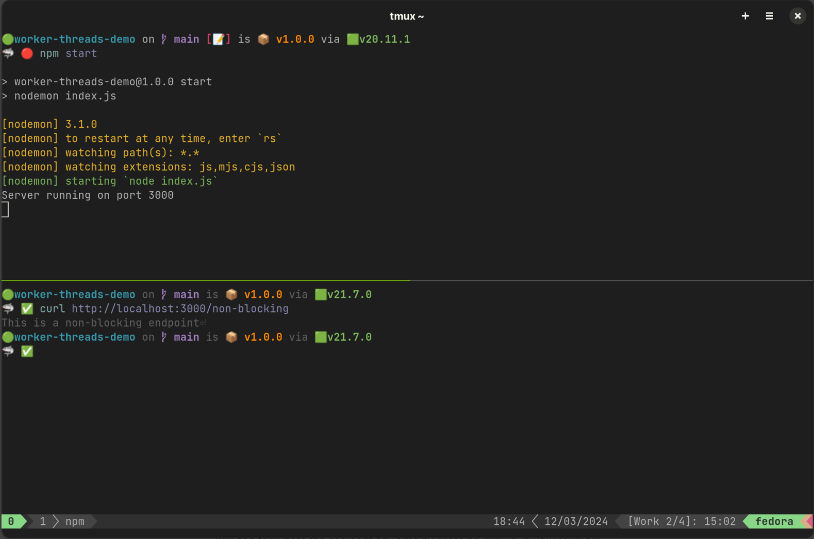

# [译] Node.js worker 线程入门指南

> 原文地址：https://betterstack.com/community/guides/scaling-nodejs/nodejs-workers-explained/
>
> 译者注：关于使用 worker 线程来实践构建 node 程序的 npm 库，可以看看 antfu 的这个：[pkg-exports](https://github.com/antfu/pkg-exports)

由于 Node.js 的架构针对 I/O 密集型活动进行了优化——这也是大多数网络服务器的主要特点，因此传统上它并不适合 CPU 密集型操作。

然而，这种管理 I/O 操作的效率，对于需要大量使用 CPU 的任务来说，却换来了不太理想的性能，这就是软件权衡的一个典型例子。

尽管如此，Node.js 还是比早期更好地适应了 CPU 密集型任务。如今，在 Node.js 上执行此类任务的性能水平已达到某些应用可以接受的程度。

在本文中，我们将深入探讨以下主题：

- 了解 CPU 密集型任务的含义
- 为什么 Node.js 在 CPU 密集型操作方面举步维艰
- 通过 [worker 线程](https://nodejs.org/api/worker_threads.html) 增强 Node.js 高效执行 CPU 密集型任务的能力

让我们深入了解吧！

## 学习前提

要有效地学习本指南，请确保你的计算机至少有两个 CPU。此外，在计算机上安装最新版本的 Node.js 也很重要，最好是 [最新的 LTS 版本](https://nodejs.org/en/download)。

要查看系统的 CPU 数量，请运行下面的命令：

```bash
$ nproc
# 2
```

请注意，通过 worker 池优化 CPU 密集型操作的章节将在配备四个或更多 CPU 的系统上取得最佳效果。

## 启动 demo 项目

::: tip

译者注：demo 项目是使用 ES modules 规范来组织代码的，如果对如何在 Node.js 中使用 ES modules 规范不是很了解的，建议看看这篇文章：[How to Use ES Modules in Node.js](https://dmitripavlutin.com/ecmascript-modules-nodejs/)。

:::

为了演示本文将要介绍的概念，我准备了一个简单的 Express 应用程序，该程序具有单个非阻塞端点，你将在接下来的章节中通过集成 CPU 密集型任务并随后将其转移到 worker 线程来进一步开发该程序。

首先使用以下命令克隆项目仓库：

```bash
$ git clone https://github.com/betterstack-community/worker-threads-demo.git
```

克隆之后，进入到项目目录：

```bash
$ cd worker-threads-demo
```

接下来，安装必要的依赖项，包括用于网络服务器的 [Express](https://expressjs.com/)、用于在文件更改时自动重启服务器的 [nodemon](https://nodemon.io/) 和用于在服务器上进行基本负载测试的 [autocannon](https://www.npmjs.com/package/autocannon)：

```bash
$ npm install
```

仓库中的 `index.js` 文件设置了一个简单的 Express 服务器，如下图所示：

```js
import express from 'express';

const app = express();
const PORT = process.env.PORT || 3000;

app.get('/non-blocking', (req, res) => {
  res.send('This is a non-blocking endpoint');
});

app.listen(PORT, () => {
  console.log(`Server running on port ${PORT}`);
});
```

该代码片段建立了一个带有单一端点的 Express 服务器，并在访问时输出特定信息。

要运行开发服务器，请执行：

```bash
$ npm start
```

在另一个终端窗口中，使用如下命令测试：

```bash
$ curl http://localhost:3000/non-blocking
```

你应该会看到服务器作出如下响应：

```text
This is a non-blocking endpoint
```



你可以随时按终端窗口中的 `CTRL+C` 键终止服务器。

现在，你已准备好探索 worker 线程，但在深入了解之前，让我们先来探讨一下在 Node.js 环境中 I/O 和 CPU 密集型任务间的区别。

## 了解 Node.js 中的 I/O 密集型和 CPU 密集型任务

在计算机编程中，任务大致分为两种：I/O 密集型和 CPU 密集型。

**I/O 密集型任务**是指执行速度主要取决于 I/O 子系统的任务。这包括磁盘读写、网络通信和数据库交互等操作。

这些任务的关键因素不是程序处理数据的速度，而是程序与其他系统或设备执行输入或输出操作的速度。

I/O 密集型活动的常见例子包括数据库查询、网络文件传输和磁盘 I/O 操作。这些任务的主要延迟来自完成外部操作所需的时间，而非 CPU 的处理能力。

Node.js 利用底层操作系统的能力，通过异步操作高效处理 I/O 密集型任务。例如，从文件读取数据的 `fs.readFile()` 方法就展示了这种方法：

```js
const fs = require("node:fs");
fs.readFile("/file.txt", (err, data) => {
  if (err) throw err;
});
```

在这种情况下，Node.js 会将文件读取任务委托给操作系统，并在事件队列中注册回调函数。当这一过程异步开展时，程序的其他部分将继续不间断地执行。

操作完成后，操作系统会将数据传回 Node.js，Node.js 会执行已注册的回调函数参数 `readFile()`，并将接收到的数据传给 Node.js。

这种机制可确保 I/O 密集型任务不会妨碍主执行线程，从而将其归类为非阻塞操作。

另一方面，**CPU 密集型任务**是指那些受 CPU 速度限制的任务。这包括复杂计算、数据分析、密码学、图像或视频编码、机器学习模型训练等操作。

在这些场景中，每项任务的主要限制是 CPU 的处理能力，因为它们需要大量计算资源来执行一系列指令。

CPU 密集型任务的一个基本例子是执行大量迭代的循环：

```js
let iterationCount = 0;
for (let i = 0; i < 300000; i++) {
  iterationCount++;
}
```

CPU 密集型严重依赖于 Node.js 单 JavaScript 执行线程。即使尝试将这些任务封装在 Promise 中，也无法缓解这一固有特性，因为它们的执行独占了主线程。

因此，当此类任务正在执行时，它会占用线程，并使整个应用程序暂停，使其无法处理进一步的指令或处理任何请求。因此，这些任务被视为 [阻塞](https://nodejs.org/en/learn/asynchronous-work/overview-of-blocking-vs-non-blocking#blocking) 任务。

既然你已经了解 I/O 和 CPU 密集型任务之间的区别，接下来我们将创建并测试一个 CPU 密集型任务，以演示它对 Node.js 性能的影响。

## 创建和测试 CPU 密集型任务

为了演示 CPU 密集型操作对 Node.js 应用程序性能和响应速度的影响，你将修改 demo 项目，添加一条通过递归算法计算 [斐波那契数列](https://en.wikipedia.org/wiki/Fibonacci_sequence) 的路径。

这是一个以 0 和 1 开头的数字序列，其中后面的每个数字都是前面两个数字的和。数列中的前 10 个数字分别是 0、1、1、2、3、5、8、13、21 和 34，并无限循环下去。

在本次探索中，你将使用递归算法实现一个函数，该函数接收一个整数并返回第 n 个斐波那契数，该算法因其简单性和给 CPU 带来的计算负荷而被选中。

首先，打开 `index.js` 文件并添加下面突出显示的代码：

```js{6-9,11-20}
import express from 'express';

const app = express();
const PORT = process.env.PORT || 3000;

function fibonacci(n) {
  if (n <= 1) return n;
  return fibonacci(n - 1) + fibonacci(n - 2);
}

app.get('/fibonacci/:n', (req, res) => {
  const n = parseInt(req.params.n);
  if (isNaN(n) || n < 0) {
    res.status(400).json({ error: 'Invalid input' });
    return;
  }

  const result = fibonacci(n);
  res.json({ fibonacci: result });
});

app.get('/non-blocking', (req, res) => {
  res.send('This is a non-blocking endpoint');
});

app.listen(PORT, () => {
  console.log(`Server running on port ${PORT}`);
});
```

上面的 `fibonacci()` 函数计算斐波那契数列的第 n 项，如果数值小于或等于 1，则直接返回 n，如果 n 较大，则计算前两个数的和。

虽然 [存在更高效的算法](https://www.nayuki.io/page/fast-fibonacci-algorithms)，但该版本有效地展示了 CPU 密集型任务对 Node.js 事件循环的影响。

保存文件后，确保服务器仍在运行，然后返回终端并执行下面的命令，查找第 35 次斐波那契数列以及计算结果所需的时间：

::: warning

如下命令在 Windows 电脑上无法正常运行！

::: 

```bash
$ time curl http://localhost:3000/fibonacci/35
```

在我的机器上，计算大约需要 83 毫秒才能完成：

```text
{"fibonacci":9227465}
real    0m0.083s
user    0m0.001s
sys     0m0.003s
```

通过运行负载测试，为 `/fibonacci` 处理程序可处理的请求数量设定基准也很有用，具体方法如下：

```bash
$ npx autocannon --renderStatusCodes http://localhost:3000/fibonacci/35
```

```text
Running 10s test @ http://localhost:3000/fibonacci/35
10 connections


┌─────────┬────────┬─────────┬─────────┬─────────┬────────────┬───────────┬─────────┐
│ Stat    │ 2.5%   │ 50%     │ 97.5%   │ 99%     │ Avg        │ Stdev     │ Max     │
├─────────┼────────┼─────────┼─────────┼─────────┼────────────┼───────────┼─────────┤
│ Latency │ 276 ms │ 1226 ms │ 2430 ms │ 2593 ms │ 1257.22 ms │ 347.73 ms │ 2593 ms │
└─────────┴────────┴─────────┴─────────┴─────────┴────────────┴───────────┴─────────┘
┌───────────┬─────────┬─────────┬─────────┬─────────┬─────────┬───────┬─────────┐
│ Stat      │ 1%      │ 2.5%    │ 50%     │ 97.5%   │ Avg     │ Stdev │ Min     │
├───────────┼─────────┼─────────┼─────────┼─────────┼─────────┼───────┼─────────┤
│ Req/Sec   │ 7       │ 7       │ 7       │ 8       │ 7.4     │ 0.49  │ 7       │
├───────────┼─────────┼─────────┼─────────┼─────────┼─────────┼───────┼─────────┤
│ Bytes/Sec │ 1.79 kB │ 1.79 kB │ 1.79 kB │ 2.05 kB │ 1.89 kB │ 126 B │ 1.79 kB │
└───────────┴─────────┴─────────┴─────────┴─────────┴─────────┴───────┴─────────┘
┌──────┬───────┐
│ Code │ Count │
├──────┼───────┤
│ 200  │ 74    │
└──────┴───────┘

Req/Bytes counts sampled once per second.
# of samples: 10

84 requests in 10.03s, 18.9 kB read
```

在这里，服务器能够在 10 秒内成功处理 74 个关于第 35 个斐波那契数字的请求。

在结束本节之前，请在 `/non-blocking` 端点上运行负载测试，如下所示：

```bash
$ npx autocannon --renderStatusCodes http://localhost:3000/non-blocking
```

```text
Running 10s test @ http://localhost:3000/non-blocking
10 connections

┌─────────┬──────┬──────┬───────┬──────┬─────────┬─────────┬───────┐
│ Stat    │ 2.5% │ 50%  │ 97.5% │ 99%  │ Avg     │ Stdev   │ Max   │
├─────────┼──────┼──────┼───────┼──────┼─────────┼─────────┼───────┤
│ Latency │ 1 ms │ 1 ms │ 2 ms  │ 2 ms │ 1.05 ms │ 0.28 ms │ 11 ms │
└─────────┴──────┴──────┴───────┴──────┴─────────┴─────────┴───────┘
┌───────────┬────────┬────────┬─────────┬─────────┬──────────┬─────────┬────────┐
│ Stat      │ 1%     │ 2.5%   │ 50%     │ 97.5%   │ Avg      │ Stdev   │ Min    │
├───────────┼────────┼────────┼─────────┼─────────┼──────────┼─────────┼────────┤
│ Req/Sec   │ 6,963  │ 6,963  │ 7,411   │ 7,763   │ 7,365.28 │ 280.04  │ 6,961  │
├───────────┼────────┼────────┼─────────┼─────────┼──────────┼─────────┼────────┤
│ Bytes/Sec │ 1.8 MB │ 1.8 MB │ 1.92 MB │ 2.01 MB │ 1.91 MB  │ 72.7 kB │ 1.8 MB │
└───────────┴────────┴────────┴─────────┴─────────┴──────────┴─────────┴────────┘
┌──────┬───────┐
│ Code │ Count │
├──────┼───────┤
│ 200  │ 81019 │
└──────┴───────┘

Req/Bytes counts sampled once per second.
# of samples: 11

81k requests in 11.02s, 21 MB read
```

请牢记这些数字，因为我们将在本教程的后续章节中参考它们。

## 了解 CPU 密集型任务对 Node.js 性能的影响

为了说明 CPU 密集型任务对服务器性能的影响，请使用以下命令启动一个计算高阶斐波那契数字（如第 100 项）的请求：

```bash
$ curl http://localhost:3000/fibonacci/100
```

由于使用了低效的递归算法，该请求需要花费很长的时间才能完成。更重要的是，它会完全阻塞事件循环，导致功能完全丧失。

当计算正在进行时，在一个新终端中重复对 `/non-blocking` 端点的负载测试。你会发现性能急剧下降，服务器无法在斐波那契计算期间处理其他请求：

```bash
$ npx autocannon --renderStatusCodes http://localhost:3000/non-blocking
```

```text
Running 10s test @ http://localhost:3000/non-blocking
10 connections


┌─────────┬──────┬──────┬───────┬──────┬──────┬───────┬──────┐
│ Stat    │ 2.5% │ 50%  │ 97.5% │ 99%  │ Avg  │ Stdev │ Max  │
├─────────┼──────┼──────┼───────┼──────┼──────┼───────┼──────┤
│ Latency │ 0 ms │ 0 ms │ 0 ms  │ 0 ms │ 0 ms │ 0 ms  │ 0 ms │
└─────────┴──────┴──────┴───────┴──────┴──────┴───────┴──────┘
┌───────────┬─────┬──────┬─────┬───────┬─────┬───────┬─────┐
│ Stat      │ 1%  │ 2.5% │ 50% │ 97.5% │ Avg │ Stdev │ Min │
├───────────┼─────┼──────┼─────┼───────┼─────┼───────┼─────┤
│ Req/Sec   │ 0   │ 0    │ 0   │ 0     │ 0   │ 0     │ 0   │
├───────────┼─────┼──────┼─────┼───────┼─────┼───────┼─────┤
│ Bytes/Sec │ 0 B │ 0 B  │ 0 B │ 0 B   │ 0 B │ 0 B   │ 0 B │
└───────────┴─────┴──────┴─────┴───────┴─────┴───────┴─────┘
┌──────┬───────┐
│ Code │ Count │
└──────┴───────┘

Req/Bytes counts sampled once per second.
# of samples: 10

20 requests in 10.03s, 0 B read
10 errors (10 timeouts)
```

这说明了单个 CPU 密集型任务如何独占 Node.js 的线程，阻塞事件循环并阻止服务器处理其他任务。

由于事件循环被阻塞，我们从每秒处理 ~7.3k 个请求变为 0 个请求。

**这就是为什么人们常说 Node.js 不是 CPU 密集型任务的最佳选择**。不过，有一些解决方案可以缓解这一问题，这就是我们将在下一节探讨的内容。

在继续之前，你可以使用 `Ctrl+C` 停止计算第 100 个斐波那契数字的请求。

## Node.js workers 概述

Node.js 提供了一个 `Worker` 类，该类在 10.5.0 版本中引入，可用于创建独立的 JavaScript 执行上下文。每个 Worker 在自己的 V8 引擎和事件循环上运行，可能会在不同的 CPU 内核上**并行**运行任务。

与传统的线程模型不同，Node.js Worker 线程通过消息传递而非共享内存进行通信，从而避免了常见的并发隐患，如死锁和竞赛条件。这种设计强调线程安全和任务的独立执行。

要实例化 worker 线程，你可以使用 [worker_threads 模块](https://nodejs.org/api/worker_threads.html) 中的 `Worker` 构造函数：

```js
import { Worker } from 'node:worker_threads';

const worker = new Worker('/path/to/worker-script.js');
```

构造函数会获取 Worker 将执行的脚本文件的路径，从而将 CPU 负荷较重的任务从主线程中转移出去。这样可以确保主事件循环不被阻塞，从而保持服务器性能。

例如，可以将计算第 n 个斐波那契数字的任务委托给 worker 线程，并将结果反馈给主线程。这样，事件循环就能腾出时间处理其他任务，从而提高整个应用程序的响应速度。

在下一节中，你将使用 worker 线程来解决之前观察到的 Node.js 中 CPU 密集型操作带来的性能挑战。

## 在 worker 线程中执行 CPU 密集型任务

为避免斐波那契数列计算阻塞事件循环，可以使用 Node.js worker 线程将任务转移到单独的线程。通过这种方法，即使在冗长的计算过程中，服务器也能继续无缝处理其他请求。

首先，将 `fibonacci()` 函数从 `index.js` 文件移到项目根目录下新建的 `worker.js` 文件中：

::: code-group

```js[worker.js]
function fibonacci(n) {
  if (n <= 1) return n;
  return fibonacci(n - 1) + fibonacci(n - 2);
}
```

:::

然后，加入以下代码来计算所请求的斐波纳契数，并将结果转发给父线程：

::: code-group

```js[worker.js]{1,8-9}
import { parentPort, workerData } from 'worker_threads';

function fibonacci(n) {
  if (n <= 1) return n;
  return fibonacci(n - 1) + fibonacci(n - 2);
}

const result = fibonacci(workerData);
parentPort.postMessage(result);
```

:::

在 `worker.js` 文件中，第一行从 `worker_threads` 模块导入了两个变量：

- `parentPort` 表示与主线程/父线程的通信通道，允许 worker 线程向父线程发送消息。

- `workerData` 是 worker 线程在父线程中初始化时传递给 worker 线程的数据。在本例中，它将是要计算的斐波纳契数。

接下来，调整 `index.js` 文件，为每个斐波那契请求生成一个新的 worker 线程：

```js{2,6-23}
import express from 'express';
import { Worker } from 'node:worker_threads';

// ...

app.get('/fibonacci/:n', (req, res) => {
  const n = parseInt(req.params.n);
  if (isNaN(n) || n < 0) {
    res.status(400).json({ error: "Invalid input" });
    return;
  }

  const worker = new Worker('./worker.js', { workerData: n });

  worker.on('message', (result) => {
    res.json({ fibonacci: result });
  });

  worker.on('error', (error) => {
    console.error('Worker error:', error);
    res.status(500).json({ error: 'Internal server error' });
  });
});

```

每次向 `/fibonacci` 路由发出请求时，都会创建一个新的 worker 线程，并通过 `workerData` 变量访问收到的数字。随后会在 worker 线程上注册两个回调：一个用于处理消息（计算结果），另一个用于处理错误。

有了这样的设置，斐波那契计算会在一个单独的线程中处理，然后才会收到计算结果，并通过注册的回调函数转发给客户端。

你可以使用下面的命令重复计算第 35 个斐波那契数字来观察这一点：

::: warning

如下命令在 Windows 电脑上无法正常运行！

::: 

```bash
$ time curl http://localhost:3000/fibonacci/35
```

输出结果如下：

```text
{"fibonacci":9227465}
real    0m0.123s
user    0m0.001s
sys     0m0.003s
```

请注意，与之前的运行相比，计算结果所需的时间实际上更长（123ms 对 83ms）。这是创建 worker 线程的开销造成的，因为在执行程序之前，需要生成一个单独的 V8 引擎实例。

不过，在对 `/fibonacci` 路由重复进行负载测试时，应该会观察到更高的吞吐率：

```bash
$ npx autocannon --renderStatusCodes http://localhost:3000/fibonacci/35
```

服务器现在能在 10 秒内处理 442 个请求，而之前仅为 74 个请求：

```text
. . .
┌──────┬───────┐
│ Code │ Count │
├──────┼───────┤
│ 200  │ 442   │
└──────┴───────┘

Req/Bytes counts sampled once per second.
# of samples: 10

452 requests in 10.02s, 113 kB read
```

这是因为，当你在 Node.js 中创建 worker 线程时，操作系统的调度程序会决定线程的执行方式和位置，包括将线程分配给不同的 CPU 内核。

配备多核处理器的现代操作系统通常会将这些线程分配到多个内核上并行运行，从而提高 CPU 的利用率和性能。

需要注意的是，线程在不同内核上的实际执行情况取决于多个因素，包括操作系统的调度策略、可用内核数量以及每个内核的当前负载。

`worker_threads` 模块只提供了并行执行的框架，但底层系统架构和操作系统调度器才是决定如何将 worker 线程分配到 CPU 内核的关键。

将每个斐波那契计算转移到 worker 线程的另一个重要好处是，它可以防止事件循环被阻塞，从而使主线程可以继续同时处理其他请求。

让我们重复之前计算第 100 个斐波那契数字的情景来演示一下：

```bash
$ curl http://localhost:3000/fibonacci/100
```

在命令运行时，再次对 `/non-blocking` 端点进行负载测试：

```bash
$ npx autocannon --renderStatusCodes http://localhost:3000/non-blocking
```

```text
. . .
┌──────┬───────┐
│ Code │ Count │
├──────┼───────┤
│ 200  │ 80872 │
└──────┴───────┘

Req/Bytes counts sampled once per second.
# of samples: 11

81k requests in 11.02s, 20.9 MB read
```

由于主线程不再被斐波那契计算阻塞，服务器可以继续处理其他请求，从而显著提高了性能。在我的测试机上，我观察到的性能水平与基准大致相同，但你可能会看到略低或略高于基准的数值。

在下一节中，我们将讨论使用 worker 线程池提高为 CPU 密集型任务部署 worker 线程的效率。

## 探索 worker 池模式

如前所述，启动一个新的 worker 线程会创建一个独立的 V8 JavaScript 引擎实例以及相关资源。因此，过多使用 worker 线程会导致系统资源消耗过大，有可能完全抵消掉使用 worker 线程的好处。

对于 CPU 密集型任务， worker 线程数量超过可用 CPU 会导致上下文切换开销，从而降低效率。当线程竞争 CPU 时间时，操作系统必须在它们之间进行切换，这可能会导致 CPU 使用率增加，降低计算密集型任务的性能。

实现性能最大化的最佳线程数通常与可用 CPU 的数量有关，但最佳比例可能因 worker 负载而异。

**一个好的经验法则是，产生的线程数最多比可用 CPU 少一个。因此，如果你的机器有 8 个内核，那么最多应该生成 7 个 Worker。**

为了避免为每个请求创建和销毁 worker 线程的开销， worker 池模式允许你定义一个可重复使用的 worker 池来执行任务。收到的任务会被放入队列，然后由可用的 worker 执行。

这样就避免了为每个请求不断创建新的 worker 线程的开销，而且可用 worker 线程的最大数量始终以可用 CPU 数减去 1 为上限，从而避免了上下文切换带来的低效。

虽然你可以自行创建和管理 worker 池，但我们建议你使用经过实战检验的库，以节省时间并避免 worker 池管理的复杂性。这方面的几个选择包括 [workerpool](https://www.npmjs.com/package/workerpool)、[piscina](https://www.npmjs.com/package/piscina) 和 [poolifier](https://www.npmjs.com/package/poolifier)。

在下面的章节中，我将演示如何利用 workerpool 库有效管理 worker 池，以处理斐波那契计算请求。

## 使用 worker 池优化 CPU 密集型任务

首先安装 `workerpool` 这个依赖：

```bash
$ npm install workerpool
```

安装成功后，如下修改你的 `index.js` 文件：

```js{2-4,6,10-11,21-27}
import express from 'express';
import workerpool from 'workerpool';
import { dirname } from 'path';
import { fileURLToPath } from 'url';

const __dirname = dirname(fileURLToPath(import.meta.url));
const app = express();
const PORT = process.env.PORT || 3000;

// Create a worker pool
const pool = workerpool.pool(__dirname + '/worker.js');

app.get('/fibonacci/:n', async (req, res) => {
  const n = parseInt(req.params.n);

  if (isNaN(n) || n < 0) {
    res.status(400).json({ error: 'Invalid input' });
    return;
  }

  try {
    const result = await pool.exec('fibonacci', [n]);
    res.json({ fibonacci: result });
  } catch (error) {
    console.error(error);
    res.status(500).json({ error: 'Internal server error' });
  }
});

// . . .
```

该代码段使用 `workerpool.pool()` 方法初始化了一个 worker 池，并指向了你的 worker 脚本。worker 池会自动调整 worker 的数量，默认为可用 CPU 内核数减去 1。

在 `/fibonacci` 路由的处理程序中， worker 池会执行 `fibonacci` 函数，并返回一个解析为计算结果的 promise。这种基于 promise 的 API 允许你使用 `async..await` 语法和 `try/catch` 块来处理结果和错误。

现在，调整你的 `worker.js` 文件以启用 worker 函数：

::: code-group

```js[worker.js]
import workerpool from 'workerpool';

function fibonacci(n) {
  if (n <= 1) return n;
  return fibonacci(n - 1) + fibonacci(n - 2);
}

workerpool.worker({
  fibonacci,
});
```

:::

在这里，主线程可以访问 `fibonacci()` 函数，从而可以通过 `pool.exec('fibonacci', [n])` 调用该函数。

让我们通过重复请求计算第 35 个斐波那契数字，看看这些更改是否改善了斐波那契计算的性能：

::: warning

如下命令在 Windows 电脑上无法正常运行！

::: 

```bash
$ time curl http://localhost:3000/fibonacci/35
```

```text
{"fibonacci":9227465}
real    0m0.079s
user    0m0.001s
sys     0m0.002s
```

通过转移到在应用程序启动时管理 worker 池，而不是根据请求生成 worker，我们消除了与 worker 创建相关的开销。

因此，第 35 个数字的斐波那契计算只需 79 毫秒即可完成，与最初 83 毫秒的基准时间相差无几，这表明利用 worker 池的开销极小。

现在进行负载测试，应该也能发现处理能力的提升：

```bash
$ npx autocannon --renderStatusCodes http://localhost:3000/fibonacci/35
```

与上次运行的 442 次相比，10 秒内成功请求的次数略有增加，达到 500 次：

```text
. . .
┌──────┬───────┐
│ Code │ Count │
├──────┼───────┤
│ 200  │ 500   │
└──────┴───────┘

Req/Bytes counts sampled once per second.
# of samples: 10

510 requests in 10.02s, 128 kB read
```

要想更大幅度地提高处理 CPU 密集型任务的能力，可以考虑将硬件升级到具有更多 CPU 内核的系统。不过，在这种特定情况下，采用 [矩阵指数化](https://en.wikipedia.org/wiki/Matrix_exponential) 或 [快速倍增](https://www.geeksforgeeks.org/fast-doubling-method-to-find-the-nth-fibonacci-number/) 等更高效的算法会更有效。

## 总结

worker 线程提高了 Node.js 处理 CPU 密集型任务的能力，标志着该平台的重大改进。尽管取得了这些进步，Node.js 仍然最适合处理 I/O 驱动型操作，而不是密集型计算任务。

这并不是 Node.js 的不足，而是其设计初衷的体现。虽然管理 CPU 密集型任务并不是 Node.js 的强项，但它仍然提供了 worker 线程等机制，可以在一定程度上应对这些挑战。

现在，你可以自行决定这种处理 CPU 密集型操作的方法是否能满足你的项目需求，或者探索专为此类任务定制的技术是否能产生更好的效果。

感谢你的阅读，祝你编码愉快！

<Giscus
  repo="xkyong/blogs"
  repo-id="R_kgDOMk5dyA"
  category="Announcements"
  category-id="DIC_kwDOMk5dyM4ChwJe"
  mapping="title"
  reactions-enabled="1"
  emit-metadata="0"
  input-position="top"
  theme="preferred_color_scheme"
  lang="zh-CN"
  loading="lazy"
/>
